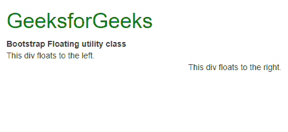
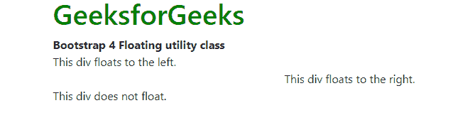
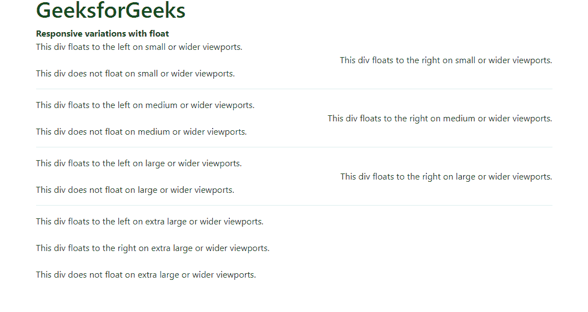

# Bootstrap 4 中的.Pull-Left 和.Pull-Right 类

> Original: [https://www.geeksforgeeks.org/pull-left-and-pull-right-classes-in-bootstrap-4/](https://www.geeksforgeeks.org/pull-left-and-pull-right-classes-in-bootstrap-4/)

Bootstrap 4 中的**.Pull-Left**和**.Pull-Right**类已替换为**.Float-Left**和**.Float-Right**类。这些实用程序类用于根据引导栅格将元素向左或向右浮动到不同大小的视口上。 它使用 CSS Float 属性工作。

**使用.Pull-Left 和.Pull-Right 类**
这些类帮助浮动元素：

*   **.Pull-Left**类用于将元素向左浮动。
*   **.Pull-Right**类用于将元素向右浮动。

**示例：**

```
<!DOCTYPE html>
<html>

<head>
    <title>Bootstrap Floating utility class</title>

    <!-- Include Bootstrap CSS -->
    <link rel="stylesheet" 
          href=
"https://stackpath.bootstrapcdn.com/bootstrap/3.0.0/css/bootstrap.min.css">
</head>

<body>
    <div class="container">
        <h1 style="color:green">
          GeeksforGeeks
      </h1>
        <b>Bootstrap Floating utility class</b>
        <br>

        <div class="pull-left">
          This div floats to the left.
      </div>
        <br>
        <div class="pull-right">
          This div floats to the right.
      </div>
        <br>
    </div>
</body>

</html>
```

**输出：**


**基类**
有三个类帮助浮动元素：

*   Float-Left 类用于将元素向左浮动。
*   Float-Right 类用于将元素向右浮动。
*   **.Float-None**类用于禁用浮点。

除非使用其响应版本指定，否则这些类将适用于所有视口大小。

**示例：**

```
<!DOCTYPE html>
<html>

<head>
    <title>
      Bootstrap 4 Floating utility class
  </title>

    <!-- Include Bootstrap CSS -->
    <link rel="stylesheet"
          href=
"https://stackpath.bootstrapcdn.com/bootstrap/4.3.1/css/bootstrap.min.css">
</head>

<body>

    <div class="container">
        <h1 style="color:green">
          GeeksforGeeks
      </h1>
        <b>Bootstrap 4 Floating utility class</b>
        <br>

        <div class="float-left">
          This div floats to the left.
      </div>
        <br>
        <div class="float-right">
          This div floats to the right.
      </div>
        <br>
        <div class="float-none">
          This div does not float.
      </div>
    </div>
</body>

</html>
```

**输出：**


**基于视口大小的响应性浮动**
基类的响应性变体可用于仅在指定的视口大小上应用浮动。 有四种视口大小变化可供使用。

*   **sm：**这是**小**断点。 使用此选项的所有类都将在大小较小或较宽的视口上浮动。
*   **MD：**这是**中**断点。 使用此选项的所有类都将在中等大小或更宽的视口上浮动。
*   **LG：**这是**大**断点。 使用此选项的所有类都将在大小或更宽的视口上浮动。
*   **xl：**这是**超大**断点。 使用此选项的所有类都将浮动在超大或更宽的视口上。

**示例：**

```
<!DOCTYPE html>
<html>

<head>
    <title>Responsive variations
      with float</title>

    <!-- Include Bootstrap CSS -->
    <link rel="stylesheet" 
          href=
"https://stackpath.bootstrapcdn.com/bootstrap/4.3.1/css/bootstrap.min.css">
</head>

<body>

    <div class="container">
        <h1 style="color:green">GeeksforGeeks</h1>
        <b>Responsive variations with float</b>
        <br>

        <div class="float-sm-left">
          This div floats to the left on small or wider viewports.
      </div>
        <br>
        <div class="float-sm-right">
          This div floats to the right on small or wider viewports.
      </div>
        <br>
        <div class="float-sm-none">
          This div does not float on small or wider viewports.
      </div>

        <div class="float-md-left">
          This div floats to the left on medium or wider viewports.
      </div>
        <br>
        <div class="float-md-right">
          This div floats to the right on medium or wider viewports.
      </div>
        <br>
        <div class="float-md-none">
          This div does not float on medium or wider viewports.
      </div>

        <div class="float-lg-left">
          This div floats to the left on large or wider viewports.
      </div>
        <br>
        <div class="float-lg-right">
          This div floats to the right on large or wider viewports.
      </div>
        <br>
        <div class="float-lg-none">
          This div does not float on large or wider viewports.
      </div>

        <div class="float-xl-left">
          This div floats to the left on extra large or wider viewports.
      </div>
        <br>
        <div class="float-xl-right">
          This div floats to the right on extra large or wider viewports.
      </div>
        <br>
        <div class="float-xl-none">
          This div does not float on extra large or wider viewports.
      </div>
    </div>
</body>

</html>
```

**输出：**
