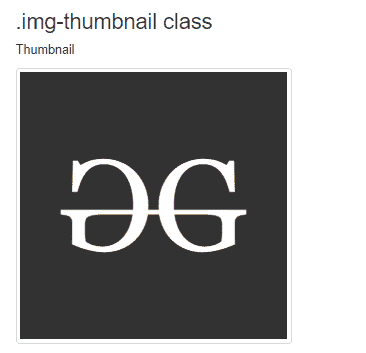

# 引导程序中的响应图像示例

> 原文:[https://www . geesforgeks . org/responsive-images-in-bootstrap-with-examples/](https://www.geeksforgeeks.org/responsive-images-in-bootstrap-with-examples/)

Bootstrap 为图像提供了不同的类别，以使它们的外观更好，并使它们更具响应性。使图像**响应**意味着它应该根据其父元素进行缩放。也就是说，图像的大小不应该溢出其父图像，并且将根据其父图像大小的变化而增长和缩小，而不会失去其纵横比。
Bootstrap 中可用于映像的不同类别解释如下:

*   **。img 响应类**:Bootstrap 中的响应镜像是通过添加**创建的。img 响应**类到 **img** 标签。img 响应等级适用于:*最大宽度:100%* | *高度:自动* | *显示:将*阻挡在图像上。

## 超文本标记语言

```
<!DOCTYPE html>
<html>

<head>
    <!-- Link Bootstrap CSS -->
    <link rel="stylesheet" href="https://maxcdn.bootstrapcdn.com/bootstrap/3.3.7/css/bootstrap.min.css">

    <!-- Link Bootstrap JS and JQuery -->
    <script src="https://ajax.googleapis.com/ajax/libs/jquery/3.3.1/jquery.min.js"></script>
    <script src="https://maxcdn.bootstrapcdn.com/bootstrap/3.3.7/js/bootstrap.min.js"></script>
</head>

<body>
    <div class="container">
        <h1>Responsive Image </h1>
        <br>

        <h3>.img-responsive class</h3>

<p>
            Change the size of the browser window
            to see effect
        </p>

        
    </div>
</body>

</html>
```

*   **输出:**


*   **。img-流体类别**:添加。要标记的流体类别。**。img-fluid** 等级适用:*最大宽度:100%* | *高度:自动*到图像上。

## 超文本标记语言

```
<!DOCTYPE html>
<html>

<head>
    <!-- Link Bootstrap CSS -->
    <link rel="stylesheet" href="https://maxcdn.bootstrapcdn.com/bootstrap/3.3.7/css/bootstrap.min.css">

    <!-- Link Bootstrap JS and JQuery -->
    <script src="https://ajax.googleapis.com/ajax/libs/jquery/3.3.1/jquery.min.js"></script>
    <script src="https://maxcdn.bootstrapcdn.com/bootstrap/3.3.7/js/bootstrap.min.js"></script>
</head>

<body>
    <div class="container">
        <h3>.img-fluid class</h3>

<p>
            Change the size of the browser window
            to see effect.
        </p>

        
    </div>

</body>

</html>
```

*   **输出:**


*   **。img-圆角类**:图像 arw 的圆角。 *img-rounded* 级。(IE8 不支持圆角。)

## 超文本标记语言

```
<!DOCTYPE html>
<html>

<head>
    <!-- Link Bootstrap CSS -->
    <link rel="stylesheet" href="https://maxcdn.bootstrapcdn.com/bootstrap/3.3.7/css/bootstrap.min.css">

    <!-- Link Bootstrap JS and JQuery -->
    <script src="https://ajax.googleapis.com/ajax/libs/jquery/3.3.1/jquery.min.js"></script>
    <script src="https://maxcdn.bootstrapcdn.com/bootstrap/3.3.7/js/bootstrap.min.js"></script>
</head>

<body>
    <div class="container">

        <h3>.img-rounded class</h3>

<p>Rounded Corners</p>

        
    </div>

</body>

</html>
```

*   **输出:**


*   **。img-circle 类**:图像的形状由*做成圆形。img-circle* 类。(IE8 不支持圆角。)

## 超文本标记语言

```
<!DOCTYPE html>
<html>

<head>
    <!-- Link Bootstrap CSS -->
    <link rel="stylesheet" href="https://maxcdn.bootstrapcdn.com/bootstrap/3.3.7/css/bootstrap.min.css">

    <!-- Link Bootstrap JS and JQuery -->
    <script src="https://ajax.googleapis.com/ajax/libs/jquery/3.3.1/jquery.min.js"></script>
    <script src="https://maxcdn.bootstrapcdn.com/bootstrap/3.3.7/js/bootstrap.min.js"></script>
</head>

<body>
    <div class="container">

        <h3>.img-circle class </h3>

<p>Circle</p>

        
    </div>
</body>

</html>
```

*   **输出:**


*   **。img-缩略图类**:缩略图的形状是由*完成的。img-缩略图*类。

## 超文本标记语言

```
<!DOCTYPE html>
<html>

<head>
    <!-- Link Bootstrap CSS -->
    <link rel="stylesheet" href="https://maxcdn.bootstrapcdn.com/bootstrap/3.3.7/css/bootstrap.min.css">

    <!-- Link Bootstrap JS and JQuery -->
    <script src="https://ajax.googleapis.com/ajax/libs/jquery/3.3.1/jquery.min.js"></script>
    <script src="https://maxcdn.bootstrapcdn.com/bootstrap/3.3.7/js/bootstrap.min.js"></script>
</head>

<body>
    <div class="container">
        <h3>.img-thumbnail class</h3>

<p>Thumbnail</p>

        
</body>

</html>
```

*   **输出:**



**支持的浏览器:**

*   谷歌 Chrome
*   微软公司出品的 web 浏览器
*   火狐浏览器
*   歌剧
*   狩猎