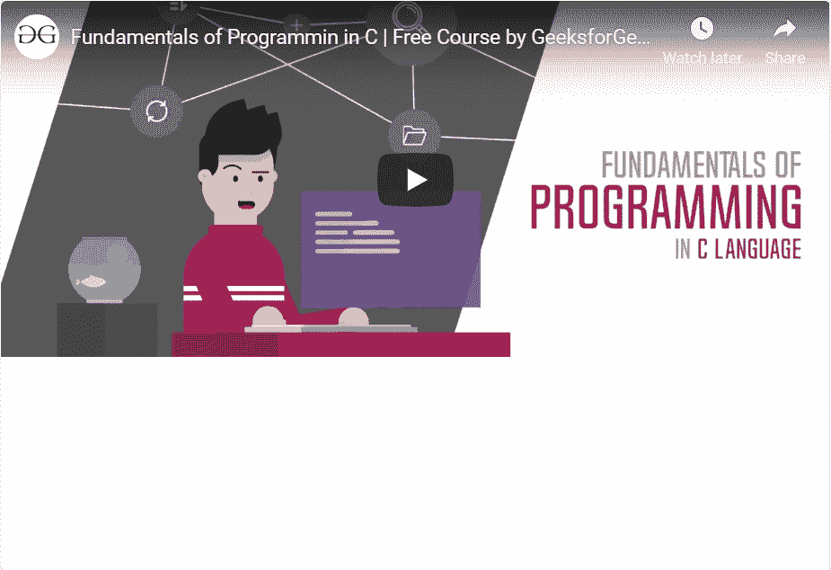

# 响应视频或幻灯片嵌入引导程序，示例

> 原文:[https://www . geesforgeks . org/responsive-video-or-slide-embedded-in-bootstrap-with-examples/](https://www.geeksforgeeks.org/responsive-video-or-slideshow-embeds-in-bootstrap-with-examples/)

Bootstrap 允许根据显示器或父元素的宽度创建响应视频或幻灯片嵌入，方法是创建可随设备缩放的原生比例。使用响应视频或幻灯片嵌入的内容可以根据屏幕大小或父容器元素自动缩放，这使得用户界面更具响应性。

Bootstrap 提供了一个名为**嵌入响应**的类来创建响应嵌入。该类被分配给包含以下任何嵌入元素的父类:< iframe >、< embed >、< video >和< object >。

可选地，除了**嵌入响应**类之外，一个以上的类*嵌入响应项*可以与嵌入元素一起使用。

Bootstrap 还提供了一些修改器类来调整元素的纵横比:

*   嵌入式响应-16by9
*   嵌入式响应-21by9
*   嵌入式响应-1by1
*   嵌入式响应-4by3

下面的程序说明了**嵌入式响应**类:

```html
<!DOCTYPE html>
<html>
<head>
    <!-- Link Bootstrap CSS -->
    <link rel="stylesheet" href="https://maxcdn.bootstrapcdn.com/bootstrap/4.0.0/css/bootstrap.min.css" integrity="sha384-Gn5384xqQ1aoWXA+058RXPxPg6fy4IWvTNh0E263XmFcJlSAwiGgFAW/dAiS6JXm" crossorigin="anonymous">

    <title>
        Responsive Video
    </title>
</head>

<body>
    <div class="embed-responsive 
                embed-responsive-21by9">
        <iframe class="embed-responsive-item" 
                src="https://www.youtube.com/embed/HMAwoMt3kek" 
                allowfullscreen>
        </iframe>
    </div>
</body>
</html>                    
```

**输出** :
