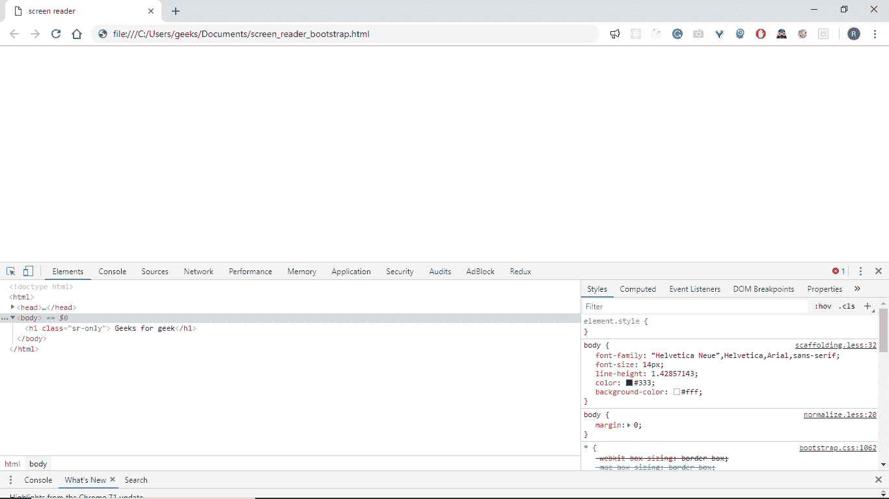

# 引导程序中的屏幕阅读器实用程序示例

> 原文:[https://www . geesforgeks . org/screen-reader-utilities-in-bootstrap-with-examples/](https://www.geeksforgeeks.org/screen-reader-utilities-in-bootstrap-with-examples/)

Bootstrap 中的**屏幕阅读器**实用程序有助于将元素限制在[屏幕阅读器](https://en.wikipedia.org/wiki/Screen_reader)内。也就是说，通过使用屏幕阅读器实用程序，我们可以隐藏除*屏幕阅读器*之外的所有其他设备中的元素。
屏幕阅读器实用程序还提供了一个选项，在聚焦时再次显示隐藏的元素。例如，当用键盘导航时。
**屏幕阅读器实用程序中提供的课程** :

*   **。sr-only** :这个类隐藏了除了屏幕阅读器之外的所有设备中的一个元素。
*   **。sr-only-focusable** :如果这个类用在一个隐藏元素上。sr-only 类，那么当被任何东西(如键盘)聚焦时，元素将是可见的。

以下示例解释了引导程序中的屏幕阅读器实用程序:

*   让我们用**创建一个标题元素。仅限 Sr**级:

## 超文本标记语言

```
<!DOCTYPE html>
<html>
<head>
    <title>screen reader</title>

    <script src="https://maxcdn.bootstrapcdn.com/bootstrap/3.3.7/js/bootstrap.min.js" ></script>
    <link rel="stylesheet" href="https://maxcdn.bootstrapcdn.com/bootstrap/3.3.7/css/bootstrap.min.css"/>
</head>

<body>
    <h1 class="sr-only">Geeks for geek</h1>
</body>
</html>
```

*   **输出** :



*   所以我们可以看到它在浏览器中不可见，但是如果我们在检查器中查看，我们可以看到它仍然在那里，但是现在没有占用屏幕上的任何空间。
*   现在让我们创建一个链接，它将作为一个跳过链接，当通过使用键盘导航获得焦点时，它将变得可见。为此，我们使用两个类**。仅限 Sr**和**。仅 sr 可聚焦**如下所示:

```
class="sr-only  sr-only-focusable" 
```

## 超文本标记语言

```
<!DOCTYPE html>
<html>
<head>
    <title>screen reader</title>

    <script src="https://maxcdn.bootstrapcdn.com/bootstrap/3.3.7/js/bootstrap.min.js" ></script>
    <link rel="stylesheet" href="https://maxcdn.bootstrapcdn.com/bootstrap/3.3.7/css/bootstrap.min.css"/>
</head>

<body>
    <a class="sr-only  sr-only-focusable"
       href="#content">
        Skip to main content
    </a>
</body>
</html>
```

*   正如我们在检查器中看到的，它就在标题元素的下面，现在它们都被隐藏了。


*   一旦按下 tab 键，跳过链接将高亮显示。


**支持的浏览器:**

*   谷歌 Chrome
*   微软公司出品的 web 浏览器
*   火狐浏览器
*   歌剧
*   旅行队