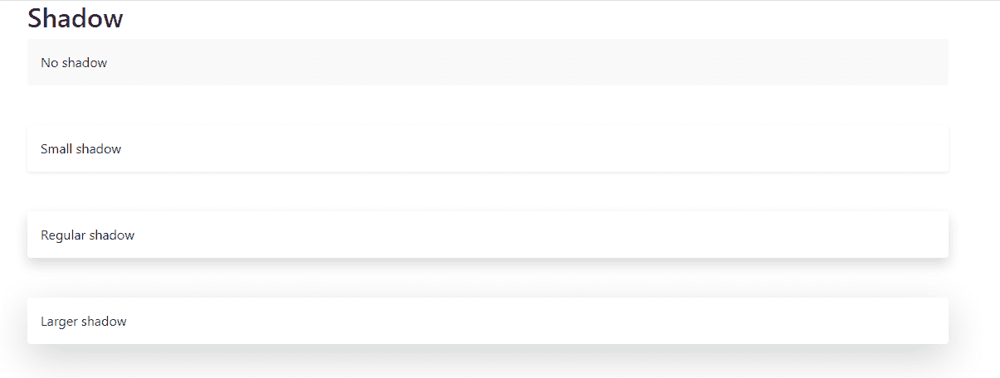
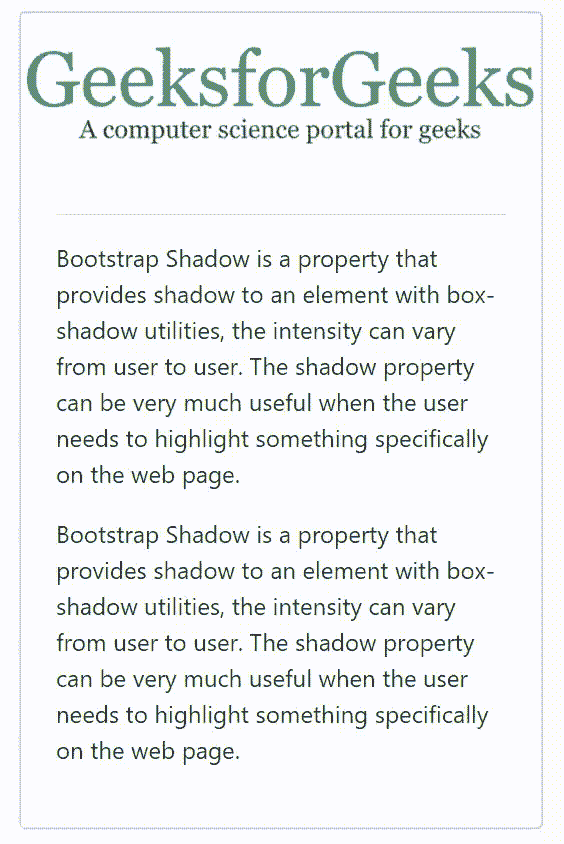

# 引导中的阴影示例

> 原文:[https://www . geesforgeks . org/shadows-in-bootstrap-with-examples/](https://www.geeksforgeeks.org/shadows-in-bootstrap-with-examples/)

**Bootstrap Shadow** 是一个属性，它使用盒状阴影实用程序为元素提供阴影，强度因用户而异。当用户需要突出显示网页上的特定内容时，shadow 属性非常有用。

**示例 1:** 以下示例表示从无阴影效果到高阴影效果的 4 种不同阴影强度。它是使用实现的。div 元素中的阴影类。

```html
<!DOCTYPE html>
<html lang="en">

<head>
    <!-- Meta tags -->
    <meta charset="utf-8">
    <meta name="viewport" content=
        "width=device-width, initial-scale=1, 
        shrink-to-fit=no">

    <!-- Bootstrap CSS -->
    <link rel="stylesheet" href=
"https://maxcdn.bootstrapcdn.com/bootstrap/4.1.3/css/bootstrap.min.css">

    <title>Bootstrap 4 Shadow</title>
</head>

<body bgcolor>
    <div class="container">
        <h2>Shadow</h2>
        <div class="shadow-none p-3 mb-5 
            bg-light rounded">No shadow</div>
        <div class="shadow-sm p-3 mb-5 
            bg-white rounded">Small shadow</div>
        <div class="shadow p-3 mb-5 
            bg-white rounded">Regular shadow</div>
        <div class="shadow-lg p-3 mb-5
            bg-white rounded">Larger shadow</div>
    </div>

    <!-- jQuery first, then Popper.js, 
        then Bootstrap JS -->
    <script src=
"https://code.jquery.com/jquery-3.2.1.slim.min.js"
        integrity=
"sha384-KJ3o2DKtIkvYIK3UENzmM7KCkRr/rE9/Qpg6aAZGJwFDMVNA/GpGFF93hXpG5KkN"
        crossorigin="anonymous">
    </script>

    <!-- Popper -->
    <script src=
"https://cdnjs.cloudflare.com/ajax/libs/popper.js/1.12.9/umd/popper.min.js"
        integrity=
"sha384-ApNbgh9B+Y1QKtv3Rn7W3mgPxhU9K/ScQsAP7hUibX39j7fakFPskvXusvfa0b4Q"
        crossorigin="anonymous">
    </script>

    <!-- Latest compiled and minified 
        Bootstrap JavaScript -->
    <script src=
"https://maxcdn.bootstrapcdn.com/bootstrap/4.0.0/js/bootstrap.min.js"
        integrity=
"sha384-JZR6Spejh4U02d8jOt6vLEHfe/JQGiRRSQQxSfFWpi1MquVdAyjUar5+76PVCmYl"
        crossorigin="anonymous">
    </script>
</body>

</html>
```

**输出:**


**示例 2:** 以下示例表示悬停在阴影框上，即当光标指向框时显示阴影，当光标从框中移除时阴影消失。这个例子中阴影的强度很高。

```html
<!DOCTYPE html>
<html lang="en">

<head>
    <meta charset="utf-8">
    <meta http-equiv="X-UA-Compatible" 
                content="IE=edge">

    <meta name="viewport" content=
        "width=device-width, initial-scale=1">

    <title>Bootstrap Shadow</title>

    <!-- Bootstrap -->
    <link rel="stylesheet" href=
"https://stackpath.bootstrapcdn.com/bootstrap/4.1.3/css/bootstrap.min.css"
        integrity=
"sha384-MCw98/SFnGE8fJT3GXwEOngsV7Zt27NXFoaoApmYm81iuXoPkFOJwJ8ERdknLPMO"
        crossorigin="anonymous">

    <style>
        .box-shadow-hover:hover {
            box-shadow: 0 2px 5px 0 
            rgba(0, 0, 0, 0.5), 0 
            2px 10px 0 rgba(0, 0, 0, 1);
        }

        .pointer {
            cursor: pointer;
        }

        img {
            width: auto;
            max-height: 100px;
        }
    </style>
</head>

<body>
    <div class="container">
        <div class="row">
            <div class="col-md-4 col-sm-6 
                            col-xl-4 my-3">
                <div class="card d-block h-100 
                    box-shadow-hover pointer">
                    <div class="pt-3 h-75p 
                        align-items-center d-flex 
                        justify-content-center">
                        
                    </div>

                    <div class="card-body p-4">

                        <hr>
                        <p>
                            Bootstrap Shadow is a property 
                            that provides shadow to an element 
                            with box-shadow utilities, the 
                            intensity can vary from user to 
                            user. The shadow property can be 
                            very much useful when the user needs
                            to highlight something specifically 
                            on the web page.
                        </p>

                        <p>
                            Bootstrap Shadow is a property that 
                            provides shadow to an element with 
                            box-shadow utilities, the intensity 
                            can vary from user to user. The 
                            shadow property can be very much 
                            useful when the user needs to 
                            highlight something specifically 
                            on the web page.
                        </p>
                    </div>
                </div>
            </div>
        </div>
    </div>

    <!-- jQuery (necessary for Bootstrap's 
        JavaScript plugins) -->
        <script src=
"https://ajax.googleapis.com/ajax/libs/jquery/1.11.1/jquery.min.js">
        </script>

        <!-- Include all compiled plugins (below), 
            or include individual files as needed -->
        <script src=
"//maxcdn.bootstrapcdn.com/bootstrap/3.3.1/js/bootstrap.min.js">
    </script>
</body>

</html>
```

**输出:**
