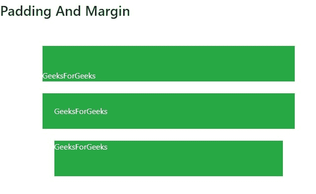

# 引导中的间距示例

> 原文:[https://www . geeksforgeeks . org/spacing-in-bootstrap-with-examples/](https://www.geeksforgeeks.org/spacing-in-bootstrap-with-examples/)

Bootstrap 有许多工具类可以轻松地为 HTML 中的元素设置样式。它包括用于修改元素外观的各种响应填充和边距类。间隔实用程序没有断点符号可应用于断点。
各种类别中使用以下语法来增加间距:

*   xs 的(属性)(边)-(大小)
*   sm、md、lg 和 xl 的(属性)(边)-(断点)-(大小)。

**属性:**有两种给元素增加间距的方法。

*   **m** :该属性定义边距。边距提供了一条边或边框。
*   **p** :该属性定义填充。填充属性用于在内容周围生成空间。

**边:**这允许用户在任何需要的地方向特定的边添加内容间距。

*   **t** :边距顶/填充顶。
*   **b** :边距-底部/填充-底部。
*   **l** :左边距/左边距。
*   **r** :右边距/右边距。
*   **x** :左边距和右边距/左边距和右边距。
*   **y** :用于填充-顶部和填充-底部/边距-顶部和边距-底部。
*   **空白**:元素各边的边距/填充。

**大小:**这允许用户向级别添加特定数量的间距。

*   **0**–0px 边距/填充。
*   **1**–4px 边距/填充。
*   **2**–8px 边距/填充。
*   **3**–16px 边距/填充。
*   **4**–24px 边距/填充。
*   **5**–48px 边距/填充。
*   **自动**–自动余量。

**断点:**断点是网站内容可以根据设备进行调整并允许向用户展示最佳布局的点。

*   sm、md、lg 和 xl 是以下断点。

**语法:**

*   对于断点–xs:

```
<div class="mt-4">
```

*   对于断点–MD:

```
<div class="mt-md-4">
```

*   对于断点–LG:

```
<div class="mt-lg-4">
```

*   对于断点–XL:

```
<div class="mt-xl-4">
```

**响应间距表:**

<figure class="table">

| screen size | kind |
| --- | --- |
| Appear in all | Go. ml-3 |
| Only appears in xs | 979 年. ml-3。ml-sm-0 突击步枪 |
| Only in sm. | 979 年. ml-sm-3 突击步枪。ml-md-0 |
| Only appears in md | 979 年。ml-md-3。ml-lg-0 突击步枪 |
| Only appears in lg | 979 年. ml-lg-3。d-xl-0 战斗机 |
| Only appears in xl | 971 . ml-XL-3 吗 |

</figure>

**例 1:**

## 超文本标记语言

```
<!DOCTYPE html>
<html>
    <head>

        <!-- Link Bootstrap CSS -->
        <link rel="stylesheet" href="https://stackpath.bootstrapcdn.com/bootstrap/4.2.1/css/bootstrap.min.css">

        <!-- Link Bootstrap Js and Jquery -->
        <script src="https://code.jquery.com/jquery-3.3.1.slim.min.js"></script>
        <script src="https://cdnjs.cloudflare.com/ajax/libs/popper.js/1.14.6/umd/popper.min.js"></script>
        <script src="https://stackpath.bootstrapcdn.com/bootstrap/4.2.1/js/bootstrap.min.js"></script>

        <title>
            GeeksForGeeks Bootstrap Spacing Example
        </title>
    </head>

    <body>
        <br>
        <tab>
        <h3>Padding And Margin</h3>

        <div class="container text-white">
            <br><br>

            <div class="pt-5 bg-success">
                GeeksForGeeks
            </div>
            <br>

            <div class="p-4 bg-success">
                GeeksForGeeks
            </div>

            <div class="m-4 pb-5 bg-success">
                GeeksForGeeks
            </div>
        </div>
    </body>
</html>
```

**输出:**



**例 2:**

## 超文本标记语言

```
<!DOCTYPE html>
<html>
<head>
    <!-- Link bootstrap CSS -->
    <link rel="stylesheet" href="https://stackpath.bootstrapcdn.com/bootstrap/4.2.1/css/bootstrap.min.css">

    <!-- Link bootstrap JS and Jquery -->
    <script src="https://code.jquery.com/jquery-3.3.1.slim.min.js"></script>
    <script src="https://cdnjs.cloudflare.com/ajax/libs/popper.js/1.14.6/umd/popper.min.js"></script>
    <script src="https://stackpath.bootstrapcdn.com/bootstrap/4.2.1/js/bootstrap.min.js"></script>

    <title>
        GeeksforGeeks Bootstrap Spacing Example
    </title>
</head>

<body>

    <div class="container"><br>
        <h4 style="color:green;">
            GeeksforGeeks is a regularly spaced.
        </h4>

        <h4 class="ml-5 ml-lg-0"style="color:green;">
            GFG Geeks1 has left margin visible on
            xs, sm and md displays.
        </h4>
    </div>

</body>
</html>                                       
```

**输出:**


**例 3:**

## 超文本标记语言

```
<!DOCTYPE html>
<html>
<head>
    <!-- Link Bootstrap CSS -->
    <link rel="stylesheet" href="https://stackpath.bootstrapcdn.com/bootstrap/4.2.1/css/bootstrap.min.css">

    <!-- Link Bootstrap JS and Jquery -->
    <script src="https://code.jquery.com/jquery-3.3.1.slim.min.js"></script>
    <script src="https://cdnjs.cloudflare.com/ajax/libs/popper.js/1.14.6/umd/popper.min.js"></script>
    <script src="https://stackpath.bootstrapcdn.com/bootstrap/4.2.1/js/bootstrap.min.js"></script>

    <title>
        GeeksForGeeks Bootstrap Spacing Example
    </title>
</head>

<body>
    <div class="container"><br>
        <div class="mx-auto" style="width:300px;
                            background-color:green;">
            <h3 style="color:white;">GeeksForGeeks</h3>
        </div>
    </div>
</body>
</html>                   
```

**输出:**


**支持的浏览器:**

*   谷歌 Chrome
*   微软公司出品的 web 浏览器
*   火狐浏览器
*   歌剧
*   旅行队