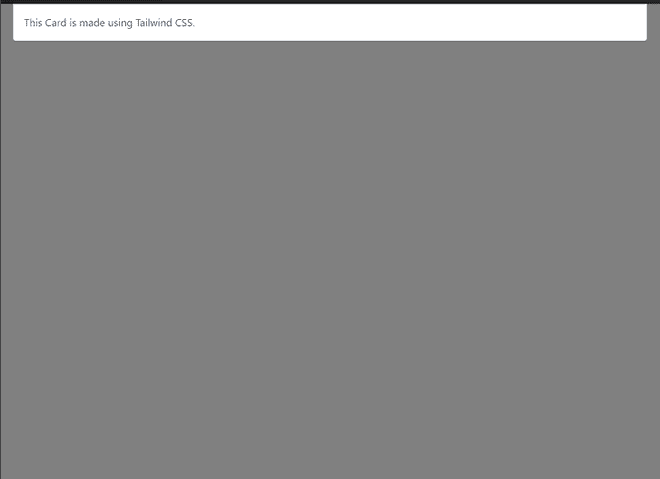
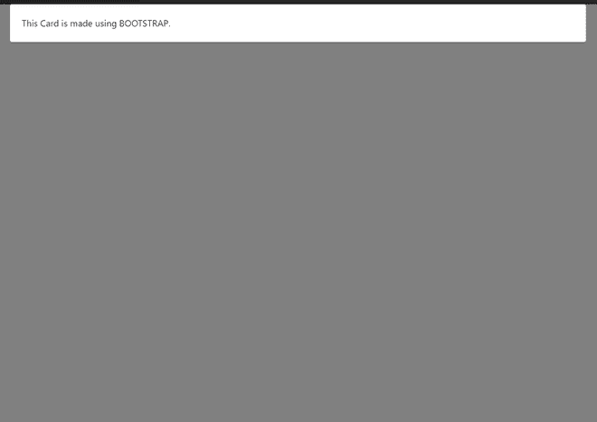

# 顺风 CSS vs 自举

> 原文:[https://www.geeksforgeeks.org/tailwind-css-vs-bootstrap/](https://www.geeksforgeeks.org/tailwind-css-vs-bootstrap/)

[Tailwind CSS](https://www.geeksforgeeks.org/introduction-to-tailwind-css/) 最初是由 Adam Wathan 开发的，第一版早在 2017 年 11 月 1 日就发布了。Tailwind CSS 是一个实用程序优先的 CSS 框架，用于快速高效地构建自定义用户界面。这是一种内联样式，用于实现流畅的界面，而无需为自己的 CSS 编写代码。顺风 CSS 提供了可定制性和灵活性来改变元素的外观和感觉。Tailwind CSS 不是第一个实用程序优先的 CSS 库，但它是最受欢迎和最轻便的库之一。这是一个高度可定制的低级 CSS 框架，它提供了开发人员为任何网站构建出色界面所需的所有构件。

[T1】CDNT3**链接:**](https://www.geeksforgeeks.org/what-is-a-content-distribution-network-and-how-does-it-work/)

> <link href="”https://unpkg.com/tailwindcss@^1.0/dist/tailwind.min.css”" rel="”stylesheet”">

***样张页面制作 u**T3**s**T6**ing tail wind CSS:**T9】*

## 超文本标记语言

```
<!DOCTYPE html>
<html>

<head>
    <!-- Tailwind CSS -->
    <link href=
"https://unpkg.com/tailwindcss@^1.0/dist/tailwind.min.css"
        rel="stylesheet">
    <title>Tailwind CSS</title>
</head>

<body style="background-color: gray;">

    <!--Card 1-->
    <div class=" w-full lg:max-w-full lg:flex">
        <div class="border-r border-b border-l 
            border-gray-400 lg:border-l-0 
            lg:border-t lg:border-gray-400 bg-white
            \rounded-b lg:rounded-b-none lg:rounded-r
            p-4 leading-normal">
            <p class="text-gray-700 text-base">
                This Card is made using Tailwind CSS.
            </p>
        </div>
    </div>
</body>

</html>
```

**输出:**



使用顺风 CSS 制作的卡片

[Bootstrap](https://www.geeksforgeeks.org/bootstrap-tutorials/) 由马克·奥托和雅各布·索顿在 2011 年 8 月的推特内部竞争中开发。这是一个开源框架，用于设计更好、更快、更容易响应的网站。这是一个初学者友好的、最受欢迎的开源框架，包括 HTML、CSS 和 JavaScript。Bootstrap 可用于创建任何服务器端技术的网络应用程序，如 Java、PHP 等。，它的响应设计允许像移动电话、平板电脑和计算机这样的平台。Bootstrap 包含基于 CSS 和 JavaScript 的设计模板，用于排版、表单、按钮、导航、图标和其他界面组件。它基于面向对象的 CSS。Bootstrap 有助于快速设计和开发网站模板。

**CDN 链接:**

> <link rel="”stylesheet”" href="”https://stackpath.bootstrapcdn.com/bootstrap/4.3.1/css/bootstrap.min.css”" integrity="”sha384-ggOyR0iXCbMQv3Xipma34MD+dH/1fQ784/j6cY/iJTQUOhcWr7x9JvoRxT2MZw1T”" crossorigin="”anonymous”">

***使用 BOOTSTRAP 制作的样本页面:***

## 超文本标记语言

```
<!DOCTYPE html>
<html>

<head>
    <!-- BOOTSTRAP -->
    <link rel="stylesheet" href=
"https://stackpath.bootstrapcdn.com/bootstrap/4.3.1/css/bootstrap.min.css"
        integrity=
"sha384-ggOyR0iXCbMQv3Xipma34MD+dH/1fQ784/j6cY/iJTQUOhcWr7x9JvoRxT2MZw1T"
        crossorigin="anonymous">
    <title>BOOTSTRAP</title>
</head>

<body style="background-color: gray;">
    <div class="card">
        <div class="card-body">
            This Card is made using BOOTSTRAP.
        </div>
    </div>
</body>

</html>
```

**输出:**



使用 BOOTSTRAP 制作的卡片

**不同版本的 Bootstrap:**

*   2.0 版本支持响应性网页设计。
*   3.0 版本支持移动优先设计。
*   4.0 版引入了 SASS 和 Flexbox 支持。

**tail wind CSS vs Bootstrap:**

<figure class="table">

| **尾风 CSS** | **自举** |
| Tail wind provides pre-designed widgets to build websites from scratch through rapid UI development. | Bootstrap comes with a set of pre-designed responsive and mobile-first components with a clear user interface suite. |
| Tailswind CSS uses a set of practical classes to create a more flexible and unique clean UI. | Sites created using the bootstrap follow a common pattern to make them look the same. |
| Websites created with Tailwind CSS are much more customizable. | The website created by Bootstraps is famous for its fast response and perfect design, but its appearance is common and similar. |
| Tailwind CSS is relatively new, and there is still much room for growth in its community. However, it is growing day by day, and the number of users, references, tools and websites related to it is also increasing. | Bootstrap is efficient and saves a lot of time. It has been in existence for more than nine years and is the most popular CSS framework. It has a large community composed of developers, forums and tools. |
| Tailwind CSS only needs the basic stylesheet file, which is as large as 27kb, making it lighter. | Bootstrap has four files that need to be included in your project to get all the benefits of CSS framework. The total size of these files is 308.25kb, including jQuery, Popper.js, Bootstrap JS and main Bootstrap CSS files. |
| 绿筠 CSS(CSS)什么事开玩笑的啦你好给我闭嘴僧曰。 | Spotify, Twitter and Lyft are all well-known companies that use Bootstrap. |

</figure>