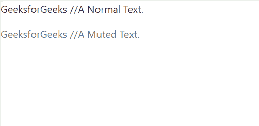
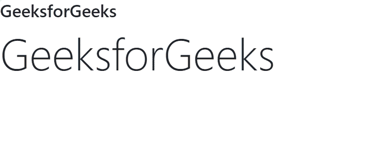
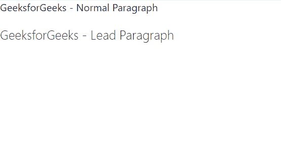
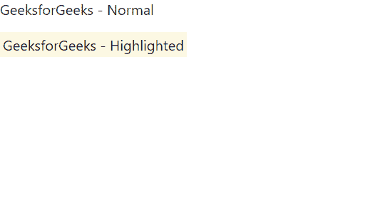
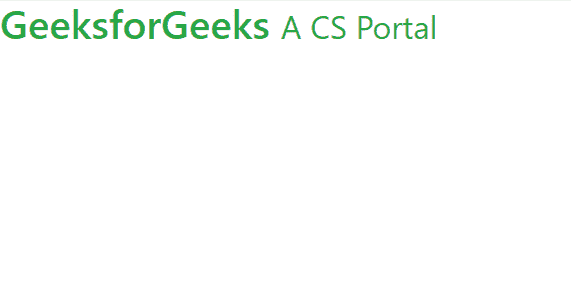
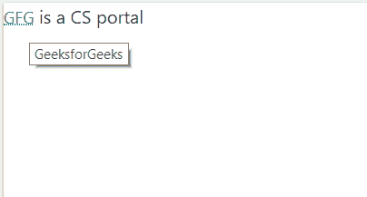
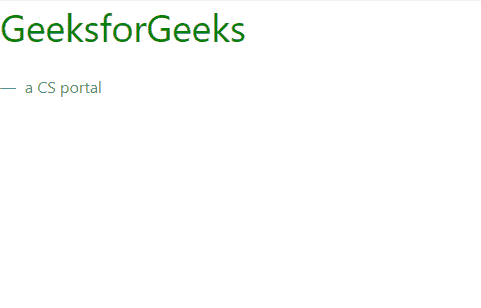
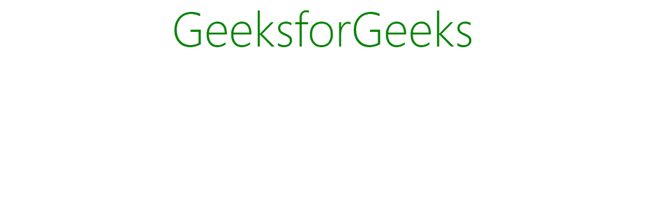

# 自举中的排版

> 原文:[https://www.geeksforgeeks.org/typography-in-bootstrap/](https://www.geeksforgeeks.org/typography-in-bootstrap/)

排版是 Bootstrap 的一个特性，用于设置文本内容的样式和格式。它用于创建自定义标题、内嵌副标题、列表、段落、对齐、添加更多面向设计的字体样式等等。引导程序支持字体堆栈、标题和链接样式的全局设置，用于各种类型的操作系统和设备的网络应用程序，以提供最佳的用户界面。
**排版可以用来创建:**

*   标题
*   副标题
*   文本和段落字体颜色、字体类型和对齐方式
*   列表
*   其他内嵌元素

**一些类和标签来实现 bootstrap 的排版功能:**

*   **文本静音**:用于文本颜色，文本静音淡化文本。即文本变灰
*   **显示**:用于创建更好的标题。
*   **引导**:用于使一个段落突出，即视觉上更好。
*   **标记**:用于突出显示文字。
*   **小**:用于创建二级副标题。
*   **初始值设定项**:用于以略小的文字大小渲染缩写。
*   **区块引用**:用于引用内容。
*   **区块报价-页脚**:是标识报价来源的页脚明细。
*   **文本居中**:用于文本居中对齐。
*   **列表-内联**:用于使列表的元素内联。
*   **文本-截断**:用于用省略号截断来缩短较长的文本。
*   **文字-大写**:用于将文字转换为大写。
*   **文字-小写**:用于将文字转换为小写。
*   **文本大写**:用于将文本转换为每个单词的第一个字母大写，其他字母小写。

**示例 1:** 说明**文本静音**类。

## 超文本标记语言

```
<!DOCTYPE html>
<html>
  <head>
    <link rel="stylesheet" href="https://stackpath.bootstrapcdn.com/bootstrap/4.2.1/css
                                 /bootstrap.min.css"
          integrity="sha384-GJzZqFGwb1QTTN6wy59ffF1BuGJpLSa9DkKMp0DgiMDm4iYMj70gZWKYbI706
                     tWS" crossorigin="anonymous">
    <title>
      Text-muted
    </title>
  </head>
  <body>
    <p >GeeksforGeeks  //A Normal Text.</p>

    <p class="text-muted">GeeksforGeeks  //A Muted Text.</p>

  </body>
</html>
```

**输出:**



class = " alignone size-medium WP-image-843349 "/>
**例 2** :举例说明**显示**类。

## 超文本标记语言

```
<!DOCTYPE html>
<html>
  <head>
    <link rel="stylesheet" href="https://stackpath.bootstrapcdn.com/bootstrap/4.2.1/css
                                 /bootstrap.min.css"
          integrity="sha384-GJzZqFGwb1QTTN6wy59ffF1BuGJpLSa9DkKMp0DgiMDm4iYMj70gZWKY
                     bI706tWS" crossorigin="anonymous">
    <title>
      Display
    </title>
  </head>
  <body>
    <h3>GeeksforGeeks</h3>
    <h3 class="display-3">GeeksforGeeks</h3>
  </body>
</html>
```

**输出:**



**例 3** :举例说明**带领**班。

## 超文本标记语言

```
<!DOCTYPE html>
<html>
  <head>
    <link rel="stylesheet" href="https://stackpath.bootstrapcdn.com/bootstrap/4.2.1/css
                                 /bootstrap.min.css"
          integrity="sha384-GJzZqFGwb1QTTN6wy59ffF1BuGJpLSa9DkKMp0DgiMDm4iYMj70gZWKYb
                     I706tWS" crossorigin="anonymous">
    <title>
      Lead
    </title>
  </head>
  <body>

<p>GeeksforGeeks - Normal Paragraph</p>

    <p class="lead">GeeksforGeeks - Lead Paragraph</p>

  </body>
</html>
```

**输出:**



**例 4** :为了说明**标记**标签。

## 超文本标记语言

```
<!DOCTYPE html>
<html>
  <head>
    <link rel="stylesheet" href="https://stackpath.bootstrapcdn.com/bootstrap/4.2.1/css
                                 /bootstrap.min.css"
          integrity="sha384-GJzZqFGwb1QTTN6wy59ffF1BuGJpLSa9DkKMp0DgiMDm4iYMj70gZWKYbI70
                     6tWS" crossorigin="anonymous">
    <title>
      Mark
    </title>
  </head>
  <body>

<p>GeeksforGeeks - Normal</p>

    <mark>GeeksforGeeks - Highlighted</mark>
  </body>
</html>
```

**输出:**



**例 5** :为了说明**小**标签。

## 超文本标记语言

```
<!DOCTYPE html>
<html>
  <head>
    <link rel="stylesheet" href="https://stackpath.bootstrapcdn.com/bootstrap/4.2.1/css
                                 /bootstrap.min.css"
          integrity="sha384-GJzZqFGwb1QTTN6wy59ffF1BuGJpLSa9DkKMp0DgiMDm4iYMj70gZWKYbI7
                     06tWS" crossorigin="anonymous">
    <title>
      Small
    </title>
  </head>
  <body>
    <h2 class="text-success">GeeksforGeeks
    <small>A CS Portal </small>
    </h2>
  </body>
</html>
```

**输出:**



**例 6** :举例说明**初始化**类。

## 超文本标记语言

```
<!DOCTYPE html>
<html>
  <head>
    <link rel="stylesheet" href="https://stackpath.bootstrapcdn.com/bootstrap/4.2.1/css
                                 /bootstrap.min.css"
          integrity="sha384-GJzZqFGwb1QTTN6wy59ffF1BuGJpLSa9DkKMp0DgiMDm4iYMj70gZWKYbI70
                     6tWS" crossorigin="anonymous">
    <title>
      Initialism
    </title>
  </head>
  <body>
    <abbr title="GeeksforGeeks" class="text-success initialism">GfG</abbr> is a CS portal
  </body>
</html>
```

**输出:**



**例 7** :举例说明**区块引用**标签和**区块引用-页脚**类。

## 超文本标记语言

```
<!DOCTYPE html>
<html>
  <head>
    <link rel="stylesheet" href="https://stackpath.bootstrapcdn.com/bootstrap/4.2.1/css
                                 /bootstrap.min.css"
          integrity="sha384-GJzZqFGwb1QTTN6wy59ffF1BuGJpLSa9DkKMp0DgiMDm4iYMj70gZWKYbI7
                     06tWS" crossorigin="anonymous">
    <title>
      Blockquote and Blockquote footer
    </title>
    <style>
      blockquote {
        font-size: 30px;
        color: green;
      }
    </style>
  </head>
  <body>
    <blockquote>GeeksforGeeks</blockquote>
    <blockquote class="blockquote-footer"> a CS portal</blockquote>
  </body>
</html>
```

**输出:**



class = " alignone size-medium WP-image-844239 "/>
**例 8** :举例说明**文本中心**类。

## 超文本标记语言

```
<!DOCTYPE html>
<html>
  <head>
    <link rel="stylesheet" href="https://stackpath.bootstrapcdn.com/bootstrap/4.2.1/css
                                 /bootstrap.min.css"
          integrity="sha384-GJzZqFGwb1QTTN6wy59ffF1BuGJpLSa9DkKMp0DgiMDm4iYMj70gZWKY
                     bI706tWS" crossorigin="anonymous">
    <title>
      Text-Center
    </title>
    <style>
      p {
        color: green;
      }
    </style>
  </head>
  <body>
    <p class="display-4 text-center">GeeksforGeeks</p>

  </body>
</html>
```

**输出:**



**支持的浏览器:**

*   谷歌 Chrome
*   微软边缘
*   火狐浏览器
*   歌剧
*   旅行队