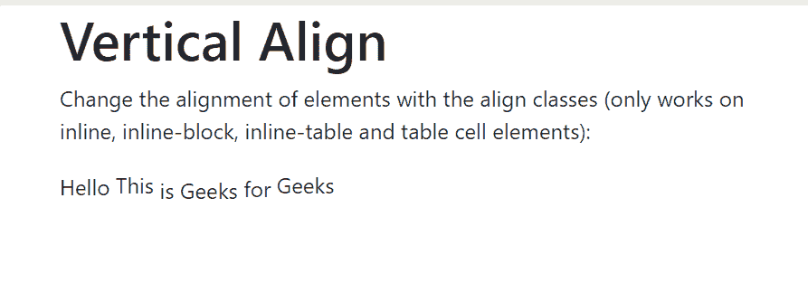
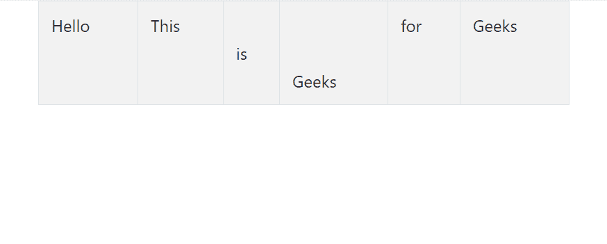

# 带示例的引导中的垂直对齐

> 原文:[https://www . geeksforgeeks . org/垂直对齐-带示例引导/](https://www.geeksforgeeks.org/vertical-alignment-in-bootstrap-with-examples/)

引导中的垂直对齐在垂直对齐工具的帮助下改变元素的垂直对齐。垂直对齐工具仅影响内联(显示在一行中)、内联块(显示为一行中的块)、内联表格和表格单元格(表格单元格中的元素)元素。
引导库中可用于垂直对齐的各种类有:

*   。对齐基线
*   。顶部对齐
*   。对齐-中间
*   。底部对齐
*   。对齐-文本-底部
*   。对齐-文本-顶部

以下示例说明了引导中的垂直对齐类:
**示例 1:** 带有内嵌元素

## 超文本标记语言

```
<!-- BootStrap Vertical alignment classes
    for inline elements -->

<!DOCTYPE html>
<html>
<head>
    <title>GeeksForGeeks</title>
    <link rel="stylesheet"
          href="https://maxcdn.bootstrapcdn.com/bootstrap/4.1.3/css/bootstrap.min.css">
    <script src="https://ajax.googleapis.com/ajax/libs/jquery/3.3.1/jquery.min.js"></script>
    <script src="https://cdnjs.cloudflare.com/ajax/libs/popper.js/1.14.3/umd/popper.min.js"></script>
    <script src="https://maxcdn.bootstrapcdn.com/bootstrap/4.1.3/js/bootstrap.min.js"></script>
</head>

<body>
    <div class="container">
        <h1>Vertical Align</h1>

<p>
            Change the alignment of elements
            with the align classes (only works
            on inline, inline-block,
            inline-table and table
            cell elements):
        </p>

        <span class="align-baseline">Hello</span>
        <span class="align-top">This</span>
        <span class="align-middle">is</span>
        <span class="align-bottom">Geeks</span>
        <span class="align-text-top">for</span>
        <span class="align-text-bottom">Geeks</span>
    </div>
</body>
</html>
```

**输出:**



**示例 2:** 带表格单元格。

## 超文本标记语言

```
<html>
<head>
    <title>GeeksForGeeks</title>
    <link rel="stylesheet" href="https://maxcdn.bootstrapcdn.com/bootstrap/4.1.3/css/bootstrap.min.css">
    <script src="https://ajax.googleapis.com/ajax/libs/jquery/3.3.1/jquery.min.js"></script>
    <script src="https://cdnjs.cloudflare.com/ajax/libs/popper.js/1.14.3/umd/popper.min.js"></script>
    <script src="https://maxcdn.bootstrapcdn.com/bootstrap/4.1.3/js/bootstrap.min.js"></script>
</head>

<body>
    <div class="container">
        <table class='table table-striped table-bordered'
               style="height: 100px;">
            <tbody>
                <tr>
                    <td class="align-baseline">
                        Hello
                    </td>
                    <td class="align-top">
                        This
                    </td>
                    <td class="align-middle">
                        is
                    </td>
                    <td class="align-bottom">
                        Geeks
                    </td>
                    <td class="align-text-top">
                        for
                    </td>
                    <td class="align-text-bottom">
                        Geeks
                    </td>
                </tr>
             </tbody>
        </table>
    </div>
</body>
</html>
```

**输出:**



**支持的浏览器:**

*   谷歌 Chrome
*   微软公司出品的 web 浏览器
*   火狐浏览器
*   歌剧
*   旅行队

**参考:**T2https://getbootstrap.com/docs/4.1/utilities/vertical-align/