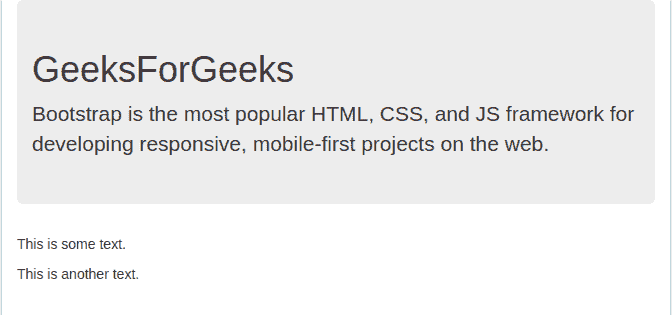

# 引导中元素的可见性，示例

> 原文:[https://www . geeksforgeeks . org/实例引导中元素的可见性/](https://www.geeksforgeeks.org/visibility-of-elements-in-bootstrap-with-examples/)

在某些情况下，需要在不影响页面布局的情况下隐藏网页上的某些内容。Bootstrap 使用 CSS 可见性属性，并提供两个可见和不可见的类来控制网页上元素的可见性。
这些类不影响布局即**不可见的**元素仍会占用布局中的空间。内容将隐藏在视觉和屏幕阅读器。
**隐形类**
这个类的 bootstrap 用来隐藏页面中的某个元素。在下面的程序中，标题 h2“引导教程”是使用这个类隐藏的。这个类主要使用 CSS 的**可见性**属性，并将其值设置为隐藏。即使标题**引导教程**是**不可见的**，它仍然会占用布局中的空间。

## 超文本标记语言

```
<!DOCTYPE html>
<html>
<head>
  <title>GeeksForGeeks</title>

  <!-- Import Jquery -->
  <script src=
  "https://ajax.googleapis.com/ajax/libs/jquery/3.3.1/jquery.min.js">
  </script>

  <!-- Import Bootstrap CSS and JS files -->
  <link rel="stylesheet" 
   href="https://maxcdn.bootstrapcdn.com/bootstrap/3.3.7/css/bootstrap.min.css" />
  <script src=
  "https://maxcdn.bootstrapcdn.com/bootstrap/3.3.7/js/bootstrap.min.js">
  </script>
</head>

<body>
    <div class="container">
      <div class="jumbotron">

        <!-- Making invisible -->
        <h1 class="invisible">Bootstrap Tutorial</h1>  

<p>
            Bootstrap is the most popular HTML, CSS, and
            JS framework for developing responsive,
            mobile-first projects on the web.
        </p>

      </div>

<p>This is some text.</p>

<p>This is another text.</p>

    </div>
</body>
</html>
```

**输出:**


**可见类**
这个类的 bootstrap 用于从页面中取消隐藏一个隐藏的元素。在下面的程序中，标题 h2“引导教程”使用这个类可见。这个类主要使用 CSS 的**可见性**属性，并将其值设置为*可见性*。
可见的**类在下面的例子中没有效果，因为元素默认是可见的，但是当一个以前不可见的元素变成可见时，这个类会有帮助。以编程方式。** 

## **超文本标记语言**

```
<!DOCTYPE html>
<html>
<head>
  <title>GeeksForGeeks</title>

  <!-- Import Jquery -->
  <script src=
  "https://ajax.googleapis.com/ajax/libs/jquery/3.3.1/jquery.min.js">
  </script>

  <!-- Import Bootstrap CSS and JS -->
  <link rel="stylesheet"
    href="https://maxcdn.bootstrapcdn.com/bootstrap/3.3.7/css/bootstrap.min.css">
  <script src=
  "https://maxcdn.bootstrapcdn.com/bootstrap/3.3.7/js/bootstrap.min.js">
  </script>
</head>

<body>
    <div class="container">
      <div class="jumbotron">

        <!-- Making visible -->
        <h1 class="visible">GeeksForGeeks</h1>     

<p>
            Bootstrap is the most popular HTML, CSS,
            and JS framework for developing responsive,
            mobile-first projects on the web.
        </p>

      </div>

<p>This is some text.</p>

<p>This is another text.</p>

    </div>
</body>
</html>
```

****输出:**** 

****

****要点** :** 

*   **Bootstrap 的**可见**和**不可见**类使用 CSS 的*可见性*属性来隐藏和取消隐藏元素。**
*   **隐藏的元素仍然会占用布局空间。这个类只是隐藏和元素，并不移除它。**
*   **这些类不会以任何方式影响或使用 CSS 的**显示**属性来隐藏或取消隐藏元素。**

****参考:**T2https://getbootstrap.com/docs/4.1/utilities/visibility/**