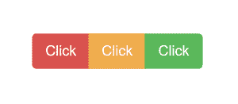
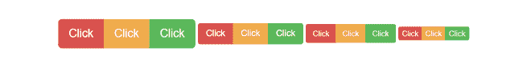
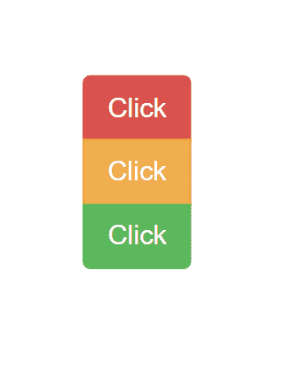
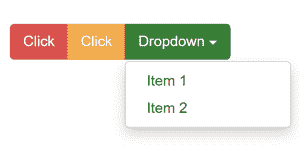

# Bootstrap 中有哪些按钮组？

> 原文:[https://www . geesforgeks . org/什么是引导中的按钮组/](https://www.geeksforgeeks.org/what-are-button-groups-in-bootstrap/)

Bootstrap 中的“按钮组”是一个名为“btn-group”的类，用于垂直或水平地创建一系列按钮组(没有空格)。

这是按钮组类的基本语法，其中每个按钮都有自己的“btn”类。

```html
<div class="btn-group">
    <button type="button" class="btn">Click</button>
</div>
```

按钮在组的第一个和最后一个按钮上有默认的边框半径。

**在按钮上添加样式:**引导程序允许您使用以下类向按钮添加样式:

*   。BTN-默认
*   。BTN-初级
*   。BTN-成功
*   。btn 信息
*   。BTN-警告
*   。BTN-危险
*   .btn-link

**示例:**

## 超文本标记语言

```html
<!DOCTYPE html>
<html lang="en">

<head>
    <title>Bootstrap Example</title>
    <meta charset="utf-8">
    <meta name="viewport" content=
        "width=device-width, initial-scale=1">
    <link rel="stylesheet" href=
"https://maxcdn.bootstrapcdn.com/bootstrap/4.5.2/css/bootstrap.min.css">
    <script src=
"https://ajax.googleapis.com/ajax/libs/jquery/3.5.1/jquery.min.js">
    </script>
    <script src=
"https://cdnjs.cloudflare.com/ajax/libs/popper.js/1.16.0/umd/popper.min.js">
    </script>
    <script src=
"https://maxcdn.bootstrapcdn.com/bootstrap/4.5.2/js/bootstrap.min.js">
    </script>
</head>

<body>
    <div class="btn-group">
        <button type="button" class="btn btn-danger">Click</button>
        <button type="button" class="btn btn-warning">Click</button>
        <button type="button" class="btn btn-success">Click</button>
    </div>
</body>

</html>
```

输出:



**按钮的大小:** Bootstrap 提供 4 种按钮大小，您可以通过在“btn-group”类中添加一个额外的“btn-group-*”类来直接添加到按钮中。不需要为每个按钮添加单独的类。

所有 4 种尺寸均可按如下方式使用:

## 超文本标记语言

```html
<!DOCTYPE html>
<html lang="en">

<head>
    <title>Bootstrap Example</title>
    <meta charset="utf-8">
    <meta name="viewport" content=
        "width=device-width, initial-scale=1">
    <link rel="stylesheet" href=
"https://maxcdn.bootstrapcdn.com/bootstrap/4.5.2/css/bootstrap.min.css">
    <script src=
"https://ajax.googleapis.com/ajax/libs/jquery/3.5.1/jquery.min.js">
    </script>
    <script src=
"https://cdnjs.cloudflare.com/ajax/libs/popper.js/1.16.0/umd/popper.min.js">
    </script>
    <script src=
"https://maxcdn.bootstrapcdn.com/bootstrap/4.5.2/js/bootstrap.min.js">
    </script>
</head>

<body>
    <div class="btn-group btn-group-lg">
        <button type="button" class="btn btn-danger">Click</button>
        <button type="button" class="btn btn-warning">Click</button>
        <button type="button" class="btn btn-success">Click</button>
    </div>
    <div class="btn-group">
        <button type="button" class="btn btn-danger">Click</button>
        <button type="button" class="btn btn-warning">Click</button>
        <button type="button" class="btn btn-success">Click</button>
    </div>
    <div class="btn-group btn-group-sm">
        <button type="button" class="btn btn-danger">Click</button>
        <button type="button" class="btn btn-warning">Click</button>
        <button type="button" class="btn btn-success">Click</button>
    </div>
    <div class="btn-group btn-group-xs">
        <button type="button" class="btn btn-danger">Click</button>
        <button type="button" class="btn btn-warning">Click</button>
        <button type="button" class="btn btn-success">Click</button>
    </div>
</body>

</html>
```

**输出:**



**垂直按钮组:** Bootstrap 还支持垂直堆叠而非水平堆叠的垂直按钮组。使用类别“btn-group-vertical”创建垂直按钮组:

## 超文本标记语言

```html
<!DOCTYPE html>
<html lang="en">

<head>
    <title>Bootstrap Example</title>
    <meta charset="utf-8">
    <meta name="viewport" content=
        "width=device-width, initial-scale=1">
    <link rel="stylesheet" href=
"https://maxcdn.bootstrapcdn.com/bootstrap/4.5.2/css/bootstrap.min.css">
    <script src=
"https://ajax.googleapis.com/ajax/libs/jquery/3.5.1/jquery.min.js">
    </script>
    <script src=
"https://cdnjs.cloudflare.com/ajax/libs/popper.js/1.16.0/umd/popper.min.js">
    </script>
    <script src=
"https://maxcdn.bootstrapcdn.com/bootstrap/4.5.2/js/bootstrap.min.js">
    </script>
</head>

<body>
    <div class="btn-group-vertical">
        <button type="button" class="btn btn-danger">Click</button>
        <button type="button" class="btn btn-warning">Click</button>
        <button type="button" class="btn btn-success">Click</button>
    </div>
</body>

</html>
```

**输出:**



**按钮嵌套:**引导程序允许您通过嵌套在按钮下创建下拉菜单。在主“btn-group”类中添加一个“btn-group”类，以便在按钮中有一个下拉菜单:

## 超文本标记语言

```html
<!DOCTYPE html>
<html lang="en">

<head>
    <title>Bootstrap Example</title>
    <meta charset="utf-8">
    <meta name="viewport" content=
        "width=device-width, initial-scale=1">
    <link rel="stylesheet" href=
"https://maxcdn.bootstrapcdn.com/bootstrap/4.5.2/css/bootstrap.min.css">
    <script src=
"https://ajax.googleapis.com/ajax/libs/jquery/3.5.1/jquery.min.js">
    </script>
    <script src=
"https://cdnjs.cloudflare.com/ajax/libs/popper.js/1.16.0/umd/popper.min.js">
    </script>
    <script src=
"https://maxcdn.bootstrapcdn.com/bootstrap/4.5.2/js/bootstrap.min.js">
    </script>
</head>

<body>
    <div class="btn-group">
        <button type="button" class="btn btn-danger">Click</button>
        <button type="button" class="btn btn-warning">Click</button>
        <div class="btn-group">
            <button type="button" class="btn btn-success 
                dropdown-toggle" data-bs-toggle="dropdown"
                aria-expanded="false">Dropdown 
            </button>
            <ul class="dropdown-menu" aria-labelledby="btnGroupDrop1">
                <li><a class="dropdown-item" href="#">Item 1</a></li>
                <li><a class="dropdown-item" href="#">Item 2</a></li>
            </ul>
        </div>
    </div>
</body>

</html>
```

**输出:**

