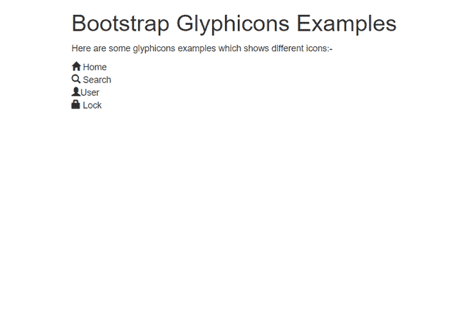
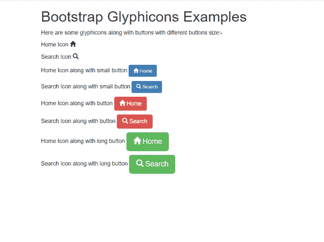

# Bootstrap 中的水纹是什么？

> 原文:[https://www . geeksforgeeks . org/bootstrap 中的什么是字体/](https://www.geeksforgeeks.org/what-are-glyphicons-in-bootstrap/)

Bootstrap 提供了一组图形图标、符号和字体，称为**graphics**。一些图标，如主页图标、用户图标、锁定图标等。一般来说，字体是图标字体，你可以在你的网络项目中使用。自举包括 260 个字体**。**这些用于网络项目的图案来自**自举图案半身人套装**。雕刻半身人不是免费提供的，但是他们的创造者让他们可以免费使用自举。

**应用:**

*   在网络项目中更有效、更容易理解。
*   用于一些文字、表格、按钮、导航等。
*   给任何网络项目有效和真实的外观。
*   用它来定义任何东西，都很容易。

现在让我们看看如何在 Bootstrap 中使用字体

**方法:**要在 Bootstrap 中使用 Glyphicons 图标，请在代码的任何地方使用以下代码。在图标和文本之间留出适当的空白，例如:

```html
<span class = "glyphicon glyphicon-search"></span>
```

在所有其他样式表之前将 Bootstrap3 和 jQuery CDN 包含到标签中，以加载我们的 CSS。

> <src = " https://Ajax . Google APIs . com/Ajax/libs/jquery/1 . 12 . 0/jquery . min . js "></script><src = " https://maxcdn . bootstracdn . com/bootstrap/3 . 3 . 6/脚本

**示例 1:** 在本例中，我们将看到 bootstrap 中的字体以及如何在网页中使用它。

## 超文本标记语言

```html
<!DOCTYPE html>
<html>

<head>
    <meta charset="utf-8">
    <link rel="stylesheet" href=
"https://maxcdn.bootstrapcdn.com/bootstrap/3.3.6/css/bootstrap.min.css">
    <script src=
"https://ajax.googleapis.com/ajax/libs/jquery/1.12.0/jquery.min.js">
    </script>
    <script src=
"https://maxcdn.bootstrapcdn.com/bootstrap/3.3.6/js/bootstrap.min.js">
    </script>
</head>

<body>
    <div class="container">
        <h1>Bootstrap Glyphicons Examples</h1>

        <p>
            Here are some glyphicons examples 
            which shows different icons:-
        </p>

        <span class="glyphicon glyphicon-home"></span> Home<br>
        <span class="glyphicon glyphicon-search"></span> Search<br>
        <span class="glyphicon glyphicon-user"> </span>User<br>
        <span class="glyphicon glyphicon-lock"> </span> Lock
    </div>
</body>

</html>
```

**输出:**



**自举图形示例**

**示例 2:** 在本例中，我们将使用纹理以及不同按钮大小的按钮。

## 超文本标记语言

```html
<!DOCTYPE html>
<html>

<head>
    <meta charset="utf-8">
    <link rel="stylesheet" href=
"https://maxcdn.bootstrapcdn.com/bootstrap/3.3.6/css/bootstrap.min.css">
    <script src=
"https://ajax.googleapis.com/ajax/libs/jquery/1.12.0/jquery.min.js">
    </script>
    <script src=
"https://maxcdn.bootstrapcdn.com/bootstrap/3.3.6/js/bootstrap.min.js">
    </script>
</head>

<body>
    <div class="container">
        <h1>Bootstrap Glyphicons Examples</h1>

        <p>
            Here are some glyphicons along with 
            buttons with different buttons size:-
        </p>

        <p>
            Home Icon <span class=
            "glyphicon glyphicon-home"></span><br>
        </p>

        <p>
            Search Icon <span class=
            "glyphicon glyphicon-search"></span> <br>
        </p>

        <p>Home Icon along with small button
            <button type="button" 
                class="btn btn-sm btn-primary">
                <span class="glyphicon 
                    glyphicon-home"></span> Home
            </button>
        </p>

        <p>Search Icon along with small button
            <button type="button" 
                class="btn btn-sm btn-primary">
                <span class="glyphicon 
                    glyphicon-search"></span> Search
            </button>
        </p>

        <p>Home Icon along with button
            <button type="button" 
                class="btn btn-danger">
                <span class="glyphicon 
                    glyphicon-home"></span> Home
            </button>
        </p>

        <p>Search Icon along with button
            <button type="button" 
                class="btn btn-danger">
                <span class="glyphicon 
                    glyphicon-search"></span> Search
            </button>
        </p>

        <p>Home Icon along with long button
            <button type="button" 
                class="btn btn-lg btn-success">
                <span class="glyphicon 
                    glyphicon-home"></span> Home
            </button>
        </p>

        <p>Search Icon along with long button
            <button type="button" 
                class="btn btn-lg btn-success">
                <span class="glyphicon 
                    glyphicon-search"></span> Search
            </button>
        </p>

    </div>
</body>

</html>
```

**输出:**



**不同大小按钮的引导图**