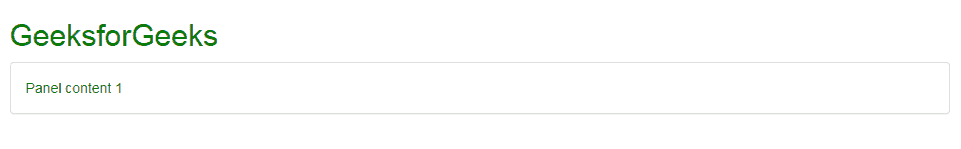
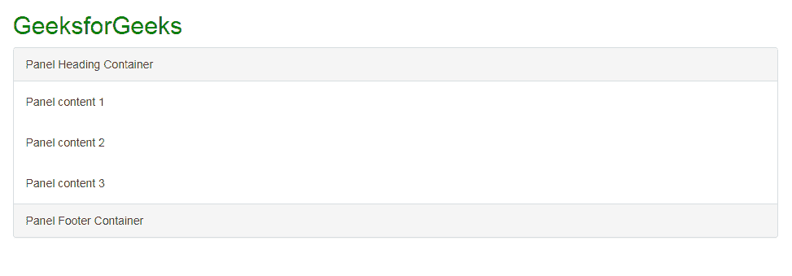
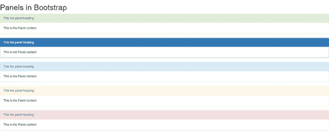
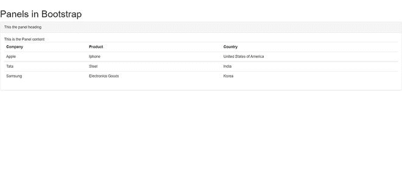

# Bootstrap 3 中有哪些面板？

> 原文:[https://www . geesforgeks . org/bootstrap-3 中的面板是什么/](https://www.geeksforgeeks.org/what-are-panels-in-bootstrap-3/)

A **面板**是 bootstrap 中的一个组件，它基本上是一个框架或容器，由一些文本、列表或表格等形式的内容组成。周围有一些填充物。

面板支持多种内容。通过使用 bootstrap 提供的不同类，标题、页脚或上下文选项也可以添加到面板中。

引导程序中面板的一些主要类别如下:

*   **。面板标题–**它向面板添加标题容器。
*   **。面板页脚–**它向面板添加一个页脚容器。
*   **。面板组–**它清除每个面板的底部边缘。
*   **。卡体–**它在面板内创建一个填充部分。

**基本面板:**可以使用**创建基本引导面板。面板类**在需要创建面板的 HTML 代码的 div 标签中，面板内部的内容或主体应该在**中。面板主体类**，它基本上在内容周围创建填充。另外，添加**。面板-默认类**到面板的 div 标签来设置面板的样式并制作面板的实心边框。

```html
<div class="panel panel-default">
    <div class="panel-body">
        Panel content
    </div>
</div>
```

在代码中包含以下样式表链接，为面板添加基本样式和结构。

> <link rel="”stylesheet”" href="”https://maxcdn.bootstrapcdn.com/bootstrap/3.4.1/css/bootstrap.min.css”">

**示例 1:** 在本例中，我们使用 Bootstrap 创建了一个基本面板。

## 超文本标记语言

```html
<!DOCTYPE html>

<html>

<head>
    <title>Panel example</title>

    <link rel="stylesheet" href=
"https://maxcdn.bootstrapcdn.com/bootstrap/3.4.1/css/bootstrap.min.css">
</head>

<body>
    <div class="container">
        <h2 style="color: green;">
            GeeksforGeeks
        </h2>

        <div class="panel panel-default">
            <div class="panel-body">
                Panel content 1
            </div>
        </div>
    </div>
</body>

</html>
```

**输出:**



正如您在输出中看到的，已经创建了一个带有默认样式的基本面板，并且在其内容周围有填充。

**示例 2:** 在本例中，我们正在创建一个具有页眉和页脚容器的面板。

## 超文本标记语言

```html
<!DOCTYPE html>
<html>

<head>
    <title>Panel example</title>

    <link rel="stylesheet" href=
"https://maxcdn.bootstrapcdn.com/bootstrap/3.4.1/css/bootstrap.min.css">
</head>

<body>
    <div class="container">
        <h2 style="color: green;">
            GeeksforGeeks
        </h2>

        <div class="panel panel-default">
            <div class="panel-heading">
                Panel Heading Container
            </div>
            <div class="panel-body">
                Panel content 1
            </div>
            <div class="panel-body">
                Panel content 2
            </div>
            <div class="panel-body">
                Panel content 3
            </div>
            <div class="panel-footer">
                Panel Footer Container
            </div>
        </div>
    </div>

</body>

</html>
```

**输出:**



正如您在输出中看到的，已经创建了一个面板，其中有一个页眉和页脚容器，内容(即文本)周围有填充，并且具有默认样式。

### 向面板添加上下文替代项

我们可以让我们的面板对使用上下文类的用户更有吸引力和意义。

#### 语法:

```html
<div class="panel panel-primary">
</div>
<div class="panel panel-success"></div>
```

#### 完整代码:

## 超文本标记语言

```html
<!DOCTYPE html>
<html lang="en">

<head>
    <meta charset="UTF-8">
    <meta http-equiv="X-UA-Compatible" content="IE=edge">
    <meta name="viewport" content="width=device-width, initial-scale=1.0">
    <link rel="stylesheet" href="https://maxcdn.bootstrapcdn.com/bootstrap/3.4.1/css/bootstrap.min.css">
    <title>Document</title>
</head>

<body>
    <h1>Panels in Bootstrap </h1>
    <div class="panel panel-success">
        <div class="panel-heading">This the panel heading</div>
        <div class="panel-body">
            This is the Panel content
        </div>
    </div>
    <div class="panel panel-primary">
        <div class="panel-heading">This the panel heading</div>
        <div class="panel-body">
            This is the Panel content
        </div>
    </div>
    <div class="panel panel-info">
        <div class="panel-heading">This the panel heading</div>
        <div class="panel-body">
            This is the Panel content
        </div>
    </div>
    <div class="panel panel-warning">
        <div class="panel-heading">This the panel heading</div>
        <div class="panel-body">
            This is the Panel content
        </div>
    </div>
    <div class="panel panel-danger">
        <div class="panel-heading">This the panel heading</div>
        <div class="panel-body">
            This is the Panel content
        </div>
    </div>
    <script src="https://stackpath.bootstrapcdn.com/bootstrap/3.4.1/js/bootstrap.min.js"
        integrity="sha384-aJ21OjlMXNL5UyIl/XNwTMqvzeRMZH2w8c5cRVpzpU8Y5bApTppSuUkhZXN0VxHd"
        crossorigin="anonymous"></script>
</body>

</html>
```

#### 输出:



### 带桌子的面板

我们还可以在面板内添加表格，使其具有无缝设计。类似的代码如下:

#### 代码:

## 超文本标记语言

```html
<!DOCTYPE html>
<html lang="en">

<head>
    <meta charset="UTF-8">
    <meta http-equiv="X-UA-Compatible" content="IE=edge">
    <meta name="viewport" content="width=device-width, initial-scale=1.0">
    <link rel="stylesheet" href="https://maxcdn.bootstrapcdn.com/bootstrap/3.4.1/css/bootstrap.min.css">
    <title>Document</title>
</head>

<body>
    <h1>Panels in Bootstrap </h1>
    <div class="panel panel-default">
        <div class="panel-heading">This the panel heading</div>
        <div class="panel-body">
            This is the Panel content
            <table class="table">
                <tr>
                    <th>Company</th>
                    <th>Product</th>
                    <th>Country</th>
                </tr>
                <tr>
                    <td>Apple</td>
                    <td>Iphone</td>
                    <td>United States of America</td>
                </tr>
                <tr>
                    <td>Tata</td>
                    <td>Steel</td>
                    <td>India</td>
                </tr>
                <tr>
                    <td>Samsung</td>
                    <td>Electronics Goods</td>
                    <td>Korea</td>
                </tr>

            </table>
        </div>

    </div>

    <script src="https://stackpath.bootstrapcdn.com/bootstrap/3.4.1/js/bootstrap.min.js"
        integrity="sha384-aJ21OjlMXNL5UyIl/XNwTMqvzeRMZH2w8c5cRVpzpU8Y5bApTppSuUkhZXN0VxHd"
        crossorigin="anonymous"></script>
</body>

</html>
```

#### 输出:



### 支持的浏览器:

*   谷歌 Chrome
*   微软边缘
*   旅行队
*   勇敢的浏览器
*   Mozilla Firefox
*   歌剧