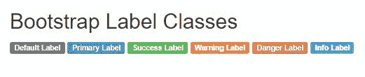
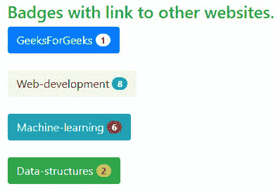

# Bootstrap 中有哪些标签和徽章？

> 原文:[https://www . geeksforgeeks . org/什么是引导标签和徽章/](https://www.geeksforgeeks.org/what-are-the-labels-and-badges-in-bootstrap/)

在本文中，我们将学习引导标签和徽章及其实现。 [**Bootstrap**](https://www.geeksforgeeks.org/bootstrap-tutorials/) 是一个免费的开源工具集合，用于创建响应性网站和网络应用。 Bootstrap 是最流行的前端框架之一，它有一组非常好的预定义 CSS 代码。Bootstrap 使用不同类型的类来创建响应性网站。引导标签和徽章用于指定附加信息。徽章通过使用相对字体大小来缩放以匹配直接父元素的大小。标签告知关于链接或文本的附加信息。

**标签:** Bootstrap ' **。label'** 类是一个预定义的类，它提供了与网页上的链接或文本相关的重要附加细节，如警告、计数、更新、提醒和提示等。以不同的格式。&还为网页内容添加样式。

**语法:**

```
<span class="label label-primary">Content</span>
```

**类型:**以下是 Bootstrap 中可用的 6 种标签类型:

*   **标签-默认**:顾名思义，这是使用的默认标签，当没有其他标签用于一个元素时。
*   **标签-主要**:这个标签是通过给元素添加蓝色来表示一些重要的标签。
*   **标签-成功**:该标签通过给元素添加绿色来表示成功或者一些积极的动作标签。
*   **标签信息:**该标签用于通过向元素添加浅蓝色来指示信息标签。
*   **标签-警告**:该标签用于通过给元素添加黄色来指示警告或负面动作标签。
*   **标签-危险**:该标签用于通过给元素添加红色来指示危险或消极动作标签。

**方法:**我们将按照以下方法实现标签:

*   在所有其他样式表之前，在标签中包含引导 CDN，以加载我们的 CSS。

> <link rel="”stylesheet”" href="”https://maxcdn.bootstrapcdn.com/bootstrap/3.3.6/css/bootstrap.min.css”">

*   用类容器在 HTML 体中添加标签。
*   用**声明标签。在 html 正文中标注**类。
*   添加不同的标签，例如。标签-成功，。标签-主要，。标签-危险，为标签添加背景色的类。

**示例 1:** 这个示例说明了标签的实现。

## 超文本标记语言

```
<!DOCTYPE html>
<html lang="en">

<head>
    <title>Bootstrap Label Example</title>
    <link rel="stylesheet" href=
"https://maxcdn.bootstrapcdn.com/bootstrap/3.3.6/css/bootstrap.min.css" />
</head>

<body>
    <div class="container">
        <h2>Bootstrap Label Example</h2>
        <h6>GeeksForGeeks
            <span class="label label-success">New</span>
        </h6>

        <h5>GeeksForGeeks
            <span class="label label-primary">New</span>
        </h5>

        <h4>GeeksForGeeks
            <span class="label label-success">New</span>
        </h4>

        <h3>GeeksForGeeks
            <span class="label label-warning">New</span>
        </h3>

        <h2>GeeksForGeeks
            <span class="label label-danger">New</span>
        </h2>

        <h1>GeeksForGeeks
            <span class="label label-default">New</span>
        </h1>
    </div>
</body>

</html>
```

**输出:**


**示例 2:** 此示例说明了具有不同预定义上下文类别的标签。

## 超文本标记语言

```
<!DOCTYPE html>
<html lang="en">

<head>
    <link rel="stylesheet" href=
"https://maxcdn.bootstrapcdn.com/bootstrap/3.4.1/css/bootstrap.min.css" />
</head>

<body>
    <div class="container">
        <h2>Bootstrap Label Classes</h2>
        <span class="label label-default">Default Label</span>
        <span class="label label-primary">Primary Label</span>
        <span class="label label-success">Success Label</span>
        <span class="label label-warning">Warning Label</span>
        <span class="label label-danger">Danger Label</span>
        <span class="label label-info">Info Label</span>
    </div>
</body>

</html>
```

**输出:**



**徽章:**徽章是用于显示指示器或计数的简单基本组件。这对于邮件计数和警报非常有用。徽章和标签是一样的，除了它们有更多的圆角。徽章通过使用相对字体大小和 em 单位来缩放以匹配直接父元素的大小。这些可以使用预定义的**。徽章'**类。详情请参考 [Bootstrap-5 徽章](https://www.geeksforgeeks.org/bootstrap-5-badges/)文章。

**语法:**

```
<div class="badge bg-type"> Contents... <div>
```

**类型:**以下是 Bootstrap 5 中提供的 8 种背景类型。

*   **bg-primary:** 用于给元素添加蓝色背景，突出元素的重要性。
*   **bg-info:** 通过给元素添加浅蓝色的背景色来表示一些信息。
*   **bg-success:** 通过对一个元素使用绿色背景色来表示成功或积极的行动。
*   **BG-危险**:用红色背景色给一个元素表示危险或消极动作。
*   **bg-warning** :用于对一个元素使用黄色背景色来表示警告或否定动作。
*   **bg-secondary:** 通过对一个元素使用灰色背景色来表示非信息或次要动作。
*   **bg-light** :用于表示一个元素的透明背景色。
*   **bg-dark** :用于表示一个元素的深灰色背景色。

**方法:**我们将通过以下方法实现徽章:

*   在所有其他样式表之前，在标签中包含引导 CDN，以加载我们的 CSS。

> <link rel="”stylesheet”" href="”https://maxcdn.bootstrapcdn.com/bootstrap/3.3.6/css/bootstrap.min.css”">

*   用类容器在 HTML 体中添加标签。
*   在<button>标签中添加带有班级徽章的。</button>

**注意:**你也可以使用<一个>标签添加其他网站的链接，当点击按钮时就会打开该标签。

**示例 1:** 该示例说明了按钮内部的徽章。

## 超文本标记语言

```
<!DOCTYPE html>
<html lang="en">

<head>
    <link rel="stylesheet" href=
"https://maxcdn.bootstrapcdn.com/bootstrap/3.3.6/css/bootstrap.min.css" />
</head>

<body>
    <div class="container">
        <h2>Bootstrap Badge Example</h2>
        <button type="button" class="btn btn-danger">
            Danger <span class="badge">10</span>
        </button>
        <button type="button" class="btn btn-success">
            Success <span class="badge">12</span>
        </button>
        <button type="button" class="btn btn-warning">
            Warning <span class="badge">20</span>
        </button>
        <button type="button" class="btn btn-primary">
            Warning <span class="badge">25</span>
        </button>
        <button type="button" class="btn btn-info">
            Warning <span class="badge">6</span>
        </button>
    </div>
</body>

</html>
```

**输出:**


**示例 2:** 这个示例说明了带有其他网站链接的徽章，并且还使用了“药丸徽章”来使角变得更圆，像药丸一样。

## 超文本标记语言

```
<!DOCTYPE html>

<head>
    <title>Pill badge example</title>

    <link rel="stylesheet" href=
"https://maxcdn.bootstrapcdn.com/bootstrap/4.1.0/css/bootstrap.min.css" />
</head>

<body>
    <div class="container">
        <h4 class="text-success">
            Badges with link to other websites.
        </h4>

        <a href="https://www.geeksforgeeks.org/">
            <button type="button" class="btn btn-primary">
                GeeksForGeeks <span class=
                "badge badge-pill badge-light">1</span>
            </button>
        </a>

        <a href=
"https://www.geeksforgeeks.org/web-development/?ref=shm">
            <button type="button" 
                class="btn btn-default">
                Web-development <span class=
                "badge badge-pill badge-info">8</span>
            </button>
        </a>

        <a href=
"https://www.geeksforgeeks.org/machine-learning/?ref=shm">
            <button type="button" class="btn btn-info">
                Machine-learning <span class=
                "badge badge-pill badge-danger">6</span>
            </button>
        </a>

        <a href=
"https://www.geeksforgeeks.org/data-structures/?ref=shm">
            <button type="button" class="btn btn-success">
                Data-structures <span class=
                "badge badge-pill badge-warning">2</span>
            </button>
        </a>
    </div>
</body>

</html>
```

**输出:**



**支持的浏览器:**

*   谷歌 Chrome
*   火狐浏览器
*   微软公司出品的 web 浏览器
*   微软边缘
*   旅行队
*   歌剧