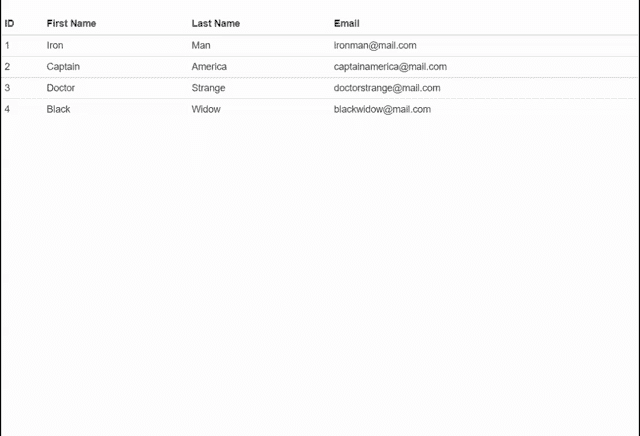

# 什么是 Bootstrap 中的压缩表？

> 原文:[https://www . geesforgeks . org/什么是压缩引导表/](https://www.geeksforgeeks.org/what-is-a-condensed-table-in-bootstrap/)

那个。表压缩是 Bootstrap 3 框架中的一个类。当我们想让行填充一半以便压缩表格时，可以使用它。这样我可以更方便用户。因此。当你想在网页上显示更密集的表格时，使用表格压缩类。如果我们不使用。bootstrap 表中的表压缩类当你有一个密集的表，并且你试图在小屏幕设备上查看它时，我们需要水平滚动来查看隐藏的列。使用了表格压缩类，整个表格根据你的屏幕大小进行压缩，这样你可以一次看到表格的完整视图。

**语法:**

**用于自举 3**

```html
<table class="table table-condensed">
```

**用于自举 4**

```html
<table class="table table-sm"> 
```

**示例 1:** 在本例中，我们将在 Bootstrap 3 中使用表压缩类创建一个压缩表。

## 超文本标记语言

```html
<!DOCTYPE html>
<html>

<head>
    <title>Bootstrap Condensed Table</title>
    <meta name="viewport" content=
        "width = device-width, initial-scale = 1">

    <!-- Include Bootstrap 3 and jQuery CDNs -->
    <link href=
"https://stackpath.bootstrapcdn.com/bootstrap/3.3.7/css/bootstrap.min.css"
        rel="stylesheet">
    <script src=
"https://ajax.googleapis.com/ajax/libs/jquery/3.3.1/jquery.min.js">
    </script>
    <script src=
"https://stackpath.bootstrapcdn.com/bootstrap/3.3.7/js/bootstrap.min.js">
    </script>
</head>

<body>

    <!-- Include .table-condensed class after
        .table class in table tag-->
    <table class="table table-condensed">
        <thead>
            <tr>
                <th>ID</th>
                <th>First Name</th>
                <th>Last Name</th>
                <th>Email</th>
            </tr>
        </thead>
        <tbody>
            <tr>
                <td>1</td>
                <td>Iron</td>
                <td>Man</td>
                <td>ironman@mail.com</td>
            </tr>
            <tr>
                <td>2</td>
                <td>Captain</td>
                <td>America</td>
                <td>captainamerica@mail.com</td>
            </tr>
            <tr>
                <td>3</td>
                <td>Doctor</td>
                <td>Strange</td>
                <td>doctorstrange@mail.com</td>
            </tr>
            <tr>
                <td>4</td>
                <td>Black</td>
                <td>Widow</td>
                <td>blackwidow@mail.com</td>
            </tr>
        </tbody>
    </table>
</body>

</html>
```

**输出:**



**示例 2:** 在本例中，我们将在 Bootstrap 4 中使用 table-sm 类创建一个压缩表。

## 超文本标记语言

```html
<!DOCTYPE html>
<html>

<head>
    <title>Bootstrap Condensed Table</title>
    <meta name="viewport" content=
        "width = device-width, initial-scale = 1">

    <!-- Include Bootstrap 4 and jQuery CDNs -->
    <link href=
"https://stackpath.bootstrapcdn.com/bootstrap/4.1.1/css/bootstrap.min.css"
        rel="stylesheet">
    <script src=
"https://ajax.googleapis.com/ajax/libs/jquery/3.3.1/jquery.min.js">
    </script>
    <script src=
"https://stackpath.bootstrapcdn.com/bootstrap/4.1.1/js/bootstrap.min.js">
    </script>
</head>

<body>
    <!-- Include .table-sm class after
        .table class in table tag-->
    <table class="table table-sm">
        <thead>
            <tr>
                <th>ID</th>
                <th>First Name</th>
                <th>Last Name</th>
                <th>Email</th>
            </tr>
        </thead>
        <tbody>
            <tr>
                <td>1</td>
                <td>Iron</td>
                <td>Man</td>
                <td>ironman@mail.com</td>
            </tr>
            <tr>
                <td>2</td>
                <td>Captain</td>
                <td>America</td>
                <td>captainamerica@mail.com</td>
            </tr>
            <tr>
                <td>3</td>
                <td>Doctor</td>
                <td>Strange</td>
                <td>doctorstrange@mail.com</td>
            </tr>
            <tr>
                <td>4</td>
                <td>Black</td>
                <td>Widow</td>
                <td>blackwidow@mail.com</td>
            </tr>
        </tbody>
    </table>
</body>

</html>
```

**输出:**

