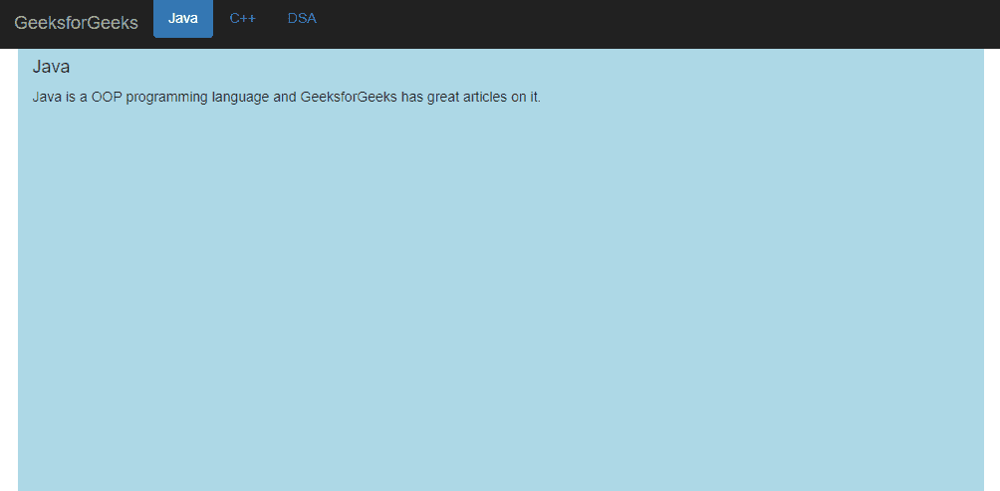
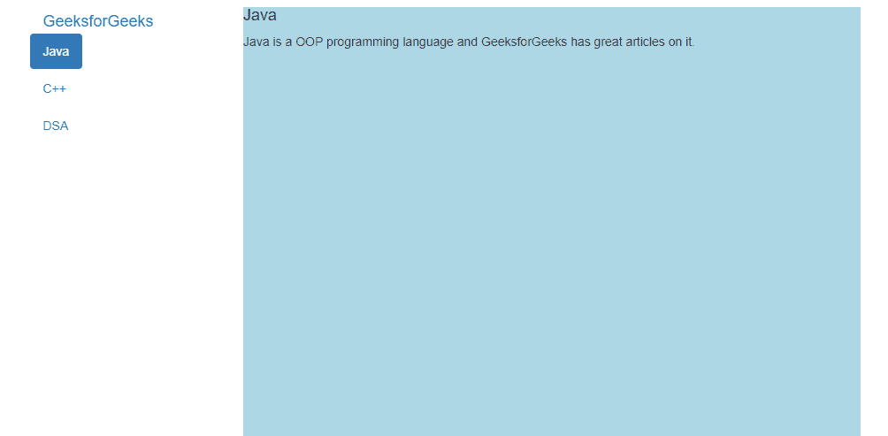

# 什么是 Bootstrap 中的 scrollspy？

> 原文:[https://www . geesforgeks . org/什么是自举中的 scroll spy/](https://www.geeksforgeeks.org/what-is-a-scrollspy-in-bootstrap/)

我们访问过许多网站，当用户向下滚动网页时，导航栏会自动更新。Scrollspy 根据滚动位置或用户当前看到的位置工作。 **Bootstrap scrollspy** 在滚动区域时自动定位导航栏内容。在本文中，我们将看到如何在 Bootstrap 中实现 scrollspy。我们将以两种方式实现 scrollspy:

*   水平滚动间谍
*   垂直滚动间谍

我们需要导入引导 CDN 库来使用 scrollspy 功能。我们将包括来自[官方引导网站的库。](https://getbootstrap.com/)为了让 scrollspy 正常工作，有几个要求:

*   必须包括引导导航组件或列表组。
*   要求*位置:相对:*在应用间谍活动的元素上，通常在身体标签中。

**实现水平滚动间谍:**我们将使用我们身体中的*导航*标签创建一个导航栏。导航栏将包含三个项目。我们将使用具有标题的容器类和一些虚拟文本*、*，它们将提供一些顶部填充，以确保导航栏和容器不会相互重叠。navbar 应该固定在顶部，以便 scrollspy 正常工作。

一些属性与实现该特性的元素一起被添加到主体标签中。

```html
<body style="position:relative" data-spy="scroll" 
    data-target=".navbar" data-offset="50">
```

**属性值:**

*   **数据-窥探:**用于窥探用户当前滚动的位置。
*   **数据-目标:**该属性用于连接导航栏和可滚动区。
*   **数据-偏移量:**该属性指定计算滚动位置时从顶部偏移的像素数。

**示例:**

## 超文本标记语言

```html
<!DOCTYPE html>
<html>

<head>
    <meta charset="utf-8" />
    <meta name="viewport" content="width=device-width" />
    <link rel="stylesheet" href=
"https://maxcdn.bootstrapcdn.com/bootstrap/3.4.1/css/bootstrap.min.css" />
    <script src=
"https://ajax.googleapis.com/ajax/libs/jquery/3.5.1/jquery.min.js">
    </script>
    <script src=
"https://maxcdn.bootstrapcdn.com/bootstrap/3.4.1/js/bootstrap.min.js">
    </script>

    <style>
        .container {
            height: 500px;
            padding-top: 50px;
        }

        #java {
            background: lightblue;
        }

        #cpp {
            background: lightgreen;
        }

        #dsa {
            background: #ffcc66;
        }
    </style>
</head>

<body style="position: relative" data-spy="scroll"
    data-target=".navbar" data-offset="50">

    <nav class="navbar navbar-expand-lg 
        navbar-inverse navbar-fixed-top">
        <a href="#" class="navbar-brand">
            GeeksforGeeks
        </a>

        <ul class="nav nav-pills">
            <li class="nav-item"><a class="nav-link" 
                    href="#java">Java</a></li>
            <li class="nav-item"><a class="nav-link"
                    href="#cpp">C++</a></li>
            <li class="nav-item"><a class="nav-link"
                    href="#dsa">DSA</a></li>
        </ul>
    </nav>
    <div id="java" class="container container-fluid">
        <h4>Java</h4>
        <p>
            Java is a OOP programming language and
            GeeksforGeeks has great articles
            on it.
        </p>
    </div>
    <div id="cpp" class="container container-fluid">
        <h4>C++</h4>
        <p>
            C++ is a very popular programming language
            used by many developers and
            programmers around the world. It has
            wide range of applications from
            software to backend. I have learned
            C++ mostly from GeeksforGeeks
            because of the great content.
        </p>
    </div>

    <div id="dsa" class="container container-fluid">
        <h4>DSA</h4>
        <p>
            DSA or Data Structures and Algorithms are
            the most important aspects of
            programming and every good programmer
            should know DSA for better and
            efficient algorithms irrespective of
            programming language. You can find
            tons of lessons for DSA in GeeksforGeeks.
        </p>
    </div>
</body>

</html>
```

**输出:**



**实现垂直滚动间谍:**对于垂直滚动间谍，我们需要一个垂直导航条。我们已经将我们的内容包装在一行中，以获得导航栏的垂直视图。

**示例:**

## 超文本标记语言

```html
<!DOCTYPE html>
<html lang="en">

<head>
    <meta charset="utf-8" />
    <meta name="viewport" content="width=device-width" />
    <link rel="stylesheet" href=
"https://maxcdn.bootstrapcdn.com/bootstrap/3.4.1/css/bootstrap.min.css" />
    <script src=
"https://ajax.googleapis.com/ajax/libs/jquery/3.5.1/jquery.min.js">
    </script>
    <script src=
"https://maxcdn.bootstrapcdn.com/bootstrap/3.4.1/js/bootstrap.min.js">
    </script>

    <style>
        body {
            position: relative;
        }

        .navbar-brand {
            position: fixed;
        }

        ul.nav-pills {
            top: 40px;
            position: fixed;
        }

        div.col-sm-9 div {
            height: 500px;
        }

        #java {
            background: lightblue;
        }

        #cpp {
            background: lightgreen;
        }

        #dsa {
            background: #ffcc66;
        }

        @media screen and (max-width: 810px) {

            #java,
            #cpp,
            #dsa {
                margin-left: 150px;
            }
        }
    </style>
</head>

<body data-spy="scroll" data-target=".navbar" 
    data-offset="20">

    <div class="container">
        <div class="row">
            <nav class="navbar col-sm-3">
                <a class="navbar-brand">GeeksforGeeks</a>
                <ul class="nav nav-pills nav-stacked">
                    <li class="nav-item">
                        <a class="nav-link" href="#java">Java</a>
                    </li>
                    <li class="nav-item">
                        <a class="nav-link" href="#cpp">C++</a>
                    </li>
                    <li class="nav-item">
                        <a class="nav-link" href="#dsa">DSA</a>
                    </li>
                </ul>
            </nav>
            <div class="col-sm-9">
                <div id="java">
                    <h4>Java</h4>
                    <p>
                        Java is a OOP programming language
                        and GeeksforGeeks has great
                        articles on it.
                    </p>
                </div>
                <div id="cpp">
                    <h4>C++</h4>
                    <p>
                        C++ is a very popular programming
                        language used by many developers
                        and programmers around the world.
                        It has wide range of applications 
                        from software to backend. I have 
                        learned C++ mostly from GeeksforGeeks
                        because of the great content."
                    </p>
                </div>
                <div id="dsa">
                    <h4>DSA</h4>
                    <p>
                        DSA or Data Structures and Algorithms are
                        the most important aspects of programming
                        and every good programmer should know DSA
                        for better and efficient algorithms irrespective
                        of programming language. You can find tons of
                        lessons for DSA in GeeksforGeeks.
                    </p>
                </div>
            </div>
        </div>
    </div>
</body>

</html>
```

**输出:**如果屏幕宽度小于 810px，我们提供了 150px 的余量。

