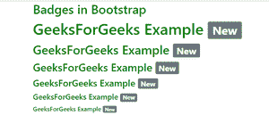
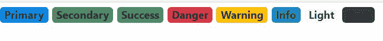

# Bootstrap 中的徽章是什么？

> 原文:[https://www.geeksforgeeks.org/what-is-badges-in-bootstrap/](https://www.geeksforgeeks.org/what-is-badges-in-bootstrap/)

**简介:**在 Bootstrap v5 中，徽章是简单且基本的组件，用于显示指示器或计数。这对于邮件计数和警报非常有用。徽章和标签是一样的，除了它们有更多的圆角。徽章通过使用相对字体大小和 em 单位来缩放以匹配直接父元素的大小。从 Bootstrap v5 开始，徽章不再具有链接的焦点或悬停样式。

**进场:**我们可以制作徽章。<内的徽章类跨越>元素来创建矩形徽章。我们还可以使用上下文类创建不同的徽章变体(如。徽章-第二)用最少的努力。下面是在 Bootstrap 中实现简单徽章的过程。

**步骤 1:** 将 [Bootstrap](https://www.geeksforgeeks.org/bootstrap-tutorials/) 和 [jQuery CDN](https://www.geeksforgeeks.org/how-to-add-jquery-code-to-html-file/) 包含到所有其他样式表之前的<头>标签中，以加载我们的 CSS。

> <src 脚本= " https://Ajax . Google APIs . com/Ajax/libs/jquery/3 . 5 . 1/jquery . min . js "></script><src 脚本= " https://cdnjs . cloudflare . com/Ajax/libs/popper . js

**第二步:**在<身上>标记中添加< span >标记。

```html
<h1>GeeksForGeeks <span>New</span>  </h1>
```

**第三步:**增加这个。徽章类和上下文类(如。徽章-二级)在<范围内>元素。

```html
 <h1>GeeksForGeeks <span class="badge badge-secondary">New</span></h1>
```

**注**:屏幕阅读器和其他辅助技术的用户可能会发现徽章令人困惑，这取决于它们的使用方式。虽然徽章的设计给用户一个视觉线索，让他们知道自己是干什么的，但这些用户只会看到徽章的文字。根据上下文的不同，这些标记可能会作为随机的额外单词或数字出现在短语的末尾。

**示例 1:** 在本例中，我们将在文本前面显示徽章以突出文本。在下面的示例中，显示了“新”徽章。徽章将能够通知用户任何“新”的帖子，或消息已经在他的帐户上。徽章可以用作直接导航到网页的链接，也可以用作提供计数器的网页按钮。

## index.html

```html
<!DOCTYPE html>
<html lang="en">
  <head>
    <title>Badges Example</title>
    <meta charset="utf-8" />
    <meta name="viewport" 
          content="width=device-width, initial-scale=1" />
    <link
      rel="stylesheet"
      href=
"https://maxcdn.bootstrapcdn.com/bootstrap/4.5.2/css/bootstrap.min.css"/>
    <script src=
"https://ajax.googleapis.com/ajax/libs/jquery/3.5.1/jquery.min.js">
    </script>
    <script src=
"https://cdnjs.cloudflare.com/ajax/libs/popper.js/1.16.0/umd/popper.min.js">
    </script>
    <script src=
"https://maxcdn.bootstrapcdn.com/bootstrap/4.5.2/js/bootstrap.min.js">
    </script>
  </head>
  <body style="color: green">
    <div class="container">
      <h2>Badges in Bootstrap</h2>
      <h1>
        GeeksForGeeks Example 
        <span class="badge badge-secondary">
          New
        </span>
      </h1>
      <h2>
        GeeksForGeeks Example 
        <span class="badge badge-secondary">
          New
        </span>
      </h2>
      <h3>
        GeeksForGeeks Example 
        <span class="badge badge-secondary">
          New
        </span>
      </h3>
      <h4>
        GeeksForGeeks Example 
        <span class="badge badge-secondary">
          New
        </span>
      </h4>
      <h5>
        GeeksForGeeks Example 
        <span class="badge badge-secondary">
          New
        </span>
      </h5>
      <h6>
        GeeksForGeeks Example 
        <span class="badge badge-secondary">
          New
        </span>
      </h6>
    </div>
  </body>
</html>
```

**输出:**



自举中的徽章

**示例 2:** 在示例中，我们将在显示计数器的按钮内部使用徽章。它显示用户有 4 个通知、10 条消息和 2 个更新。它将通知用户检查这些通知、消息和更新。我们还可以更改背景实用程序来更改徽章的颜色。我们可以用红色来表示危险，或者我们可以用黄色来表示警告等。

## index.html

```html
<!DOCTYPE html>
<html lang="en">
  <head>
    <title>Badges Example</title>
    <meta charset="utf-8" />
    <meta name="viewport" 
          content="width=device-width, initial-scale=1" />
    <link
      rel="stylesheet"
      href=
"https://maxcdn.bootstrapcdn.com/bootstrap/4.5.2/css/bootstrap.min.css"
    />
    <script src=
"https://ajax.googleapis.com/ajax/libs/jquery/3.5.1/jquery.min.js">
    </script>
    <script src=
"https://cdnjs.cloudflare.com/ajax/libs/popper.js/1.16.0/umd/popper.min.js">
    </script>
    <script src=
"https://maxcdn.bootstrapcdn.com/bootstrap/4.5.2/js/bootstrap.min.js">
    </script>
  </head>
  <body style="color: green">

    <button type="button" 
            class="btn btn-primary">
      Notifications 
      <span class="badge bg-secondary">
        4
      </span>
    </button>
    <button type="button" 
            class="btn btn-primary">
      Messages 
      <span class="badge bg-warning">
        1
        0</span>
    </button>
    <button type="button" 
            class="btn btn-primary">
      Updates 
      <span class="badge bg-danger">
        2
      </span>
    </button>
  </body>
</html>
```

**输出:**


使用引导中的徽章显示的计数器

**示例 3:** 在本例中，我们还将更改我们的后台实用程序类，以快速修改徽章的外观。请注意，使用 Bootstrap 的默认值时。bg-light，你可能需要一个文本颜色工具，比如。文字-深色，适合适当的造型。这是因为背景实用程序除了背景颜色什么都不设置。

## index.html

```html
<!DOCTYPE html>
<html lang="en">
  <head>
    <title>Badges Example</title>
    <meta charset="utf-8" />
    <meta name="viewport" content="width=device-width, initial-scale=1" />
    <link
      rel="stylesheet"
      href=
"https://maxcdn.bootstrapcdn.com/bootstrap/4.5.2/css/bootstrap.min.css"/>
    <script src=
"https://ajax.googleapis.com/ajax/libs/jquery/3.5.1/jquery.min.js">
    </script>
    <script src=
"https://cdnjs.cloudflare.com/ajax/libs/popper.js/1.16.0/umd/popper.min.js">
    </script>
    <script src=
"https://maxcdn.bootstrapcdn.com/bootstrap/4.5.2/js/bootstrap.min.js">
    </script>
  </head>
  <body>

    <span class="badge bg-primary">
      Primary
    </span>
    <span class="badge bg-secondary">
      Secondary
    </span>
    <span class="badge bg-success">
      Success
    </span>
    <span class="badge bg-danger">
      Danger
    </span>
    <span class="badge bg-warning text-dark">
      Warning
    </span>
    <span class="badge bg-info text-dark">
      Info
    </span>
    <span class="badge bg-light text-dark">
      Light
    </span>
    <span class="badge bg-dark">
      Dark
    </span>
  </body>
</html>
```

**输出:**



徽章采用不同的背景颜色，以增加其意义

**注**:赋予辅助技术目的感颜色可以用来添加意义，但是辅助技术的使用者，比如屏幕阅读器，将无法理解。确定颜色所代表的信息从内容本身来看是显而易见的(例如可见的文本)，或者是通过其他方式包含的。