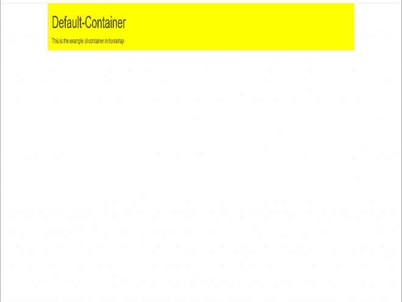

# 什么是引导容器？

> 原文:[https://www.geeksforgeeks.org/what-is-bootstrap-container/](https://www.geeksforgeeks.org/what-is-bootstrap-container/)

**Bootstrap 容器**是 Bootstrap 中最基本的布局元素。Bootstrap **容器**是包装页面内容的 Bootstrap 非常重要和基本的构建块。它负责根据视口或给定设备设置和对齐其中的内容。容器在容器类别**中定义。集装箱)**。换句话说，我们可以说容器是为布局赋予内容的宽度而建立的。元素和内容被添加到容器中。

**容器有多种用途，例如–**

*   它需要与默认网格系统一起使用。
*   为给定网页内容的布局建立宽度。
*   为任何网络项目提供响应性的固定行为。
*   设置处理布局响应行为的内容边距。

Bootstrap 有默认类或预定义类是 ***”。集装箱“*** & ***”。容器-流体"*** 类为布局。容器用于包含、填充和(有时)居中内容。虽然容器可以嵌套，但大多数布局不需要嵌套容器。

基本上，引导数据库中有三种类型的容器类:

1.  默认-容器(容器)
2.  响应-容器(与 sm、md、lg、xl、xxl 一起)
3.  流体容器(容器流体)

**1。默认容器:**默认容器使用。容器类。它提供了一个响应性的固定宽度容器。

**语法:**

```html
<div class="container">
  <!-- Content here -->
</div>
```

**2。响应容器:**响应容器本质上是响应的。响应容器允许您指定一个宽的类，直到到达指定的断点，之后我们为每个较高的断点应用最大宽度。

**语法:**

```html
<div class="container-sm">Wide for small breakpoint</div>
<div class="container-md">Wide for medium breakpoint</div>
<div class="container-lg">Wide for large breakpoint</div>
<div class="container-xl">Wide for extra large breakpoint</div>
<div class="container-xxl">Wide for extra large breakpoint</div>
```

**3。流体容器:**流体容器使用。容器流体类。它用于全宽容器，横跨视口的整个宽度。

**语法:**

```html
<div class="fluid-container">
  <!-- Content here -->
</div>
```

将 Bootstrap 和 jQuery CDN 放入部分，然后再放入所有其他样式表来加载我们的 CSS。

> <src = " https://code . jquery . com/jquery-3 . 2 . 1 . slim . min . js " integrity = " sha 384-k3o 2 dktivyik 3 uezm 7 kcr/re 9/qg6 aazjwfdmvna/gpg ff 93 hxpg 5 kk " cross origin = " anonymous "</script "

**示例 1:** 在本例中，我们将看到如何使用默认容器**。bootstrap 中的容器“**类，并知道它如何在网页中使用。

## 超文本标记语言

```html
<!DOCTYPE html>
<html>

<head>
    <meta charset="utf-8">
    <link rel="stylesheet" href=
"https://maxcdn.bootstrapcdn.com/bootstrap/3.3.6/css/bootstrap.min.css">
    <script src=
"https://ajax.googleapis.com/ajax/libs/jquery/1.12.0/jquery.min.js">
    </script>
    <script src=
"https://maxcdn.bootstrapcdn.com/bootstrap/3.3.6/js/bootstrap.min.js">
    </script>
</head>

<body>
    <div class="container" 
        style="background-color: yellow;">

        <h1>Default-Container</h1>

        <p>
            This is the example of 
            container in bootstrap
        </p>
    </div>
</body>

</html>
```

**输出:**



**引导程序中的默认容器**

**示例 2:** 在本例中，我们将看到响应容器使用 like’的示例。容器-sm '等。，在 bootstrap 中类，并知道它如何在网页中使用。

## 超文本标记语言

```html
<!DOCTYPE html>
<html>

<head>
    <meta charset="utf-8">
    <link rel="stylesheet" href=
"https://maxcdn.bootstrapcdn.com/bootstrap/3.3.6/css/bootstrap.min.css">
    <script src=
"https://ajax.googleapis.com/ajax/libs/jquery/1.12.0/jquery.min.js">
    </script>
    <script src=
"https://maxcdn.bootstrapcdn.com/bootstrap/3.3.6/js/bootstrap.min.js">
    </script>
</head>

<body>
    <div class=" container container-sm" 
        style="background-color: green;">

        <h1>Responsive-Container</h1>

        <p>
            This is the example of 
            container in bootstrap
        </p>
    </div>
</body>

</html>
```

**输出:**


**自举中的响应容器**

**例 3:** 在本例中，我们将看到流体容器的使用。bootstrap 中的 container-fluid”类，并知道它如何在网页中使用。

## 超文本标记语言

```html
<!DOCTYPE html>
<html>

<head>
    <meta charset="utf-8">
    <link rel="stylesheet" href=
"https://maxcdn.bootstrapcdn.com/bootstrap/3.3.6/css/bootstrap.min.css">
    <script src=
"https://ajax.googleapis.com/ajax/libs/jquery/1.12.0/jquery.min.js">
    </script>
    <script src=
"https://maxcdn.bootstrapcdn.com/bootstrap/3.3.6/js/bootstrap.min.js">
    </script>
</head>

<body>
    <div class=" container-fluid" 
        style="background-color: blue;">

        <h1>Fluid-Container</h1>

        <p>
            This is the example of 
            container in bootstrap
        </p>
    </div>
</body>

</html>
```

**输出:**


**自举中的液体容器**