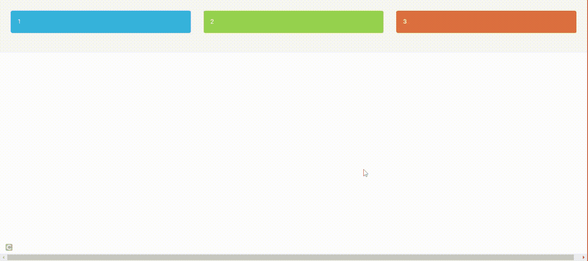
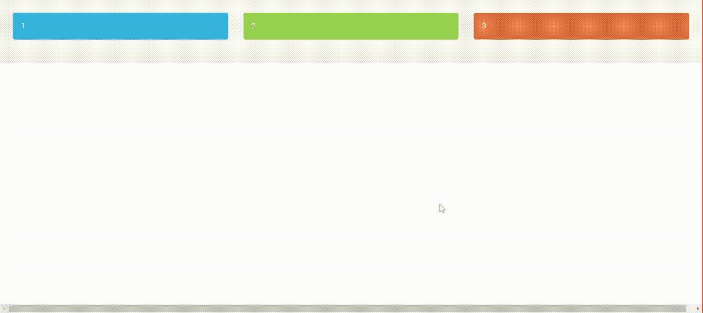

# Bootstrap 中的列排序是什么？

> 原文:[https://www . geesforgeks . org/什么是引导中的列排序/](https://www.geeksforgeeks.org/what-is-column-ordering-in-bootstrap/)

[<u>【Bootstrap】</u>](https://www.geeksforgeeks.org/bootstrap-4-introduction/)中的列排序类有助于根据不同的屏幕大小改变我们网格系统的顺序，例如:桌面、移动、平板、智能手表。这使得网站对不同屏幕尺寸的响应更快。

例如，假设我们有 4 列(V、X、Y 和 Z)。我们希望外观

*   **大屏幕上:**

    ```html
      V  X                          
      Y  Z            
    ```

*   **在小屏幕上(手机):**

    ```html
        Y  Z     
        V  X
    ```

我们可以通过**推****拉**列类，轻松改变内置网格列的顺序。

**推类和拉类:**推类将向右移动列，拉类将向左移动列。

**语法:**

```html
 .col-md-pull-# 
```

或者

```html
 .col-md-push-# 
```

**注:** #为 1-12 范围内的数字([自举网格系统)](https://www.geeksforgeeks.org/bootstrap-4-grid-system/)

**栏目重新排序:**移动优先(为移动屏幕编写的代码)创建您的内容，因为在更大的设备上推送和拉取栏目更容易。因此，您应该首先关注您的移动订购，然后关注更大的屏幕，如平板电脑或台式机。

**分步实施指南:**

*   **第一步:**包括 [<u>Bootstrap</u>](https://www.geeksforgeeks.org/bootstrap-4-introduction/) CDN 进入 [<u><头></u>](https://www.geeksforgeeks.org/html-head-tag/) 标签之前的所有其他样式表加载我们的 CSS。

    > <link rel="”stylesheet”" href="”https://maxcdn.bootstrapcdn.com/bootswatch/3.2.0/sandstone/bootstrap.min.css”">

*   **第二步:**用类行在 HTML 体中添加 [<u>< div ></u>](https://www.geeksforgeeks.org/div-tag-html/) 标签。

*   **第 3 步:**为不同的列添加< div >标记。推，推。拉类等等类在 [<u><身上></u>](https://www.geeksforgeeks.org/html-body-tag/) 标记。

**例 1:**

## 超文本标记语言

```html
<!DOCTYPE html>
<html>
  <head>
    <link
      rel="stylesheet"
      href=
"https://maxcdn.bootstrapcdn.com/bootswatch/3.2.0/sandstone/bootstrap.min.css"/>
  </head>
  <body>
    <div class="row">
      <div class="well well-lg clearfix">
        <div class="col-xs-12 col-md-4 col-md-push-4">
          <div class="alert alert-success">2</div>
        </div>

        <div class="col-xs-6 col-md-4 col-md-pull-4">
          <div class="alert alert-info">1</div>
        </div>

        <div class="col-xs-6 col-md-4">
          <div class="alert alert-warning">3</div>
        </div>
      </div>
    </div>
  </body>
</html>
```

**输出:**



**例 2:**

## 超文本标记语言

```html
<!DOCTYPE html>
<html>
  <head>
    <link
      rel="stylesheet"
      href=
"https://maxcdn.bootstrapcdn.com/bootswatch/3.2.0/sandstone/bootstrap.min.css"/>
  </head>
  <body>
    <div class="row">
      <div class="well well-lg clearfix">
        <div class="col-xs-6 col-md-4">
          <div class="alert alert-info">1</div>
        </div>

        <div class="col-xs-6 col-md-4 col-md-push-4">
          <div class="alert alert-warning">3</div>
        </div>

        <div class="col-xs-12 col-md-4 col-md-pull-4">
          <div class="alert alert-success">2</div>
        </div>
      </div>
    </div>
  </body>
</html>
```

**输出:**



**结论:**通过使用这些过程，我们可以使我们的网站对不同的屏幕大小做出响应，并编写移动内容。