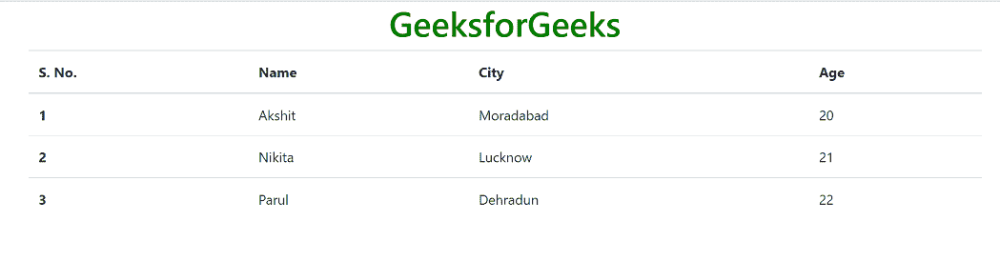
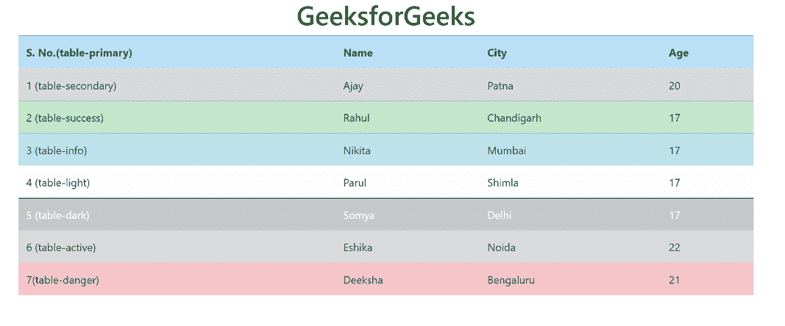

# Bootstrap 中表的上下文类是什么？

> 原文:[https://www . geesforgeks . org/什么是上下文相关的引导表中的类/](https://www.geeksforgeeks.org/what-is-contextual-classes-of-table-in-bootstrap/)

Bootstrap 提供了一系列类，可用于对表格应用各种样式，如更改标题外观、剥离行、添加或删除边框、使行可悬停等。Bootstrap 还提供了使表响应的类。

**简表:** The。表类用于创建一个简单的 Bootstrap 表。这个类名与<表>标签一起使用来创建一个表。

**语法:**

```html
<table class="table"> 
    Table Contents... 
<table>
```

## 超文本标记语言

```html
<!DOCTYPE html>
<html lang="en">
    <head>
        <title>Bootstrap Tables</title>
        <meta charset="utf-8">
        <meta name="viewport" 
              content="width=device-width, initial-scale=1">
        <link rel="stylesheet" href=
"https://maxcdn.bootstrapcdn.com/bootstrap/4.3.1/css/bootstrap.min.css">
        <script src=
"https://ajax.googleapis.com/ajax/libs/jquery/3.3.1/jquery.min.js">
        </script>
        <script src=
"https://cdnjs.cloudflare.com/ajax/libs/popper.js/1.14.7/umd/popper.min.js">
        </script>
        <script src=
"https://maxcdn.bootstrapcdn.com/bootstrap/4.3.1/js/bootstrap.min.js">
        </script>
    </head>
    <body>
        <div class="container">
            <h1 style="text-align:center;color:green;">
                GeeksforGeeks
            </h1>
            <!-- Bootstrap table class -->
            <table class="table">
                <thead>
                    <tr>
                        <th scope="col">S. No.</td>
                        <th scope="col">Name</td>
                        <th scope="col">City</td>
                        <th scope="col">Age</td>
                    </tr>
                </thead>
                <tbody>
                    <tr>
                        <th scope="row">1</td>
                        <td>Akshit</td>
                        <td>Moradabad</td>
                        <td>20</td>
                    </tr>
                    <tr>
                        <th scope="row">2</td>
                        <td>Nikita</td>
                        <td>Lucknow</td>
                        <td>21</td>
                    </tr>
                    <tr>
                        <th scope="row">3</td>
                        <td>Parul</td>
                        <td>Dehradun</td>
                        <td>22</td>
                    </tr>
                </tbody>
            </table>
        </div>
    </body>
</html>
```

**输出:**



### 了解引导数据库中表的上下文类

Bootstrap 提供了许多上下文类，可用于给表格的整行或单个单元格着色。这些类应该与浅色桌子一起使用，而不是与深色桌子一起使用，以获得更好的外观。上下文类列表如下所示。

*   表-主要
*   表格-二级
*   表格-成功
*   桌面危险
*   表格警告
*   表格信息
*   台灯
*   深色桌面
*   表格-活动

**语法:**

```html
<table class="table">
    <tr class="table- * ">
        Content
    </tr>
<table>
```

## 超文本标记语言

```html
<!DOCTYPE html>
<html lang="en">
    <head>
        <title>Bootstrap Tables</title>
        <meta charset="utf-8">
        <meta name="viewport" 
              content="width=device-width, initial-scale=1">
        <link rel="stylesheet" href=
"https://maxcdn.bootstrapcdn.com/bootstrap/4.3.1/css/bootstrap.min.css">
        <script src=
"https://ajax.googleapis.com/ajax/libs/jquery/3.3.1/jquery.min.js">
        </script>
        <script src=
"https://cdnjs.cloudflare.com/ajax/libs/popper.js/1.14.7/umd/popper.min.js">
        </script>
        <script src=
"https://maxcdn.bootstrapcdn.com/bootstrap/4.3.1/js/bootstrap.min.js">
        </script>
    </head>
    <body>
        <div class="container">
            <h1 style="text-align:center;color:green;">
                GeeksforGeeks
            </h1>
            <!-- Bootstrap table class -->
            <table class="table">
                <thead>
                    <tr class="table-primary">
                        <th scope="col">S. No.(table-primary)</td>
                        <th scope="col">Name</td>
                        <th scope="col">City</td>
                        <th scope="col">Age</td>
                    </tr>
                </thead>
                <tbody>
                    <tr class="table-secondary">
                        <td scope="row">1 (table-secondary)</td>
                        <td>Ajay</td>
                        <td>Patna</td>
                        <td>20</td>
                    </tr>
                    <tr class="table-success">
                        <td scope="row">2 (table-success)</td>
                        <td>Rahul</td>
                        <td>Chandigarh</td>
                        <td>17</td>
                    </tr>
                    <tr class="table-info">
                        <td scope="row">3 (table-info)</td>
                        <td>Nikita</td>
                        <td>Mumbai</td>
                        <td>17</td>
                    </tr>
                    <tr class="table-light">
                        <td scope="row">4 (table-light)</td>
                        <td>Parul</td>
                        <td>Shimla</td>
                        <td>17</td>
                    </tr>
                    <tr class="table-dark">
                        <td scope="row">5 (table-dark)</td>
                        <td>Somya</td>
                        <td>Delhi</td>
                        <td>17</td>
                    </tr>
                    <tr class="table-active">
                        <td scope="row">6 (table-active)</td>
                        <td>Eshika</td>
                        <td>Noida</td>
                        <td>22</td>
                    </tr>
                    <tr class="table-danger">
                        <td scope="row">7(table-danger)</td>
                        <td>Deeksha</td>
                        <td>Bengaluru</td>
                        <td>21</td>
                    </tr>
                </tbody>
            </table>
        </div>
    </body>
</html>
```

**输出:**

