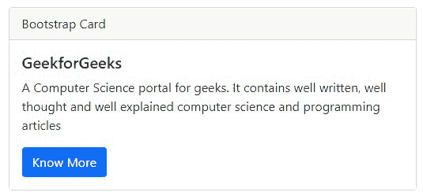

# 【Bootstrap v3 和 v4 有什么区别？

> 原文:[https://www . geeksforgeeks . org/bootstrap-v3 和-v4 的区别是什么/](https://www.geeksforgeeks.org/what-is-the-difference-between-bootstrap-v3-and-v4/)

在本文中，我们将看到 Bootstrap v3 和 v4 及其实现的差异。Bootstrap 是一个免费的开源前端框架，用于创建响应性网站和网络应用程序。它是最流行的 HTML、CSS 和 JavaScript 框架，用于开发响应迅速、移动优先的网站。它为用户提供预定义的 CSS ***类*** 和*****id*****，帮助用户在开发过程中节省时间，使代码整洁，增强可读性。Bootstrap 版本 3 于 2013 年推出，而 Bootstrap 版本 4 于 2017 年 8 月首次投入使用。您可以通过将官网&中的 CDN 链接复制到您的 HTML 文档中来获得 Bootstrap CDN 链接。我们还可以从网站下载引导程序，然后将其放在工作目录中。详情请参考[引导教程](https://www.geeksforgeeks.org/bootstrap-tutorials/)一文。****

******不同版本的 Bootstrap:******

*   ******版本 2.x:** 支持响应性设计。****
*   ******3 . x 版本:**支持移动优先设计。****
*   ******4 . x 版本:**引入了 SASS 和 Flexbox 支持。****
*   ******5 . x 版本:**最新更新。****

****我们将通过示例了解 bootstrap v3 和 v4。****

******Bootstrap v3:** 它通过引入 Bootstrap 网格系统的概念为开发人员引入了a ***移动优先设计*** ，该系统最多可扩展 12 列以增加设备视口。它允许我们通过使用 4 层网格类–手机、平板电脑、台式机和大型台式机，轻松创建复杂的自适应布局。在 Bootstrap v3 中，引入了排版概念，用于添加已经存在的基于 HTML 文本的控件功能，以及添加新的文本控件来增强呈现文本的方式。引导 v3 的 CSS 源文件是 **LESS** 。****

******Bootstrap v3 CDN 链接** **为 Bootstrap 的 CSS 和 JavaScript:******

> ****<！–最新编译和缩小的 CSS–>****
> 
> <link rel="”stylesheet”&nbsp;<br/">****href = " https://maxcdn . bootstracdn . com/bootstrap/3 . 3 . 7/CSS/bootstrap . min . CSS "
> 完整性= " sha 384-byiisifek 1 dgmjrakycuhrg 32 omucww 7 on 3 rydg 4 va+pmstz/k68 vbdeh4u " cross origin = " anonymous "】****
> 
>  ****<rel = " style sheet "
> 链接 href = " https://maxcdn . bootstracdn . com/bootstrap/3 . 3 . 7/CSS/bootstrap-theme . min . CSS "
> 完整性= " sha 384-rhon 1 irsvxv 4 nd 0 jutlngaslc7uw 9svlvryopp 2 bmgjqixwl/sp "交叉起源****
> 
>  ****<脚本 src = " https://maxcdn . bootstracdn . com/bootstrap/3 . 3 . 7/js/bootstrap . min . js "
> 完整性= " sha 384-TC 5 iqb 027 qvyjsmfhjofwvxzxupncc7l 2 mcwnipg 9 mgcd 8 wgnicpd 7 TXA " cross origin = " anonymous ">****

******示例 1:** 在本例中，我们使用了 Bootstrap v3 CDN 链接****

## ****超文本标记语言****

```html
**<!DOCTYPE html>
<html>

<head>
    <!-- Latest compiled and minified CSS -->
    <link rel="stylesheet" href=
"https://maxcdn.bootstrapcdn.com/bootstrap/3.3.7/css/bootstrap.min.css"
        integrity=
"sha384-BVYiiSIFeK1dGmJRAkycuHAHRg32OmUcww7on3RYdg4Va+PmSTsz/K68vbdEjh4u"
        crossorigin="anonymous" />

    <!-- Optional theme -->
    <link rel="stylesheet" href=
"https://maxcdn.bootstrapcdn.com/bootstrap/3.3.7/css/bootstrap-theme.min.css"
        integrity=
"sha384-rHyoN1iRsVXV4nD0JutlnGaslCJuC7uwjduW9SVrLvRYooPp2bWYgmgJQIXwl/Sp"
        crossorigin="anonymous">
</head>

<body>
    <div class="container">
        <h2>Welcome To GFG</h2>
        <div class="row">
            <div class="col-sm">Data Structure</div>
            <div class="col-sm">Web Development</div>
            <div class="col-sm">Placement course</div>
        </div>
    </div>
    <script src=
"https://maxcdn.bootstrapcdn.com/bootstrap/3.3.7/js/bootstrap.min.js"
        integrity=
"sha384-Tc5IQib027qvyjSMfHjOMaLkfuWVxZxUPnCJA7l2mCWNIpG9mGCD8wGNIcPD7Txa"
        crossorigin="anonymous">
    </script>
</body>

</html>**
```

******输出:******

********

******Bootstrap 4.0 版本:**包含 Bootstrap 3 功能，并增加了一些新功能，喜欢 SASS 文件和 Flexbox。 **SASS** 是引导 v4 的 CSS 源文件。随着网格布局&表单支持的改进，主要浏览器都支持 Bootstrap v4。它还引入了卡组件的概念，该组件提供了一个具有多个选项的灵活且可扩展的内容容器。****

******Bootstrap v4 CDN 链接** **为 Bootstrap 的 CSS 和 JavaScript:******

> <link rel="”stylesheet”" href="”https://maxcdn.bootstrapcdn.com/bootstrap/4.0.0/css/bootstrap.min.css”&nbsp;<br/">****完整性= " sha 384-gn 5384 xqq 1 aowx a+058 r xpg 6 fy 4 iwvtnh 0 e 263 xmfcjlsawigfaw/dais 6 jxm " cross origin = " anonymous ">****

******示例 2:** 在本例中，我们使用了 Bootstrap v4 CDN 链接来制作 Bootstrap 卡。****

## ****超文本标记语言****

```html
**<!DOCTYPE html>
<html>

<head>
    <link rel="stylesheet" href=
"https://maxcdn.bootstrapcdn.com/bootstrap/4.0.0/css/bootstrap.min.css"
        integrity=
"sha384-Gn5384xqQ1aoWXA+058RXPxPg6fy4IWvTNh0E263XmFcJlSAwiGgFAW/dAiS6JXm"
        crossorigin="anonymous" />
</head>

<body>
    <div class="container">
        <div class="card">
            <div class="card-header">Bootstrap Card</div>
            <div class="card-body">
                <h5 class="card-title">GeekforGeeks</h5>
                <p class="card-text">
                    A Computer Science portal for geeks. 
                    It contains well written, well
                    thought and well explained computer 
                    science and programming articles
                </p>

                <a href="#" class="btn btn-primary">
                    Know More
                </a>
            </div>
        </div>
    </div>

    <script src="https://code.jquery.com/jquery-3.2.1.slim.min.js"
        integrity=
"sha384-KJ3o2DKtIkvYIK3UENzmM7KCkRr/rE9/Qpg6aAZGJwFDMVNA/GpGFF93hXpG5KkN"
        crossorigin="anonymous">
    </script>

    <script src=
"https://cdnjs.cloudflare.com/ajax/libs/popper.js/1.12.9/umd/popper.min.js"
        integrity=
"sha384-ApNbgh9B+Y1QKtv3Rn7W3mgPxhU9K/ScQsAP7hUibX39j7fakFPskvXusvfa0b4Q"
        crossorigin="anonymous">
    </script>

    <script src=
"https://maxcdn.bootstrapcdn.com/bootstrap/4.0.0/js/bootstrap.min.js"
        integrity=
"sha384-JZR6Spejh4U02d8jOt6vLEHfe/JQGiRRSQQxSfFWpi1MquVdAyjUar5+76PVCmYl"
        crossorigin="anonymous">
    </script>
</body>

</html>**
```

******输出:******

********

******Bootstrap v3 与 Bootstrap v4 的区别:******

<figure class="table"> ****LESS

input-lg 增加尺寸，而。输入-sm 减小尺寸

| 

#### **Component**

 | 

#### **自举 v3**

 | 

#### **自举 v4**

 |
| --- | --- | --- |
| CSS 源文件 |  | 14px | 16px |
| 网格系统 | 它是基于 4 层网格系统(xs、sm、md、lg) | 它是基于 5 层网格 img-responsive | 。img-fluid

 |
| 表格 | 使用。表响应类在< div > 中标记 | 使用。表响应类在<表中>标记 |
| 偏移列 | col-MD-offset-4 | offset-MD-4 |
| 表单控制大小 | 。形状控制 lg 增加尺寸。表单-控件-sm 缩小尺寸 |
| 按钮尺寸 | 。btn-xs 类可用 | 。btn-sm 和。btn-lg 类在那里。btn-xs 类不是 |
| jumbo tron 全宽 | 。jumbo tron-流体类不用于全幅 jumbo trons | 。冗员-流体类为全幅冗员用于本 |
| 轮播项 | 轮播项的排列使用。项类 | 它使用。转盘-用于排列转盘项目的项目类。 |
| 内联 Navs | 不具备。导航-内联类 | 内联导航通过使用。nav-inline 类 |
| Styles | 它有。BTN-默认和。btn-info 按钮的可用类别 | 按钮有不同的类别，如:。BTN-次要的。光和。黑暗。 |
| 复选框和单选按钮 | 。收音机。直列收音机。复选框，或者。复选框-内联类可用于单选和复选框。 | 。表格检查。表格-检查-标签，。表单检查输入，或。form-check-inline 是用于显示单选和复选框的类。 |**** </figure>