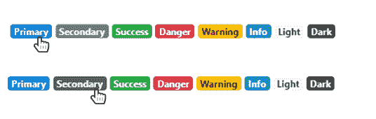
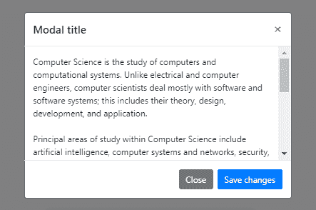

# Bootstrap 4.3 有什么新功能？

> 原文:[https://www.geeksforgeeks.org/whats-new-in-bootstrap-v4-3/](https://www.geeksforgeeks.org/whats-new-in-bootstrap-v4-3/)

前端 web 开发轨道由几种语言、框架和库组成。 [HTML](https://www.geeksforgeeks.org/html-tutorials/) 、 [CSS](https://www.geeksforgeeks.org/css-tutorials/) 、 [JavaScript](https://www.geeksforgeeks.org/javascript-tutorial/) 、 [jQuery](https://www.geeksforgeeks.org/jquery-tutorials/) 、 [AngularJS](https://www.geeksforgeeks.org/angularjs-tutorials/) 、ReactJS、VueJS、 [Bootstrap](https://www.geeksforgeeks.org/bootstrap-tutorials/) 就是其中的一些。开发人员必须了解这些技术，才能制作出美观、响应迅速、功能强大的网站和网络应用程序。

Bootstrap 是一个开源框架，建立在 HTML、CSS、Less(v3)、Sass(v4)和 JavaScript 之上。Bootstrap 于 2011 年首次发布。开发它是为了使前端开发变得容易。使用 Bootstrap，可以非常快速和容易地创建像转盘、卡片等功能。如果没有 Bootstrap，它将需要大量的编码。使用 Bootstrap 的另一个优点是，它使整个网站设备响应迅速。这意味着无论屏幕大小、操作系统或设备类型(智能手机、平板电脑、笔记本电脑、功能手机等)，网站在每台设备上都将看起来很好。

最新版本 Bootstrap 版本 **v4.3.1** 发布时间为【2019 年 2 月。

**让我们来看看这个新版本提供的新功能。**

1.  **。圆形-sm** 和**。小边框半径和大边框半径增加了圆角 lg** 。
2.  **。模态-对话框-可滚动**修改器类已经被添加，用于滚动模态内的内容。
3.  **。列表-组-水平**修改器类已经添加。这些用于将列表组显示为水平行。
4.  **。文本分隔符**是新引入的，用于在段落中应用单词分隔符。
5.  **。圆形-sm** 和**。圆角 lg** 用于将边界半径应用于分割。
6.  **。模态对话框可滚动**允许在给定模态内滚动。这允许将更多的数据输入到模式框中，而不必担心段落大小。
7.  **。列表-组-水平**修改器类已经添加。它将列表组显示为水平行。

**新版本**的改进

1.  曾经有一些变量从父元素或其他元素继承它们的值。这些元素的固有值已被设置为空，并将一直保持这种状态，直到用户亲自修改。
2.  徽章的焦点样式现在与其背景颜色相匹配。



**已弃用:**

**img-retina**

**invisible**

**float**

**size mixins**

**可滚动对话框示例**

```html
<!DOCTYPE html>
<html lang="en">

<head>
    <title>Bootstrap Images</title>

    <meta charset="utf-8">
    <meta name="viewport" 
          content="width=device-width, initial-scale=1">

    <link rel="stylesheet" 
          href=
"https://maxcdn.bootstrapcdn.com/bootstrap/4.3.1/css/bootstrap.min.css">

    <script src=
"https://ajax.googleapis.com/ajax/libs/jquery/3.3.1/jquery.min.js">
    </script>

    <script src=
"https://cdnjs.cloudflare.com/ajax/libs/popper.js/1.14.7/umd/popper.min.js">
    </script>

    <script src=
"https://maxcdn.bootstrapcdn.com/bootstrap/4.3.1/js/bootstrap.min.js">
    </script>
</head>

<body style="text-align:center;">
    <h4 class="m-3">Scrollable Dialog Box - Bootstrap v4.3</h4>
    <!-- Button trigger modal -->
    <button type="button" 
            class="btn btn-primary mx-4" 
            data-toggle="modal" 
            data-target="#exampleModalScrollable">
        Launch demo modal
    </button>
    <!-- Modal -->
    <div class="modal fade" id="exampleModalScrollable" 
         tabindex="-1"
         role="dialog" 
         aria-labelledby="exampleModalScrollableTitle"
         aria-hidden="true">

        <div class="modal-dialog modal-dialog-scrollable" 
             role="document">
            <div class="modal-content" 
                 style="overflow:initial;">

                <div class="modal-header">
                    <h5 class="modal-title" 
                        id="exampleModalScrollableTitle">
                      Modal title
                  </h5>
                    <button type="button" 
                            class="close"
                            data-dismiss="modal"
                            aria-label="Close">
                        <span aria-hidden="true">×</span>
                    </button>
                </div>
                <div class="modal-body position-static">
                    Computer Science is the study of computers and 
                  computational systems. Unlike electrical and computer 
                  engineers, computer scientists deal mostly with software
                  and software systems; this includes their theory, 
                  design, development, and application.
                    <br>
                    <br> Principal areas of study within Computer Science
                  include artificial intelligence, computer systems and
                  networks, security, database systems, human computer 
                  interaction, vision and graphics, numerical analysis,
                  programming languages, software engineering, 
                  bioinformatics and theory of computing.
                    <br>
                    <br> Although knowing how to program is essential
                  to the study of computer science, it is only one 
                  element of the field. Computer scientists design 
                  and analyze algorithms to solve programs and study
                  the performance of computer hardware and software.
                  The problems that computer scientists encounter
                  range from the abstract-- determining what problems 
                  can be solved with computers and the complexity of
                  the algorithms that solve them – to the tangible – 
                  designing applications that perform well on handheld 
                  devices, that are easy to use, and that uphold 
                  security measures.
                </div>
                <div class="modal-footer">
                    <button type="button" 
                            class="btn btn-secondary" 
                            data-dismiss="modal">
                      Close
                  </button>
                    <button type="button"
                            class="btn btn-primary">
                      Save changes
                  </button>
                </div>
            </div>
        </div>
    </div>
</body>

</html>
```

**输出**
