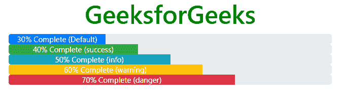

# 哪些上下文类与 Bootstrap 中的进度条一起使用？

> 原文:[https://www . geeksforgeeks . org/哪些上下文类与引导进度条一起使用/](https://www.geeksforgeeks.org/which-contextual-classes-are-used-with-progress-bars-in-bootstrap/)

进度条用于显示计算机上进程的进度。进度条显示流程完成了多少，还剩下多少。您可以使用预定义的引导类在网页上添加进度条。Bootstrap 提供了许多类型的进度条。

**语法:**

```
<div class="progress">
   <div class="progress-bar" style="width:x%"></div>
<div>
```

**例 1:**

## 超文本标记语言

```
<!DOCTYPE html>
<html lang="en">

<head>
    <title>Bootstrap Progress Bar</title>
    <meta charset="utf-8">
    <meta name="viewport" 
          content="width=device-width, initial-scale=1">
    <link rel="stylesheet" href=
"https://maxcdn.bootstrapcdn.com/bootstrap/4.3.1/css/bootstrap.min.css">
    <script src=
"https://ajax.googleapis.com/ajax/libs/jquery/3.3.1/jquery.min.js">
      </script>
    <script src=
"https://cdnjs.cloudflare.com/ajax/libs/popper.js/1.14.7/umd/popper.min.js">
      </script>
    <script src=
"https://maxcdn.bootstrapcdn.com/bootstrap/4.3.1/js/bootstrap.min.js">
      </script>
</head>

<body>
    <h1 style="color:green;text-align:center;">
        GeeksforGeeks
    </h1>
    <div class="container">
        <div class="progress">
            <div class="progress-bar" style="width:80%"></div>
        </div>
    </div>
</body>

</html>
```

**输出:**


**我们将在进度条中了解上下文类:**可以与进度条一起使用的上下文类有:

*   **。BG-成功**
*   **。血糖信息**
*   **。血糖警告**
*   **。BG-危险〔t1〕**

用简单的语言；我们可以给进度条不同的颜色。

*   **成功:**绿色阴影(#5cb85c)
*   **危险:**红色阴影(#d9534f)
*   **警告:**黄色阴影(#f0ad4e)
*   **信息:**蓝色阴影(#5bc0de)

**注意:** *进度条默认颜色为蓝色。*

**例 2:**

## 超文本标记语言

```
<!DOCTYPE html>
<html lang="en">

<head>
    <title>Bootstrap Progress Bar</title>
    <meta charset="utf-8">
    <meta name="viewport" 
          content="width=device-width, initial-scale=1">
    <link rel="stylesheet" href=
"https://maxcdn.bootstrapcdn.com/bootstrap/4.3.1/css/bootstrap.min.css">
    <script src=
"https://ajax.googleapis.com/ajax/libs/jquery/3.3.1/jquery.min.js">
      </script>
    <script src=
"https://cdnjs.cloudflare.com/ajax/libs/popper.js/1.14.7/umd/popper.min.js">
      </script>
    <script src=
"https://maxcdn.bootstrapcdn.com/bootstrap/4.3.1/js/bootstrap.min.js">
      </script>
</head>

<body style="text-align:center;">
    <h1 style="color:green;">
        GeeksforGeeks
    </h1>
    <div class="container">
        <div class="progress">
            <div class="progress-bar" style="width:30%;">
                30% Complete (Default)
            </div>
        </div>
        <div class="progress">
            <div class="progress-bar bg-success" 
                 role="progressbar" aria-valuenow="40" 
                 aria-valuemin="0" aria-valuemax="100" 
                 style="width:40%">
                40% Complete (success)
            </div>
        </div>
        <div class="progress">
            <div class="progress-bar bg-info" 
                 role="progressbar" aria-valuenow="50" 
                 aria-valuemin="0" aria-valuemax="100" 
                 style="width:50%">
                50% Complete (info)
            </div>
        </div>
        <div class="progress">
            <div class="progress-bar bg-warning" 
                 role="progressbar" aria-valuenow="60" 
                 aria-valuemin="0" aria-valuemax="100" 
                 style="width:60%">
                60% Complete (warning)
            </div>
        </div>
        <div class="progress">
            <div class="progress-bar bg-danger" 
                 role="progressbar" aria-valuenow="70" 
                 aria-valuemin="0" aria-valuemax="100" 
                 style="width:70%">
                70% Complete (danger)
            </div>
        </div>
    </div>
</body>

</html>
```

**输出:**

