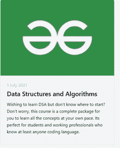
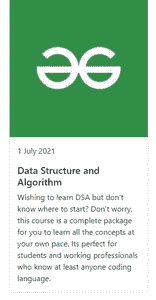

# tail wind CSS 和 Bootstrap 哪个 CSS 框架更好？

> 原文:[https://www . geeksforgeeks . org/哪个-CSS-framework-更好-tailwind-css-or-bootstrap/](https://www.geeksforgeeks.org/which-css-framework-is-better-tailwind-css-or-bootstrap/)

在本文中，我们将看到哪种 CSS 框架更适合顺风 CSS 或引导。两者都是广泛使用的 CSS 框架，用于设计前端。我们将详细了解其中的每一项。两种框架都有各自的优缺点，因此这取决于您要构建的应用程序类型，因此您可以在两者之间选择最佳框架。

**我们来逐一了解一下两者的区别。**

[**tail wind CSS**](https://www.geeksforgeeks.org/introduction-to-tailwind-css/)**:**tail wind CSS 基本上是一个实用优先的 CSS 框架，用于快速构建定制的用户界面。这是一个高度可定制的低级 CSS 框架，它为您提供了构建定制设计所需的所有构件，而没有任何令人讨厌的固执己见的风格，您必须努力克服这些风格。
这个叫做 tailwind 的东西的妙处在于它没有强加设计规范或者你的网站应该是什么样子，你只是把微小的组件放在一起构建一个独特的用户界面。Tailwind 只是获取一个“原始”的 CSS 文件，在一个配置文件上处理这个 CSS 文件，并产生一个输出。

**使用过程:**我们可以通过使用下面的 CDN 链接在我们的应用程序中使用 Tailwind CSS，并将其包含在文件的头部。

> <链接 href = " https://unpkg . com/taiwindcss @ ^ 1.0/dist/taiwind . min . CSS " rel = " style sheet ">

**特征:**

1.  更快的用户界面构建过程
2.  这是一个实用程序优先的 CSS 框架，这意味着我们可以使用实用程序类来构建定制设计，而不用像传统方法那样编写 CSS。
3.  不再给 CSS 类和 Id 起愚蠢的名字。
4.  CSS 文件中最少的代码行。
5.  我们可以定制设计来制作组件。
6.  使网站响应迅速。

**优势:**

1.  不再给 CSS 类和 Id 起愚蠢的名字。
2.  CSS 文件中最少的代码行。
3.  我们可以定制设计来制作组件。
4.  使网站响应迅速。
5.  以所需的方式进行更改。
6.  CSS 本质上是全局的，如果在文件中进行更改，属性会在链接到它的所有 HTML 文件中发生更改。但是在 Tailwind CSS 的帮助下，我们可以使用实用程序类并进行局部修改。

**缺点:**

1.  您的标记变得非常冗长。
2.  有时你可能不得不围绕这个框架工作。
3.  对于不太了解 CSS 的开发者来说，它是一根拐杖。
4.  用它变得高效需要时间。

**示例:**在本例中，我们将创建一个顺风牌组件。

**index.html**

## 超文本标记语言

```html
<!DOCTYPE html>
<html lang="en">

<head>
    <meta charset="UTF-8">
    <link href=
"https://unpkg.com/tailwindcss@^2/dist/tailwind.min.css"
        rel="stylesheet">
</head>

<body class="h-screen bg-gray-100">
    <div class="flex flex-wrap -m-4">
        <div class="p-4 sm:w-1/2 lg:w-1/3">
            <div class="h-full border-2 border-gray-200 
                border-opacity-60 rounded-lg 
                overflow-hidden">
                

                <div class="p-6 hover:bg-red-700 
                    hover:text-white transition
                    duration-300 ease-in">
                    <h2 class="text-base font-medium 
                        text-indigo-300 mb-1">
                        1 July 2021
                    </h2>

                    <h1 class="text-2xl font-semibold mb-3">
                        Data Structures and Algorithms
                    </h1>

                    <p class="leading-relaxed mb-3">
                        Wishing to learn DSA but don't know
                        where to start? Don't worry, this 
                        course is a complete package for you 
                        to learn all the concepts at your 
                        own pace. Its perfect for students 
                        and working professionals who know at
                        least anyone coding language.
                    </p>
                </div>
            </div>
        </div>
    </div>
</body>

</html>
```

**输出:**



**顺风卡**

[Bootstrap:](https://www.geeksforgeeks.org/bootstrap-tutorials/) 它是一个免费的开源工具集合，用于创建响应性网站和网络应用程序。它是最流行的 HTML、CSS 和 JavaScript 框架，用于开发响应迅速、移动优先的网站。如今，这些网站非常适合所有浏览器(IE、火狐和 Chrome)和所有大小的屏幕(台式机、平板电脑、平板电脑和手机)。这都要感谢 Bootstrap 的开发者——推特的马克·奥托和雅各布·桑顿，尽管后来它被宣布为开源项目。

**使用过程:**我们可以在应用程序中使用 Bootstrap，方法是使用下面的 CDN 链接，并将其包含在文件的头部。

> <link href="”https://cdn.jsdelivr.net/npm/bootstrap@5.1.0/dist/css/<br/">自举. min.css" rel="stylesheet "完整性= " sha 384-kyzxeag 3 qhqlmp8r+8fhaxlrk 2 vc2f3b 09 zxn 8ca 5 qivfzoj 3 bcsw 2p/
> 我们" crossorigin="anonymous" >

**特征:**

1.  任何人都可以在项目中实现引导。这很容易实现。
2.  易于定制。
3.  响应实用程序类。
4.  引导程序的组件。
5.  下拉组件菜单。
6.  引导模板。

**优势:**

1.  结盟很容易:
2.  快速省时的框架:
3.  网格的加固
4.  坚持基本原则
5.  一套 JavaScript 基础知识
6.  支持是惊人的
7.  引导是完全可定制的
8.  敏捷响应
9.  自举的一致性
10.  频繁更新

**劣势:**

1.  Bootstrap 中缺少一些元素，因此有时很难实现。
2.  Bootstrap 需要大量的定制 CSS 来制作好的响应网站
3.  超大宽屏有问题。

**示例:**在本例中，我们将创建一个引导卡组件。

## 超文本标记语言

```html
<!doctype html>
<html lang="en">

<head>
    <meta charset="utf-8">
    <meta name="viewport" content=
        "width=device-width, initial-scale=1">
    <link href=
"https://cdn.jsdelivr.net/npm/bootstrap@5.1.0/dist/css/bootstrap.min.css"
        rel="stylesheet" integrity=
"sha384-KyZXEAg3QhqLMpG8r+8fhAXLRk2vvoC2f3B09zVXn8CA5QIVfZOJ3BCsw2P0p/We" 
        crossorigin="anonymous">
    <title>Card Bootstrap</title>
</head>

<body>
    <div class="container">
        <div class="card" style="width: 18rem;">
            
            <div class="card-body">
                <p class="card-text"> 1 July 2021
                </p>

                <h5 class="card-title">
                    Data Structure and Algorithm
                </h5>

                <p class="card-text">
                    Wishing to learn DSA but don't know 
                    where to start? Don't worry, this 
                    course is a complete package for you
                    to learn all the concepts at your 
                    own pace. Its perfect for students 
                    and working professionals who know 
                    at least anyone coding language.
                </p>
            </div>
        </div>
    </div>

    <script src=
"https://cdn.jsdelivr.net/npm/bootstrap@5.1.0/dist/js/bootstrap.bundle.min.js"
        integrity=
"sha384-U1DAWAznBHeqEIlVSCgzq+c9gqGAJn5c/t99JyeKa9xxaYpSvHU5awsuZVVFIhvj"
        crossorigin="anonymous">
    </script>
</body>

</html>
```

**输出:**



**自举卡**

**结论:**现在完全取决于你的项目是什么，如果你是 CSS 的新手，那么两者都是一个很好的选择，如果你正在使用黑暗和明亮这样的模式，那么顺风 CSS 应该是选择。