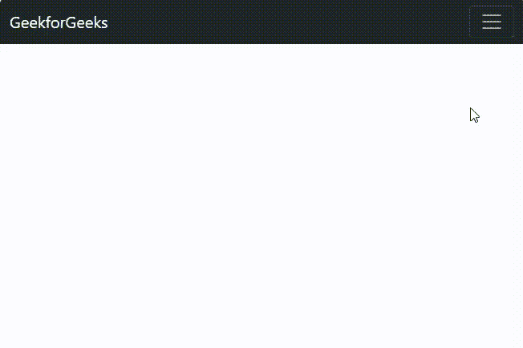
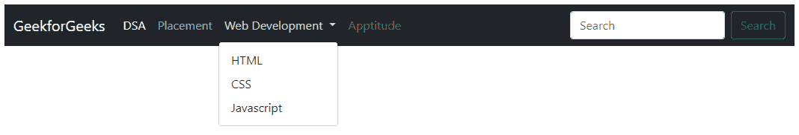

# 【Bootstrap 为什么用于移动应用开发？

> 原文:[https://www . geeksforgeeks . org/为什么-bootstrap 被用于移动应用程序开发/](https://www.geeksforgeeks.org/why-bootstrap-is-used-for-mobile-application-developments/)

[Bootstrap](https://www.geeksforgeeks.org/bootstrap-5-introduction/) 是由 Mark Otto 开发的开源 CSS 框架。它是移动友好的，这意味着模板在每种设备类型上都表现良好。Bootstrap 拥有基本网站开发所需的所有基本模板。该框架有各种形式，导航条，面板，大屏幕，可用于制作美丽的网页。这使得开发过程变得容易，因为基本的模板可以随时使用。因此，它在开发过程中节省了大量时间。可以从他们的[官方](https://getbootstrap.com/docs/5.0/getting-started/introduction/)网站访问该引导程序。该引导程序有其最新的 v 5.0。大多数浏览器都支持 Bootstrap 框架。

将 Bootstrap 用于移动应用程序开发有许多可能的原因。下面讨论几个原因:

*   **网格系统**:Bootstrap 有一个响应的网格系统，有助于构建移动优先的设计。它将屏幕分成 12 个相等的部分，并根据大小在屏幕上相应地排列 CSS 元素。此功能有助于创建移动友好的应用程序。
*   **开源框架**:由于项目是开源的，因此人们不断地为其做出贡献，所以所有重大的变化都可以根据需要进行调整。开源平台的优势在于，用户面临的任何问题都可以在社区的帮助下在短时间内清晰地得到解决。由于社区的支持，任何疑问都可以在有限的时间内解决。
*   **时间管理** **和易用性**:引导程序对初学者来说很友好，因为它需要更少的时间来理解概念。引导程序适用于所有的屏幕尺寸，模板的更改也可以根据用户的需要进行，并且可以随时使用，因此用户只需复制入门模板。如果用户创建网页的时间有限，那么最好的资源将是引导，因为它可以有效地用更少的时间创建一个高效的网站。Bootstrap 有一个非常简单易用的安装方法，可以直接挑选模板。
*   **移动应用开发资源** : Bootstrap 是专门驱动移动友好开发的资源之一。它有一个导航条、表单和许多其他组件，有助于响应性网站的创建。
*   **可定制**:模板的设计方式是一切都可以根据需要定制。甚至许多模板可以混合使用，并且可以非常有效地使用。

如今，随着设备尺寸的变化，有必要制作一个本质上具有响应性的网站，以便当网站在任何其他设备上打开时，用户使用该网站都是可行的。例如，如果我们使用 bootstrap navbar，那么在小设备下，navbar 在使用大设备时折叠，可以看到 navbar。

**示例**:本示例描述了使用 Bootstrap 开发移动应用。

## 超文本标记语言

```
<!doctype html>
<html lang="en">

<head>
    <meta charset="utf-8">
    <meta name="viewport" content="width=device-width, initial-scale=1">
    <link href=
"https://cdn.jsdelivr.net/npm/bootstrap@5.1.3/dist/css/bootstrap.min.css" 
          rel="stylesheet" 
          integrity=
"sha384-1BmE4kWBq78iYhFldvKuhfTAU6auU8tT94WrHftjDbrCEXSU1oBoqyl2QvZ6jIW3" 
          crossorigin="anonymous">
    <title>GeekforGeeks Bootstrap Tutorial</title>
</head>

<body>
    <nav class="navbar navbar-expand-lg navbar-dark bg-dark">
        <div class="container-fluid"> 
            <a class="navbar-brand" href="#">GeekforGeeks</a>
            <button class="navbar-toggler" 
                    type="button" 
                    data-bs-toggle="collapse" 
                    data-bs-target="#navbarSupportedContent" 
                    aria-controls="navbarSupportedContent" 
                    aria-expanded="false" 
                    aria-label="Toggle navigation"> 
                <span class="navbar-toggler-icon"></span> 
            </button>
            <div class="collapse navbar-collapse" 
                 id="navbarSupportedContent">
                <ul class="navbar-nav me-auto mb-2 mb-lg-0">
                    <li class="nav-item">
                        <a class="nav-link active" aria-current="page" 
                        href="#">DSA</a> 
                    </li>
                    <li class="nav-item"> 
                        <a class="nav-link" href="#">Placement</a> 
                    </li>
                    <li class="nav-item dropdown"> 
                        <a class="nav-link dropdown-toggle"
                           href="#" id="navbarDropdown" 
                           role="button" 
                           data-bs-toggle="dropdown"
                           aria-expanded="false">Web Development
                        </a>
                        <ul class="dropdown-menu" 
                            aria-labelledby="navbarDropdown">
                            <li>
                                <a class="dropdown-item" 
                                   href="#">HTML</a>
                            </li>
                            <li>
                                <a class="dropdown-item" 
                                   href="#">CSS</a>
                            </li>

                            <li>
                                <a class="dropdown-item" 
                                   href="#">Javascript</a>
                            </li>
                        </ul>
                    </li>
                    <li class="nav-item"> 
                        <a class="nav-link disabled">Apptitude</a> 
                    </li>
                </ul>
                <form class="d-flex">
                    <input class="form-control me-2" 
                           type="search"
                           placeholder="Search" 
                           aria-label="Search">
                    <button class="btn btn-outline-success" 
                            type="submit">Search
                    </button>
                </form>
            </div>
        </div>
    </nav>
    <script src=
"https://cdn.jsdelivr.net/npm/bootstrap@5.1.3/dist/js/bootstrap.min.js" 
            integrity=
"sha384-QJHtvGhmr9XOIpI6YVutG+2QOK9T+ZnN4kzFN1RtK3zEFEIsxhlmWl5/YESvpZ13" 
            crossorigin="anonymous">
    </script>
</body>

</html>
```

**输出:**

*   对于小型设备:



*   对于大型设备:

