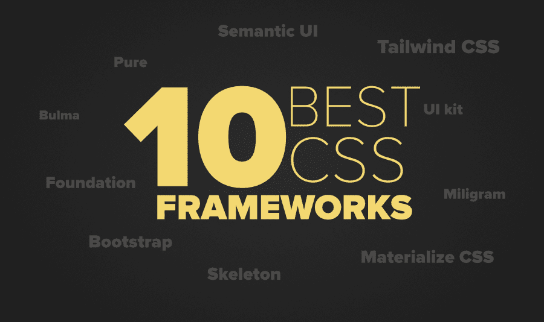

# 2020 年 10 大最佳前端开发者 CSS 框架

> 原文:[https://www . geesforgeks . org/10-best-CSS-framework-for-front-in-developer-in-2020/](https://www.geeksforgeeks.org/10-best-css-frameworks-for-frontend-developers-in-2020/)

***“NASA 已经将机器人降落在火星上，一些开发者还在为他们网站中的 div 的中心对齐而挣扎”***
这个笑话很有道理。对于 UI/UX 设计师来说，制作一个在每个浏览器上都好看的漂亮网站并不是一件容易的事情。在为网站创建布局并使其美观时，开发人员必须考虑所有的网络浏览器和移动视图。恐惧一直存在于内心，如果这个设计在某个愚蠢的浏览器上被打破会怎么样！感谢 [CSS](https://www.geeksforgeeks.org/css-tutorials/) 框架让开发者的生活变得无比轻松。CSS 框架消除了大部分痛苦，今天的开发人员无法想象没有 CSS 框架的代码。这些框架不仅节省了大量时间，而且有助于以更好、更快的方式构建一个漂亮的响应 web 应用程序。

这些框架给出了基本结构，包括网格、交互式用户界面模式、网页排版、工具提示、按钮、表单元素、图标。随时可用的解决方案是可用的，这有助于快速建立网站。您不需要从头开始，您可以在项目中重用代码。
现在有一个问题**哪个框架最适合你？**如果你是前端开发的新手，那么挑选一个框架可能会有点棘手。说实话，每个 CSS 框架都有一些优点和缺点，所以，这取决于你的具体需求。在本文中，我们将讨论一些适用于大多数行业开发人员的流行 CSS 框架。我们已经过滤掉了这些框架，记住了它们的优缺点。让我们讨论这些框架。

### 1.[自举](https://getbootstrap.com/)

你可能肯定听说过这个框架，即使这是你的第一份工作。该框架是第一个推广“智能手机优先”理念的框架。 [Bootstrap](https://www.geeksforgeeks.org/bootstrap-tutorials/) 是世界上最流行的 CSS 框架，由**推特在 2011 年**推出。Bootstrap 在大规模构建响应性设计方面有很大帮助。当您包含相关的引导类时，它会针对不同的屏幕大小自动调整设计。它提供了大量的插件和主题生成器。这个框架的当前版本是 **Bootstrap 4** ，它包括一些更多的特性，例如新的配色方案，新的修改器，新的实用程序类。版本 4 是用 SASS 构建的，这意味着 Bootstrap 现在支持 LESS 和 SASS。

**优点:**

*   快速原型
*   大型生态系统
*   大量组件集合
*   更少和更少的支持
*   易于记录和低学习曲线
*   由推特开发，因此对社区的信心与未来的长期联系。

### 2.[基础](https://get.foundation/)

开发人员说，如果编程是一个宗教基金会，Bootstrap 的人会站在路障的对面。Foundation 是世界上使用最广泛的另一个优秀的 CSS 框架。它被许多公司使用，如**脸书、易贝、Mozilla、Adobe，甚至迪士尼**。该框架建立在类似 bootstrap 的 Saas 之上。它更加复杂、灵活，并且易于定制。它还带有命令行界面，因此很容易与模块捆绑器一起使用。它提供了 Fastclick.js 工具，可以在移动设备上更快地呈现。

**优点:**

*   创建响应性设计
*   强大的电子邮件框架
*   极高的灵活性
*   在线网络研讨会培训支持。
*   易于定制。
*   完整的模块化工具集可让您解决几乎所有的界面任务
*   UI 组件和更多:高级成像系统、定价表组件、表单验证、垂直时间线布局、RTL 支持等等。

### 3. [Bulma](https://bulma.io/)

与其他 CSS 框架相比，布尔玛是市场上一个相对较新的框架，但布尔玛设法在短时间内获得了用户的大量关注。这个免费开源的 CSS 框架基于 **Flexbox** 布局模型。最棒的是它完全基于 CSS 和**它根本不需要 javascript** 。全世界有 20 多万开发者在使用它。它反应灵敏、重量轻，并且遵循“移动优先”的方法。

**优点:**

*   所有的 CSS 类名都是逻辑命名的，所以很容易学习和记住语法。
*   纯 CSS，没有 JavaScript
*   大型社区
*   模块化:用 Saas 构建，您可以通过只导入所需的必要功能来设计界面。
*   像垂直对齐解决方案、布局以及媒体对象这样的组件的大集合

### 4.[纯](https://purecss.io/)

由 **Yahoo** 开发，Pure 是一个轻量级且响应迅速的 CSS 框架。它使用 [Normalize.css](http://necolas.github.io/normalize.css/) 构建，有助于使用网格和菜单创建响应性布局。它可以分成不同的 CSS 模块，根据您的需求和偏好，您可以导入这些模块。因此，如果您只需要网格系统，就不需要导入整个 CSS 并增加站点的加载时间。与 Bootstrap 不同，它不允许创建固定布局。

**优点:**

*   移动友好
*   纯粹基于 CSS，所以很容易学习。
*   它提供从 5 点，2 点，24 点等变化。因此在创建网格和列系统时使用它要灵活得多。

### 5.[语义 UI](https://semantic-ui.com/)

这个框架以其不可思议的**主题效果**以及简单优雅的设计而闻名。语义 UI 是一个使用人性化 HTML 的响应框架，它允许您创建一个独特而美丽的网站，而无需多次更改。它提供 **3000+主题化变量**和 **50+用户界面组件**。它还**支持第三方库**，如 React、Meteor、Ember、React 等等。

**优点:**

*   友好的类名:它使用人类友好的 HTML，所以人们可以使用自然语言进行编码。
*   与 Bootstrap 4 和其他框架相比，有吸引力的布局。
*   仅加载必要的组件，减少下载时间和文件大小
*   广泛的组件

### 6.泰国风 CSS

顺风 CSS 是一个**级的低级 CSS 框架**，灵活且高度可定制。Tailwind 是用 PostCSS 编写的，用 JavaScript 配置。您将使用低级实用程序类来定制您的设计，而不是使用预构建的组件，这样您就可以完全控制站点的最终结果。从正面尺寸到间距，断点到阴影，颜色到边框尺寸都是可定制的。例如，您可以为按钮赋予药丸、轮廓和 3D 外观。您可以个性化每个方面，您可以创建一个独特风格的设计，看起来肯定不同于其他框架，如 Bootstrap 或 UI 工具包。

**优点:**

*   易于定制
*   实用程序类
*   附带响应选项

### 7. [UI 套件](https://getuikit.com/)

这个强大的 CSS 框架以其极简主义的特点而闻名。UI Kit 是一个轻量级的最小 CSS 框架，几乎包含了其他框架的所有特性。您可以使用最大的空白空间和许多用户界面组件(如 SVG 图标、进度条、图像生成器等)来创建超级干净、优雅和美丽的网络界面。有许多令人难以置信的组件、统一的样式和定制选项可供选择。您可以使用像 Nestable 这样的组件创建高级界面。它使用可靠且无冲突的命名约定。您也可以使用纯 HTML 设计复杂的基于 flexbox 的布局。

**优点:**

*   最低纲领
*   大量有用的用户界面组件。
*   兼容 Less 和 Sass
*   包括 JavaScript
*   对任何设备的适应性

### 8.[物化 CSS](https://materializecss.com/)

如果你喜欢使用材料设计，那么你肯定应该看看这个框架。它是由**谷歌在 2014 年**创建的，对于那些想要设计**网站或安卓网络应用程序**的人来说，这个框架是一个很好的解决方案。很多谷歌产品都是在这个框架上实现的，比如 YouTube、Gmail、Google Drive、Google Docs。它附带了一些现成的组件和类，可以让你在不花太多力气的情况下尽快完成工作。该框架使用由 Bootstrap 建立的 12 列基于网格的布局、响应动画和过渡、填充以及深度效果，如灯光和阴影。使用其**预建的入门模板**你可以用最少的设置时间设计你的网站。

**优点:**

*   材料设计
*   自举网格
*   大量组件选择
*   易于定制
*   与 Sass 兼容

### 9.[骨骼](http://getskeleton.com/)

顾名思义，Skeleton 是最简单、响应最少的 CSS 框架。它只包含 **400 行代码**，但是提供了大量的选项在你的项目中使用。网格、排版、按钮、表单、列表、媒体查询、表格等功能使您能够轻松创建复杂的网站。我们已经在 CSS 框架中提到过它，但是很少有代码行没有将自己定义为 CSS 框架、库甚至模块。这实际上是一个**样板**，对于**小规模项目**或者对于已经开始 UI/UX 开发生涯的人来说是很好的。它只附带有限数量的标准 HTML 元素，但这足以让你开始一个简单优雅的网站。

**优点:**

*   移动友好
*   易于学习

### 10.[米利图](https://milligram.io/)

顾名思义，这是另一个轻量级的 CSS 框架，旨在更快地创建网站。框架的大小只是 **2Kb** 但是它附带了很多功能和 web 开发工具来满足你的需求。它为开发人员提供了灵活性，并允许他们使用 CSS3 规范提供的所有功能。您也可以用几行自定义 CSS 来扩展它。

**优点:**

*   基于 Flexbox 网格
*   超级设计主题

我们已经提到了一些在开发人员中非常流行的 CSS 框架，但是您也可以尝试一些其他的 CSS 框架。其他一些流行的框架有 **Susy，Animate.css，Paper css，NES.css，Base，Tent CSS，Simple Grid，Spectre，芥子 UI，野餐 CSS，Mini.css，Gumby** 等等。