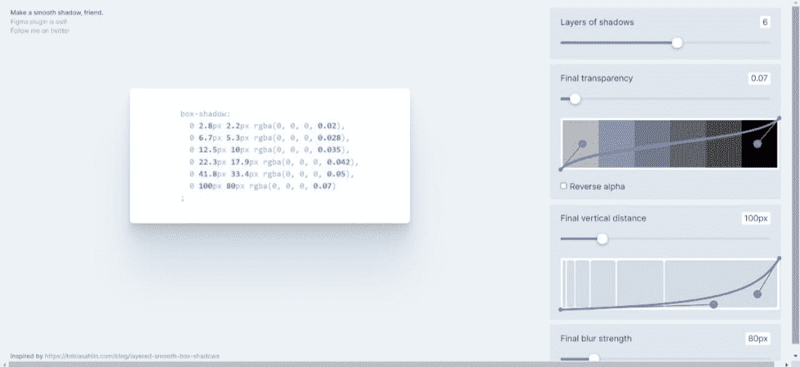

# 10 个你可以使用的最佳 CSS 生成器工具

> 原文:[https://www . geesforgeks . org/10-best-CSS-generator-tools-您可以使用的/](https://www.geeksforgeeks.org/10-best-css-generator-tools-that-you-can-use/)

每个网络开发人员都在寻找节省时间的捷径来改进他们的工作流程。有了许多优秀的工具，开发过程变得更加容易，现在获得成品比以往任何时候都更容易。随着基于浏览器的 IDEs 的普及，网络开发有远离桌面的趋势。代码可以在任何计算机上编写，结果可以在浏览器中实时检查。通过使用在线代码生成器，您可以快速迭代并构建您的代码。

当你知道需要什么时，剩下的就是为工作选择合适的工具。这里有 10 个最好的 CSS 网站生成器，都是免费的。

### 1.花式边框半径生成器

过去，大多数人认为边界半径是直接的值，比如 8px 或 11px，或者 16px。然而，边界可以非常花哨，这个花哨的边界半径生成器可以帮助你做到这一点。该工具通过组合八个值来显示普通圆形和有机形状。我们的最终形状是由重叠的椭圆创建的。此外，命令行界面可用于在本地运行该工具。

### 2.缓和梯度

转换颜色是一种常见的效果。两种颜色之间的过渡可以是线性的，也可以是缓和的。边缘锐利的渐变会吸引人们的注意力。相比之下，渐变具有更柔和的边缘，在视觉上更有吸引力。用户可以使用安德烈亚斯·拉森创建的渐变编辑器创建渐变。颜色过渡可以由用户根据他们想要的位置和方式来控制。也可以选择颜色，但不能添加十六进制值。草图插件和后期 CSS 插件可用于该生成器。

### 3.平滑阴影发生器

想要使用自动生成 CSS 代码的工具生成真正平滑、分层的盒子阴影吗？那么使用“平滑阴影”将会是一种乐趣。你试了之后，会很难不用。该工具允许你玩阿尔法，偏移和模糊，以及可视化每个层的平滑框阴影。

### 4.三次贝塞尔曲线

有时候一部动画就是感觉不对劲，不是吗？这可能是由于持续时间的不匹配，或者宽松政策的古怪，这可能需要一些时间来弄清楚。通过使用 Lea Verou 的三次贝塞尔工具，您可以预览和比较动画，减慢它们的速度，并直观地执行调整。要立即将 CSS 片段插入到您的项目中，请复制并粘贴它。

### 5.CSS 剪辑路径生成器

使用 CSS 剪辑路径属性，这个在线工具为图像创建形状。您可以从预设形状中进行选择或创建自定义形状，然后通过在图像上移动点来对其进行自定义。当你有了完美的形状后，CSS 代码就会自动生成。如果你愿意，你自己的图片可以上传。

### 6.翻

在许多字体中，所有边距和标题都是默认设置的。当 web 字体和备用字体不同时，文本的布局可能会发生巨大变化。有了发电机 River，开发者可以避免这个问题。为了调整大写字母的高度，这个生成器会减少它们上面和下面的空间。为确保无缝过渡，保持后退字体和网页字体的等高非常重要。

### 7.关键帧

关键帧工具帮助用户使用可视化编辑器和代码生成器为整个项目创建 CSS 代码。这个生成器创建动画，阴影和颜色，更多的选项正在路上。在关键帧中，用户可以访问时间线编辑器，该编辑器允许他们自定义动画。用户可以更改大小、位置、颜色和添加变换。然后可以复制和粘贴 CSS 代码。为了调试和创建 CSS 动画，这个生成器在 Chrome 和 Firefox 中提供了一个动画面板。这个可视化编辑器有一个简单明了的界面。

### 8.等等！有生命的

动画之间的暂停是威尔·斯通创建的生成器的目标。CSS 动画在再次开始播放之前不能暂停，因为它没有属性。等等，有个等等！使用动画生成器创建重复暂停。为了使该功能正常工作，该工具会生成适当的代码。

### 9.获得波浪

使用 getwaves.io 可以轻松创建 SVG 波。使用随机化器将确保您不会创建重复的设计。然后，波可以作为 SVG 下载，或者 SVG 代码可以直接复制。

### 10.模式化

使用 Patternnify，用户可以使用可视化编辑器生成 CSS 模式。用户可以将 base64 代码粘贴到 CSS 中，找到图片 URL 和图片大小。其功能允许用户调整颜色、图案、大小等。所有用户需要的是一个互联网连接来管理从浏览器的一切。与其他图形界面相比，它唯一的缺点是逐像素。