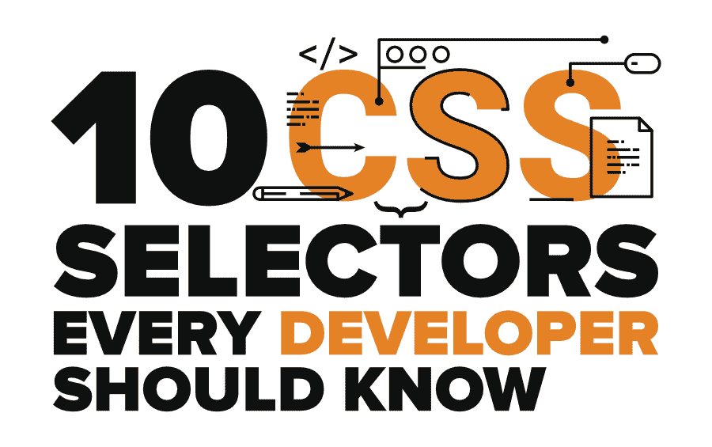
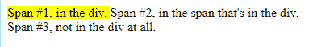
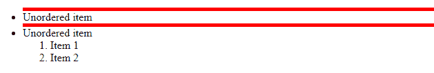
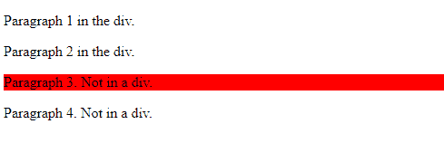
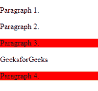
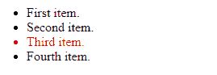
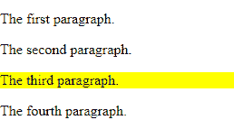

# 每个开发者都应该知道的 10 个 CSS 选择器

> 原文:[https://www . geesforgeks . org/10-CSS-selecters-ever-developer-应知/](https://www.geeksforgeeks.org/10-css-selectors-every-developer-should-know/)

任何网站给用户留下好印象的第一件事是什么？…

是的……它是任何网站的用户界面。每个开发人员都知道为用户创建一个漂亮的设计来与任何网站进行交互是多么重要。如果你对 CSS 及其选择器没有很好的了解，那么在最少的时间内给网页设计风格并不是一件容易的事情。 [**CSS**](https://www.geeksforgeeks.org/css-tutorials/) 选择器针对 HTML 文档中指定的元素，帮助开发人员将样式应用于网页。您可能了解一些基本的 CSS 选择器，但是比基本知识多一点有助于更快地实现您的目标。使用正确的 CSS 选择器可以最大限度地减少代码量，提高可读性，并使 CSS 在将来维护起来更加简单。



有各种各样的 CSS 选择器可供选择。让我们讨论一些重要的问题，以简化您在前端开发中的工作。

### 1.元素或组选择器

这是 CSS 中最基本的选择器之一。元素选择器允许您选择具有相同指定元素名称的所有元素并为其赋予样式。如果有多个具有相同样式定义的元素，您可以将所有元素分组，并将样式应用于所有元素。通过这种方式，您可以最小化代码，因为您不必为每个元素使用类。

**示例 1:** 这里，页面上的所有段落都将右对齐，文本颜色为黄色

```html
p {
  text-align: right;
  color: red;
}
```

**示例 2:** 现在，看看下面的 CSS 代码…

```html
h2 {
 text-align: center;
 color: yellow;
}
h3 {
 text-align: center;
 color: yellow;
}
p 
 text-align: center;
 color: yellow;
}
```

您可以使用组选择器最小化上述代码，并编写与下面相同的代码:

```html
h2, h3, p {
 text-align: center;
 color: yellow;
}
```

### 2.#id 选择器

id 选择器是 CSS 中另一个最强大的通用选择器。使用#符号后跟 id 名称允许您通过 id 进行定位，并将样式应用于具有选定 id 的所有指定元素。使用这个选择器听起来不错，因为它很简单，但是请记住 id 对于整个网页来说应该是唯一的。这意味着不允许您为多个元素分配 id 选择器。如果你不分配唯一的 id，你将会面临在 JavaScript 中操作特定元素的问题。此外，您的代码不会被 W3C 验证，并且您将面临不同浏览器之间的兼容性问题。因此，与其创建许多#id 使用类或任何其他样式逻辑，否则以后维护您的 CSS 会很困难。

**示例:**

```html
#box{
width : 250px;
height: 250px;
background : yellow;
}
```

### 3.。类别选择器

类选择器是开发人员最常用的选择器。您可以使用句点(.)定义类别选择器。)后跟类名。它为具有指定类属性的所有元素提供样式。它类似于 id 选择器，但唯一的区别是，类选择器允许您在一个页面中定位多个元素。您也可以在 HTML 元素上使用多个类(用空格分隔)。

**例 1:**

```html
.center{
text-align: center;
color: yellow;
}
```

**示例 2:** 在下面的示例中，只有类“center”的 p 元素会受到影响。

```html
p.center {
 text-align: center;
 color: yellow;
}
```

### 4.属性选择器

使用属性选择器，您可以根据给定属性的名称或值选择所有元素，并对它们应用样式。

**示例 1:** 下面是一个 HTML 行的示例，它的“rel”属性的值为“newfriend”

```html
<h3 id="title" class="friend" rel="newfriend">David Walsh</h3>
```

让我们看看如何在上面一行中为' rel '属性使用属性选择器。

```html
h3[rel="newfriend"] {
  color: yellow;
}
```

这个选择器经常被开发人员用在“checkbox”元素的代码中。阅读下面给出的例子。

**例 2:**

```html
input[type="checkbox"] {
     color: purple;
}
```

它也经常用于代码中的锚标签。阅读下面给出的例子。

**例 3:**

```html
a[title] {
  color: red;
}
```

**组合器:**这些用于通过使用选择器之间的关系将样式应用于 html 元素。组合器允许你混合简单的选择器，并在它们之间应用逻辑。让我们讨论 CSS 中四种不同的组合选择器。

*   后代选择器
*   子选择器
*   相邻同级选择器
*   通用同级选择器

### 5.后代选择器

后代选择器仅对指定元素的后代元素应用样式。当您只需要为某些特定元素应用样式时，这个选择器非常有用。例如，如果您只需要定位“h2”标签的一部分，而不是定位所有的“h2”标签，会怎么样。这些是您可以使用后代选择器的情况。

**例 1:**

```html
div h2 {
 background-color: green;
}
```

**例 2:** 也可以做一个链，使用后代选择器。

```html
ol li a {
 background-color: green;
}
```

**示例 3:** 在下面的示例中，您可以将其与类选择器混合使用。

```html
.box a{
color :green;
}
```

### 6.子选择器

子元素选择器允许您选择指定元素的所有子元素。

**例 1:**

```html
div > h1 {
 background-color: green;
}
```

子级选择器和后代选择器的区别在于后者只会选择直接的子级。

**例 2:**

CSS:

```html
span {
 background-color: white;
}

div > span {
 background-color: yellow;
}
```

**HTML:**

```html
<div>
 <span>Span #1, in the div.
   <span>Span #2, in the span that's in the div.</span>
 </span>
</div>
<span>Span #3, not in the div at all.</span>
```

**结果:**



**示例 3:** 您有一个“ul”包含一些项目，在这些项目中，有新的“ol”项目，您可能希望只为更高层次的列表项目而不是嵌套列表的项目选择某种样式。

CSS:

```html
ul > li {
   border-top: 5px solid red;
}
```

**HTML:**

```html
<ul>
   <li>Unordered item</li>
   <li>Unordered item
       <ol>
           <li>Item 1</li>
           <li>Item 2</li>
       </ol>
   </li>
</ul>
```

**结果:**



### 7.相邻和通用同级选择器

**相邻**表示“紧接其后”。当您想要选择紧跟在指定元素之后的元素(相邻的同级元素)时，可以使用此选择器。换句话说，它选择与层次结构中同一级别的另一个元素紧挨着的元素。

**示例:**以下示例选择直接跟在“div”元素后面的 p 元素

CSS:

```html
div + p {
 background-color: red;
}
```

**HTML:**

```html
<div>
 <p>Paragraph 1 in the div.</p>
 <p>Paragraph 2 in the div.</p>
</div>

<p>Paragraph 3\. Not in a div.</p>
<p>Paragraph 4\. Not in a div.</p>
```

**结果:**



**一般同级选择器** (~)没有相邻同级选择器严格。它允许您选择指定元素的所有同级元素，即使它们不直接相邻。

**示例:**以下示例选择所有“p”元素，它们是“div”元素的同级

CSS:

```html
div ~ p {
 background-color: red;
}
```

**HTML:**

```html
<p>Paragraph 1.</p>

<div>
 <p>Paragraph 2.</p>
</div>

<p>Paragraph 3.</p>
<span>GeeksforGeeks</span>
<p>Paragraph 4.</p>
```

**结果:**



### 8.星形选择器*

它也被称为通用选择器(*)，它选择文档中的所有内容，并对它们应用样式。默认情况下，浏览器已经定义了元素的样式，当您想要重置浏览器默认样式时，可以使用星形选择器。例如，您可以为网页的整个元素定义自己的样式，而不是使用浏览器的默认样式，如边距、填充、文本对齐或字体大小..

**例 1:**

```html
* {
text-align: center;
color: green;
margin: 0;
padding: 0;
font-size: 30px;
border: 0;
}
```

**示例 2:** 选择< div >元素内的所有元素，并将它们的背景颜色设置为红色。

```html
div * {
   background-color: red;
}
```

*你有没有注意到，当你使用‘class’、‘element’或‘id’等其他选择器时，它们已经暗示了星形选择器？*

```html
h1 {
...
}
is similar to 
*h1 {
...
}
```

通常建议在代码中少用* selector，或者仅用于测试目的，因为它会给浏览器增加不必要的过多负担。

### 9.伪类和伪元素

如果要根据指定元素的状态来设置元素的样式，可以使用**伪类**(:)来实现。例如，当用户将鼠标悬停在某个元素上时，当用户访问某个链接时，或者当某个元素获得焦点时，您可以在该元素上应用样式。所以这个选择器对于应用基于元素状态的样式很有用。让我们看看语法和例子。

**语法:**

```html
selector:pseudo-class {
 property:value;
}
```

**示例 1:** 当用户的指针悬停在按钮上时，阅读下面的代码以更改按钮的颜色

```html
button:hover {
 color: green;
}
```

**例 2:**

```html
a:link {
 color: red;
}
/* visited link */
a:visited {
 color: green;
}
```

**例 3:**

```html
input[type=radio]:checked {
 border: 2px solid green;
}
```

**伪元素**(::)允许您将样式应用于选定元素的特定部分或片段。例如，为元素的第一个字符或第一行设置样式。

**语法:**

```html
selector::pseudo-element {
 property:value;
}
```

**例 1:** :::第一行可以用来改变段落第一行的字体。

```html
p::first-line {
 color: green;
 font-size: 1.2em;
 text-transform: uppercase;
}
```

**示例 2:** 伪元素也可以与 CSS 类组合。阅读下面给出的例子

```html
p.intro::first-letter {
 color: red;
 font-size: 1.2em;
 font-weight: bold;
}
```

**例 3:** 伪元素也可以用来在元素内容之前或之后插入内容。阅读下面给出的例子，在每个“h1”元素的内容前插入一个图像。

```html
h1::before {
 content: url(abc.gif);
}
```

### 10.第 n 个类型和第 n 个子类型

考虑一个场景，其中有四个无序列表。如果您只想在 ul 的第三个项目上应用 CSS，并且没有唯一的 id 可以挂钩，则可以使用第 n 个类型(n)。基本上**:第 n 个类型**选择器允许你选择每一个元素，它是指定类型的父元素的指定的第 n 个子元素。n 可以是任何数字、关键字或公式，用于指定元素在一组同级元素中的位置。如果解释听起来仍然复杂，那么让我们用例子来理解。

**示例 1:** 在下面给出的示例中，只有第三个“li”会受到第 n 种类型的 **:** 样式的影响。

CSS:

```html
li:nth-of-type(3) {
 color: red;
}
```

**HTML:**

```html
<ul>
<li>First item.</li>
<li>Second item.</li>
<li>Third item.</li>
<li>Fourth item.</li>
</ul>
```

**结果:**



**语法:**

```html
:nth-of-type(number) {
 css declarations;
}
```

**:第 n 个子元素(n)** 选择器匹配其父元素的第 n 个子元素，无论其类型如何。n 可以是数字、关键字或公式，用于指定元素在一组兄弟元素中的位置。

**例 1:**

CSS:

```html
p:nth-child(3) {
 background: yellow;
}
```

**HTML:**

```html
<p>The first paragraph.</p>
<p>The second paragraph.</p>
<p>The third paragraph.</p>
<p>The fourth paragraph.</p>
```

**结果:**



**例 2:**

```html
p:nth-child(2n) {
 background: yellow;
}
```

**示例 3:** 对于相同样式的不同元素，也可以将多个第 n 个子链接在一起。

```html
div:nth-of-type(4) p:nth-of-child(3) {
 color: red;
}
```