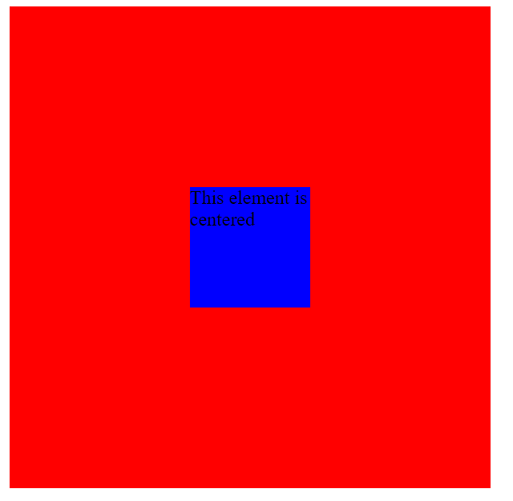

# 使用 CSS 的 4 种不同的元素居中方式

> 原文:[https://www . geesforgeks . org/4-不同的方法-使用-css 将元素居中/](https://www.geeksforgeeks.org/4-different-ways-to-center-an-element-using-css/)

当我们创建一个网页时，我们很可能遇到了一个集中元素的问题。因此，让我们看一下使用 CSS 将元素居中的 4 种不同方法:

1.  使用 Flex
2.  保证金属性
3.  网格属性
4.  绝对财产

现在让我们使用示例来看看这些属性是如何工作的。

**HTML 代码:**

**文件名:index.html**

## 超文本标记语言

```html
<!DOCTYPE html>
<html>

<head>
    <title>Page Title</title>
    <link rel="stylesheet" href="styles.css" />
</head>

<body>
    <div class="parent">
        <div class="child">
            This element is centered
        </div>
    </div>
</body>

</html>
```

在上面的代码中，我们创建了一个父 div 和一个子 div。我们将看看如何在父 div 中居中子 div。一个名为 styles.css 的样式表已经链接到我们定义了父 div 和子 div 样式的文件。

#### 文件名:styles.css

## 半铸钢ˌ钢性铸铁(Cast Semi-Steel)

```html
.parent {
  height: 400px;
  width: 400px;
  background-color: red;
}
.child {
  height: 100px;
  width: 100px;
  background-color: blue;
}
```

**方法 1:使用 Flex** 我们可以使用 **Flexbox** 来对元素进行居中。我们可以将父 div 的显示属性设置为 flex，并且可以使用**对齐-上下文:居中(水平)**和**对齐-项目:居中(垂直)**属性轻松地将子 div 居中。

## 半铸钢ˌ钢性铸铁(Cast Semi-Steel)

```html
.parent {
  display: flex;
  justify-content: center;
  align-items: center;
}
```

**方法 2:边距属性**另一个简单的方法是将子 div 居中，将其**边距**设置为自动，并使父 div 显示为**网格。**

## 半铸钢ˌ钢性铸铁(Cast Semi-Steel)

```html
.parent {
  display: grid;
}
.child {
  margin: auto;
}
```

**方法 3:网格属性**将元素居中的一个非常简单的方法是在父 div 上使用**网格**属性，并设置**位置-项目:居中**。

## 半铸钢ˌ钢性铸铁(Cast Semi-Steel)

```html
.parent {
  display: grid;
  place-items: center;
}
```

**方法 4:绝对属性**我们也可以使用**位置**属性来居中元素。

## 半铸钢ˌ钢性铸铁(Cast Semi-Steel)

```html
.parent {
  position: relative;
}
.child {
  position: absolute;
  top: 50%;
  left: 50%;
  transform: translate(-50%, -50%);
}
```

**输出:**

所有这些方式的输出都是相同的，如下所示:

