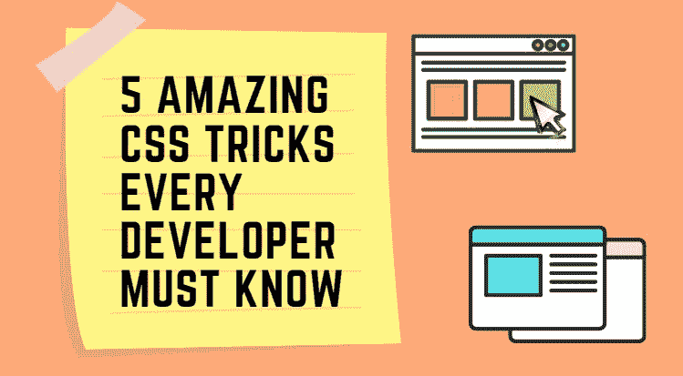
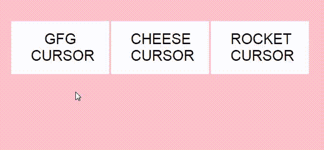
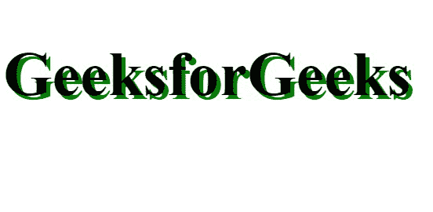
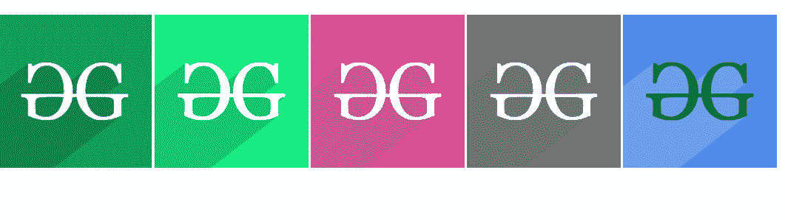
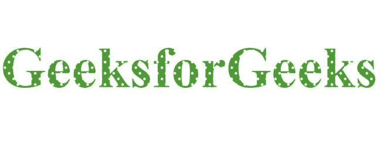
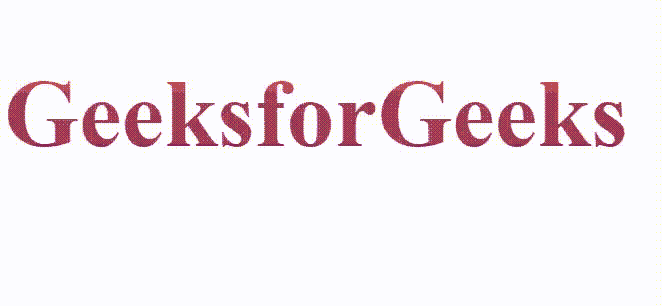
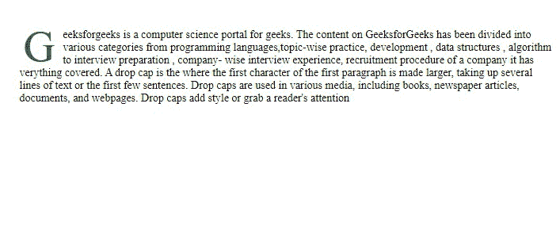

# 每个开发人员都应该知道的 5 种惊人的 CSS 样式

> 原文:[https://www . geesforgeks . org/5-惊人-CSS-style-每个开发人员都应该知道/](https://www.geeksforgeeks.org/5-amazing-css-styles-that-every-developer-should-know/)

**CSS(层叠样式表)**帮助开发者提升网页的视觉外观，换句话说，我们可以说 CSS 为网页增添了生命，美化了网页。使用 CSS，我们可以改变布局、颜色、字体、图像，最棒的是，对于特定的风格或布局，我们可以编写一次代码，并在任何时候使用它，只要我们想在我们的网站上实现它，这是非常有利和节省时间的。



这里我们将讨论 5 个可以让你的网站脱颖而出的 CSS 技巧。

**1。定制光标:**有没有觉得每次用同样的普通光标很无聊？如果可以根据自己的意愿定制光标呢？想象一个光标，上面有你的图像或一些独特的东西？听起来很酷，对吧？这可以简单地通过在一行代码中使用 CSS 来实现。在下面的例子中，我们为光标使用了三种不同的图像:GeeksforGeeks 徽标、奶酪图像和火箭，您可以使用您选择的任何图像。

```html
cursor: url("anyimage.png"), pointer;
```

### **示例:**

## index.html

```html
<!DOCTYPE html>
<html>

<head>
    <title>Customized Cursor</title>
    <link rel="stylesheet" type="text/css" href="style.css">
</head>

<body>
    <div class="container">
        <button>GFG Cursor</button>
        <button>Cheese Cursor</button>
        <button>Rocket Cursor</button>
   </div>
</body>

</html>
```

## style.css

```html
body {
    background-color: pink;
    padding: 0;
    margin: 0;
}
.container {
    width: 690px;
    height: 220px;
    position: absolute;
    margin: auto;
    top: 0;
    bottom: 0;
    left: 0;
    right: 0;
}
button {
    font-size: 30px;
    background-color: white;
    border: none;
    outline: none;
    text-transform: uppercase;
    color: black;
    width: 200px;
    padding: 20px;
    padding-left:40px; 
    padding-right:40px;
}
button:nth-child(1) {
cursor: url("gfg.png"),pointer;
}
button:nth-child(2) {
cursor: url("cheese.png"),pointer;
}
button:nth-child(3) {
cursor: url("rocket.png"),pointer;
}
```

### 输出:



#### 使用任何所需图像作为光标的限制:

*   可以使用任何图像格式，如 JPG、巴布亚新几内亚或 BMP
*   图像尺寸应该是 **32×32px** ，任何大于这个的图像尺寸都不行。

**2。阴影效果:**阴影效果是一种非常简单但令人惊叹的效果，它给我们的文本带来了 3D 的感觉。

```html
h1 {
    font-size: 5rem;
    text-shadow: 5px 5px 0px green;
}
```

### 示例:

## 超文本标记语言

```html
<!DOCTYPE html>
<html>

<head>
    <title>Shadow Effect</title>
    <style>
        h1 {
            font-size: 5rem;
            text-shadow: 5px 5px 0px green;
        }
    </style>
</head>

<body>
    <h1>GeeksforGeeks</h1>
</body>

</html>
```

### 输出:



**3。彩色滤镜:**不使用任何编辑工具就可以改变任何图像的颜色，这可以使用 CSS 滤镜属性轻松完成。

### 示例:

## index.html

```html
<!DOCTYPE html>
<html>

<head>
    <title>CSS FILTERS</title>
</head>
<link rel="stylesheet" type="text/css" href="style.css">

<body>
    <div class="image">
        
        
        
        
        
    </div>
</body>

</html>
```

## style.css

```html
.image img {
  max-width: 300px;
}
.original {
}
.brightness {
  filter: brightness(150%);
}
.huerotate {
  filter: hue-rotate(180deg);
}

.grayscale {
  filter: grayscale(100%);
}

.blend {
  filter: invert(1) hue-rotate(260deg);
}
```

### 输出:



**属性提示:**任何图像的颜色都可以更改为多种颜色，只需更改度数的值即可。
例:

```html
filter: invert(1) hue-rotate(90deg);
filter: invert(1) hue-rotate(150deg);
```

**4。背景剪贴文字:**几乎我们每个人都尝试过给自己的文字加上花哨的背景，非常简单。“背景剪裁文本”是指将背景图像修剪为文本，使其看起来更有吸引力和更酷。
我们可以简单地通过下面一行代码来实现，其中“任何图像”是您想要剪辑的您选择的理想图像。

```html
background-image: url('anyimage.jpg');
-webkit-background-clip: text;
color: transparent;
```

### 示例:

## 超文本标记语言

```html
<!DOCTYPE html>
<html>

<head>
    <title>Background Clipped Text</title>
    <style>
        h1 {
            font-size: 12rem;
            background-image: url('anyimage.jpg');
            -webkit-background-clip: text;
            color: transparent;
        }
    </style>
</head>

<body>
    <h1>GeeksforGeeks</h1>
</body>

</html>
<h1>GeeksforGeeks</h1>
</body>
</html>
```

### 输出:



你甚至可以在文本背景中剪辑一个 GIF！这可以使用上面相同的代码来完成，只需用 GIF 的名称替换图像的名称



**5。Drop Caps Text:**“Drop Caps”是一种文字效果，将第一段的第一个字母放大，以产生醒目的效果，常用于报纸、杂志和小说。

```html
p::first-letter {               
    color:green;           
    font-size: 3.9rem;
    float: left;
    padding-right: 4px;
}
```

### 示例:

## 超文本标记语言

```html
<!DOCTYPE html>
<html>

<head>
    <title>CSS Drop Effect</title>
    <style type="text/css">
        .content {
            width: 100%;
            height: 100%;
            display: flex;
            justify-content: center;
        }

        .article {
            width: 50%;
            margin: 20px;
        }

        p::first-letter {
            float: left;
            line-height: 30px;
            font-size: 50px;
            padding-right: 5px;
            padding-left: 5px;
            color: green;
            padding-top: 5px;
            padding-bottom: 5px;
            margin-bottom: -5px;
            margin-right: 5px;
        }

        p {
            font-size: 14px;
        }
    </style>
</head>

<body>
    <div class="content">
        <div class="article">
            <p>
                Geeksforgeeks is a computer science 
                portal for geeks. The content on 
                GeeksforGeeks has been divided into 
                various categories from programming 
                languages, topic-wise practice,
                development , data structures , 
                algorithm to interview preparation,
                company- wise interview experience, 
                recruitment procedure of a company
                it has verything covered. A drop cap 
                is a effect in which the first letter 
                of the first paragraph is made larger 
                to create an eye catchy effect it is 
                often used in newspaper , magazines 
                and novels.
            </p>
        </div>
    </div>
</body>

</html>
```

### 输出:

