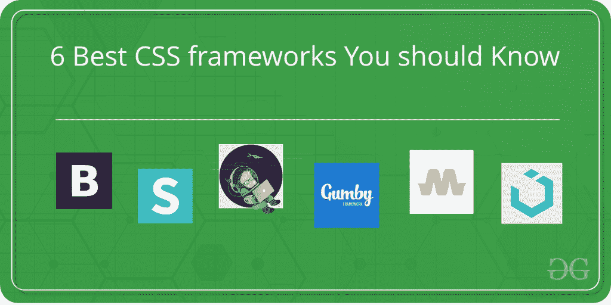

# 6 个你应该知道的设计有吸引力网站的最佳 CSS 框架

> 原文:[https://www . geesforgeks . org/6-best-CSS-frameworks-你应该知道的设计-吸引人的网站/](https://www.geeksforgeeks.org/6-best-css-frameworks-you-should-know-to-design-attractive-websites/)

如果你想加快你的网站和开发过程，或者想给你的网站增加一些经典的设计，那么你来对地方了。令人敬畏的新弹出窗口，速度，终极色彩和主题等着你。

前端开发是完整的创作和色彩包，并有惊人的框架。每个框架都有自己独特的用途。所以这里有一些你应该知道的顶级公司使用的框架。

那么，让我们从最常用的一个开始。

1.  **[Twitter Bootstrap](http://getbootstrap.com/)**:Bootstrap 是最常用的前端框架。可能您正在手机、平板电脑或笔记本电脑上阅读这篇文章。想想看，如果你不得不旋转手机或到处滚动，会有多令人恼火。看完整的界面或阅读一些东西。因此，这里的引导程序有助于负责任地设计网站或网络应用程序。针对手机、平板电脑和笔记本电脑的三个不同类别，网页的所有内容都会根据您打开设备的屏幕大小进行调整。
2.  **[语义 UI](https://semantic-ui.com/)** :以设计简洁大方，主题效果难以置信而闻名。语义 UI 提供 3000+主题变量，50+ UI，5000+提交。它有助于使用 HTML 创建美观、响应迅速的布局。更有趣的是——你必须开发一次你的用户界面。然后，您可以在任何地方使用相同的代码进行部署。
    语义自带直观的继承系统。高级主题化变量，让你有完全的设计自由。小文件大小和最小的加载时间。因为您只能加载您需要的组件；每个都有自己的 JS 文件和样式表。
3.  **[基础](https://foundation.zurb.com/)**:Zurb 打造的高度超前响应的前端框架。Foundation 是语义的、可读的、灵活的、完全可定制的框架。设计用于任何设备、介质和可访问性。其丰富的功能也用于脸书、易贝和 Mozilla 等网站。在与基金会合作时，你会有更大的灵活性。
4.  **[古姆比](https://gumbyframework.com/)** :古姆比可以比以前更快地定制和构建设计。Gumby 框架是一个灵活、响应迅速的 CSS 框架，由 SASS 提供动力。该框架带有 12 个网格布局系统，将浏览器的空间分成 12 个网格。Gumby 支持嵌套网格，并创建快速和逻辑的页面布局。和应用程序原型，具有灵活且响应迅速的网格系统和 UI 套件。Gumby 框架提供了功能丰富的文档。
5.  **[物化](https://materializecss.com/)** :基于材料设计的现代响应前端框架。使用精细的动画和过渡为开发人员提供更流畅的体验。
    以用户体验为中心，提供大量组件选择。
6.  **[UIKit](https://getuikit.com/)** : UIKit 是轻量级、高度可定制、模块化的前端框架。帮助使用像 nestables 这样的组件创建高级用户界面。UIkit 是 HTML、CSS 和基于 JS 的小型响应组件的综合集合。该框架使用一致且无冲突的命名约定。这使得它易于使用、定制和扩展。

**结论**:网络上还有无数其他的框架。每个框架都尽了最大努力。对于开发者的需求，每一个都有其不同的原因。不过以上是顶级的，也是最抢手的。如果你是一名前端开发人员或计划在未来成为一名前端开发人员，请确保你知道这些。