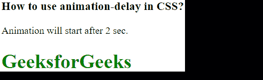
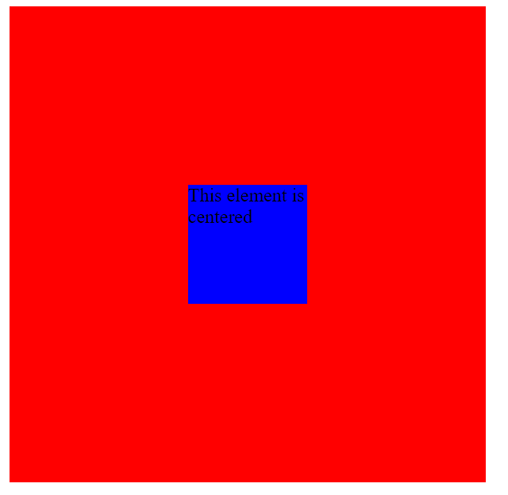
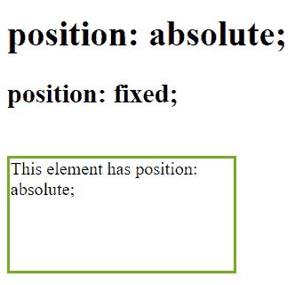
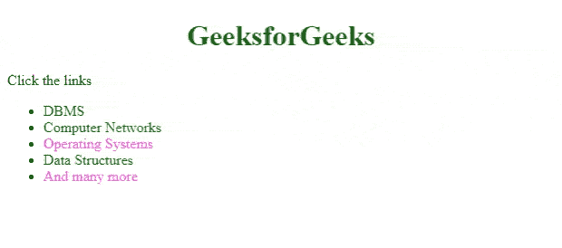
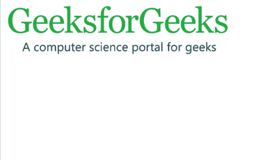
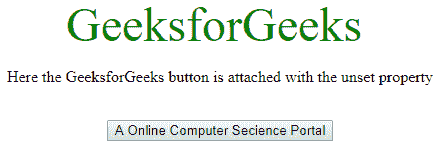

# 7 个 CSS 黑客每个开发者都应该知道

> 原文:[https://www . geesforgeks . org/7-CSS-hacks-ever-developer-应知/](https://www.geeksforgeeks.org/7-css-hacks-every-developer-should-know/)

**简介:**用户界面是你网站上第一个吸引用户的东西。你的网站布局或网站设计给用户好的感觉。它没有被广泛用作 JavaScript，但它属于顶级编码语言。96%的网站使用它。在构建应用程序时，我们总是试图优化代码。我们遵循几个捷径和黑客。这也适用于 CSS。这些黑客节省了大量时间，并改善了您的网站设计。您可以将这些片段直接插入到代码中。在构建一个应用程序时，我们通常会用 CSS 编写一段很长的代码。我们在代码中添加各种属性来实现网站的适当设计。这些事情使我们的代码变得混乱，为了避免这种情况，我们将在 CSS 中分享一些黑客攻击。这些黑客将帮助你为你的网站用户界面编写一个高效的代码。我们开始吧。

现在我们将看到每个开发人员都应该知道的 7 个 CSS 黑客。

**1。悬停效果延迟使用 CSS:** 要创建悬停效果，您可以使用悬停选择器。要延迟悬停效果，可以使用过渡元素来延迟悬停效果。基本上，它看起来如此干净，以至于吸引了用户对元素的注意力。

下面给出了一个代码片段示例。

## 超文本标记语言

```
<!DOCTYPE html>
<html>

<head>
    <style>
        h1 {
            color: green;
            position: relative;
            animation: lit 2s;
            animation-delay: 2s;
        }

        @keyframes lit {
            from {
                left: 0px;
            }

            to {
                left: 200px;
            }
        }
    </style>
</head>

<body>
    <h3>
        How to use animation-delay in CSS?
    </h3>

    <p>Animation will start after 2 sec.</p>

    <h1>GeeksforGeeks</h1>
</body>

</html>
```

**输出:**



**2。用 CSS 将内容放在中心位置:**UI 开发人员努力做的另一件棘手的事情是将内容放在中心位置。设置属性位置:绝对解决此问题。内容将位于中心。设置此属性将适用于所有设备。

下面给出了一个代码片段示例。

## 超文本标记语言

```
<!DOCTYPE html>
<html>

<head>
    <title>Page Title</title>
    <style>
        .parent {
            position: relative;
            height: 400px;
            width: 400px;
            background-color: red;
        }

        .child {
            position: absolute;
            top: 50%;
            left: 50%;
            transform: translate(-50%, -50%);
            height: 100px;
            width: 100px;
            background-color: blue;
        }
    </style>
</head>

<body>
    <div class="parent">
        <div class="child">
            This element is centered
        </div>
    </div>
</body>

</html>
```

**输出:**



**3。修复元素在 CSS 中的位置:**在 CSS 中处理代码时，您可能会在某个位置找到要修复的元素。作为初学者，这可能是最棘手的事情。要获得所需的结果，可以设置属性位置:绝对。请确保此属性不会破坏您网站的响应能力。检查每个屏幕大小和分辨率上的站点外观。这样做可以确保您的设计适合所有屏幕分辨率或设备。对于所有用户，元素应该保持在相同的位置。

下面给出了一个代码片段示例。

## 超文本标记语言

```
<!DOCTYPE html>
<html>

<head>
    <style>
        div.fixed {
            position: fixed;
            bottom: 0;
            right: 0;
            width: 300px;
            border: 3px solid #73AD21;
        }

        div.absolute {
            position: absolute;
            top: 150px;
            right: 80;
            width: 200px;
            height: 100px;
            border: 3px solid #73AD21;
        }
    </style>
</head>

<body>
    <h1>position: absolute;</h1>
    <h2>position: fixed;</h2>
    <div class="absolute">
        This element has position: absolute;
    </div>
</body>

</html>
```

**输出:**



**4。让图片适合 CSS 页面:**如果图片可以让你的网站变漂亮，那么它也会让你的网站变丑。当图像溢出整个屏幕时，在网站上看起来非常糟糕。这个问题在 web 开发中很常见。它会给访问网站的用户留下不好的印象。那么有什么解决办法呢？

下面给出了一个代码片段示例。

## 超文本标记语言

```
<!DOCTYPE html>
<html>

<head>
    <style>
        .geeks {
            width: 60%;
            height: 300px;
        }

        img {
            width: 100%;
            height: 100%;
        }
    </style>
</head>

<body>
    <div class="geeks">
        
    </div>
</body>

</html>
```

**输出:**


**5。CSS 中的访问链接样式:**当用户访问链接时，您可以自定义链接的样式。您可能已经注意到，一旦单击链接，链接的样式或颜色就会改变。您可以根据需要对其进行自定义，并且可以编写代码来调整链接在点击之前和之后的外观。

下面给出了一个代码片段示例。

## 超文本标记语言

```
<!DOCTYPE html>
<html lang="en">

<head>
    <!--Meta data-->
    <meta charset="UTF-8">
    <meta http-equiv="X-UA-Compatible" content="IE=edge">
    <meta name="viewport" 
          content="width=device-width, initial-scale=1.0">

    <style>
        h1 {
            color: #006600;
            text-align: center;
        }

        /* If the link is unvisited you see this color*/
        a:link {
            color: #006600;
            text-decoration: none;
        }

        /* If the link is visited you see this color*/
        a:visited {
            color: rgb(255, 105, 223);
        }

        /* On placing mouse over the link */
        a:hover {
            color: rgb(128, 105, 255);
            text-decoration: underline;
        }

        /* If the click the link,  you see this color*/
        a:active {
            color: rgb(255, 105, 138);
        }
    </style>
</head>

<body>
    <h1>GeeksforGeeks</h1>
    <p>Click the links</p>
    <ul>
        <li><a href=
"https://www.geeksforgeeks.org/dbms/?ref=ghm">
           DBMS
        </a>
        </li>
        <li><a href=
"https://www.geeksforgeeks.org/computer-network-tutorials/?ref=ghm">
          Computer Networks</a>
        </li>
        <li> <a href=
"https://www.geeksforgeeks.org/operating-systems/?ref=ghm">
          Operating Systems</a>
        </li>
        <li><a href=
"https://www.geeksforgeeks.org/data-structures/?ref=ghm">
          Data Structures</a>
        </li>
        <li><a href="https://www.geeksforgeeks.org/"> 
           And many more</a>
        </li>
    </ul>
</body>

</html>
```

**输出:**



**6。在 CSS 中整合样式:**在你的网页中，如果你需要多次重复相同的样式，那么在几个地方编写这段代码会花费很多时间。您需要在这里优化您的 CSS 代码，您需要用更少的行编写代码，您可以用逗号分隔项目，并且您可以将样式写入其中。它将被添加到所有这些文件中。

下面给出了一个代码片段示例。

## 超文本标记语言

```
<!DOCTYPE html>
<html>

<head>
    <style>
        .geeks,
        img {
            width: 70%;
            height: 70%;
        }
    </style>
</head>

<body>
    <div class="geeks">
        
    </div>
</body>

</html>
```

**输出:**



**7。重置和取消设置 CSS 样式:**可能会出现需要覆盖不同浏览器的所有默认样式属性的情况。默认样式不能保证它能在所有浏览器上工作。每个浏览器都有自己的带有默认内置样式的样式表。如果这个设计在你使用的浏览器中不起作用，那么这对你来说可能是个问题，尤其是当你必须让你的网站在所有浏览器中保持一致的时候。以下是解决办法。

下面给出了一个代码片段示例。

## 超文本标记语言

```
<!DOCTYPE html>
<html>

<head>
    <title>
        How to reset/remove CSS
        styles for element ?
    </title>

    <style>
        body {
            display: grid;
            min-height: 100vh;

        }
        .gfg {
            all: unset;
        }
        .geeks {
            color: green;
            font-size: 3rem;
        }
    </style>
</head>

<body>
    <center>
        <div class="geeks">
            <button class="gfg">
                GeeksforGeeks
            </button>
        </div>

        <p>
            Here the GeeksforGeeks button is
            attached with the unset property
        </p>
        <br>
        <button class="GFG">
            A Online Computer Secience Portal
        </button>
    </center>
</body>

</html>
```

### 输出:



**结论:**我们已经分享了 CSS 的一些常见黑客，但这些并不局限于此。随着你在前端开发的旅程中不断进步，你会在 CSS 中学到很多东西。阅读其他开发人员的代码对创建漂亮的用户界面有很大帮助。在用户界面开发中，检查您的 web 应用程序在所有浏览器中的响应性是非常重要的。很多开发人员最终写了很长的代码，这并不好。我们强烈建议他们检查另一个开发人员的代码，并检查使用较少代码行但仍然实现相同目标的项目。