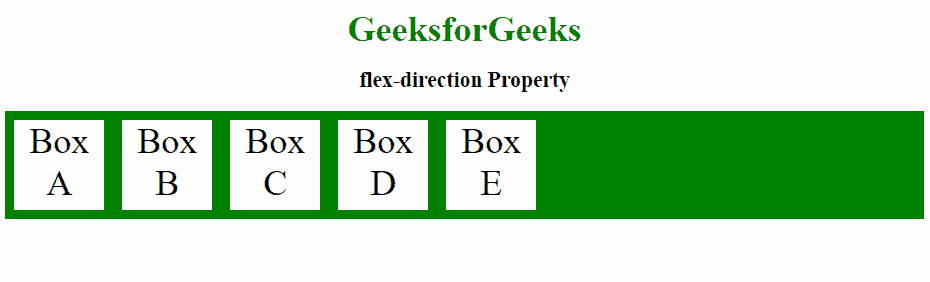
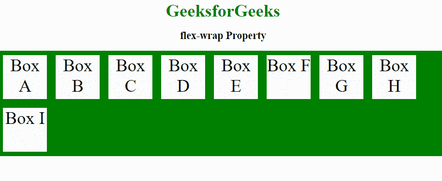
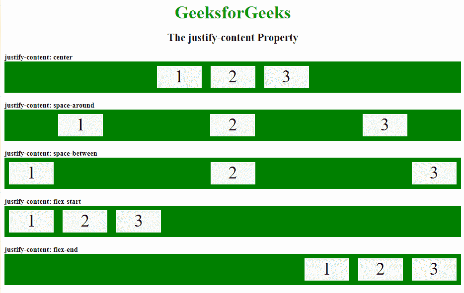
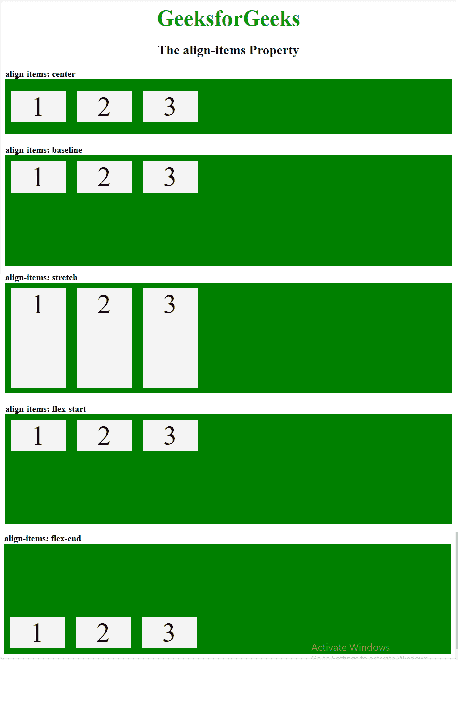
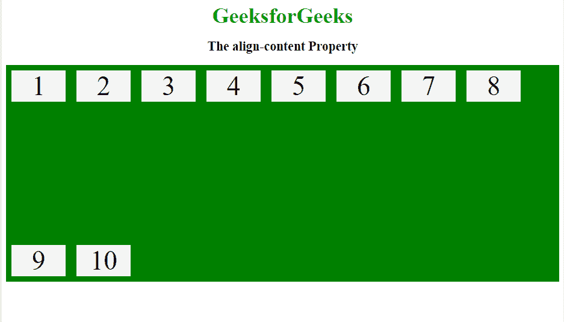

# 使用弹性框推进 CSS 布局

> 原文:[https://www . geesforgeks . org/advance-CSS-layout-with-flex box/](https://www.geeksforgeeks.org/advance-css-layout-with-flexbox/)

它也被称为柔性盒模型。它基本上是一个布局模型，提供了一种简单明了的方式来排列容器中的项目。Flexbox 不同于垂直偏向的块模型和水平偏向的内嵌模型。Flexbox 是为小规模布局创建的，还有另一个标准叫做网格，它更适合大规模布局，它的工作方式类似于推特引导网格系统的工作方式。Flexbox 反应灵敏，移动友好。从 flexbox 开始，首先创建一个 flex 容器。若要创建 flex 容器，请将 display 属性设置为 flex。

**示例:**

```html
.main-container {
  display: flex;
}

```

**挠曲特性:**

*   挠曲方向
*   柔性包装
*   柔性流
*   调整内容
*   对齐项目
*   对齐内容

**挠曲方向:**挠曲方向用于定义柔性项的方向。flexbox 中的默认轴是水平的，因此项目会排成一行。

**语法:**

```html
// Stacking flex items column wise
flex-direction: column;

// Stacking flex items from bottom to top
flex-direction: column-reverse;

// Stacking flex items row wise
flex-direction: row;

// Stacking flex items from right to left
flex-direction: row-reverse;

```

**示例:**

```html
<!DOCTYPE html>
<html>
    <head>
        <title>flexbox</title>
        <style>
            .gfg_flex {
                display: flex;
                flex-direction: row;
                background-color: green;
                text-align:center;
            }

            .gfg_flex > div {
                background-color: #f4f4f4;
                width: 100px;
                height:100px;
                margin: 10px;
                font-size: 40px;
            }
            h2 {
                text-align:center;
            }
            .geeks {
                font-size:40px;
                text-align:center;
                color:#009900;
                font-weight:bold;
            }
        </style>
    </head>
    <body>
        <div class = "geeks">GeeksforGeeks</div>
        <h2>flex-direction Property</h2>
        <div class="gfg_flex">
            <div>Box A</div>
            <div>Box B</div>
            <div>Box C</div> 
            <div>Box D</div>
            <div>Box E</div> 
        </div>
    </body>
</html>                                       
```

**输出:**


**柔性包装:**柔性包装属性用于定义柔性物品的包装。如果 flex-wrap 属性设置为 wrap，则浏览器窗口设置该框。如果浏览器窗口比元素小，那么元素会下到下一行。

**语法:**

```html
// Wrap flex items when necessary
flex-wrap: wrap;

// Flex items will not wrap
flex-wrap: nowrap;

```

**示例:**

```html
<!DOCTYPE html>
<html>
    <head>
        <title>flex-wrap property</title>
        <style>
            .gfg_flex {
                display: flex;
                flex-wrap: wrap;
                text-align:center;
                background-color: green;
            }

            .gfg_flex > div {
                background-color: #f4f4f4;
                width: 100px;
                height:100px;
                margin: 10px;
                font-size: 40px;
            }
            h2 {
                text-align:center;
            }
            .geeks {
                font-size:40px;
                text-align:center;
                color:#009900;
                font-weight:bold;
            }           
        </style>
    </head>
    <body>
        <div class = "geeks">GeeksforGeeks</div>
        <h2>flex-wrap Property</h2>
        <div class="gfg_flex">
            <div>Box A</div>
            <div>Box B</div>
            <div>Box C</div> 
            <div>Box D</div>
            <div>Box E</div>
            <div>Box F</div> 
            <div>Box G</div>
            <div>Box H</div>
            <div>Box I</div> 
        </div>
    </body>
</html>                                           
```

**输出:**


**注:**柔流是柔向和柔绕的简写。
**语法:**

```html
flex-flow: row wrap;

```

**对齐内容:**对齐内容属性用于根据 flexbox 容器内的主轴对齐 flex 项目。

**语法:**

```html
// Aligns the flex items at the center
justify-content: center;

// The space is distributed around the flexbox items
//and it also adds space before the first item and after the last one.
justify-content: space-around;

// Space between the lines
justify-content: space-between;

// Aligns the flex items at the beginning of the container
justify-content: flex-start;

// Aligns the flex items at the end of the container
justify-content: flex-end;

```

**示例:**

```html
<!DOCTYPE html>
<html>
    <head>
        <title>justify flexbox property</title>
        <style>
            .flex1 {
                display: flex;
                justify-content: center;
                background-color: green;
            }

            .flex2 {
                display: flex;
                justify-content: space-around;
                background-color: green;
            }

            .flex3 {
                display: flex;
                justify-content: space-between;
                background-color: green;
            }

            .flex4 {
                display: flex;
                justify-content: flex-start;
                background-color: green;
            }

            .flex5 {
                display: flex;
                justify-content: flex-end;
                background-color: green;
            }

            .flex-items {
                background-color: #f4f4f4;
                width: 100px;
                height:50px;
                margin: 10px;
                text-align: center;
                font-size: 40px;
            }
            h2 {
                text-align:center;
            }
            .geeks {
                font-size:40px;
                text-align:center;
                color:#009900;
                font-weight:bold;
            }                       
        </style>
    </head>
    <body>
        <div class = "geeks">GeeksforGeeks</div>
        <h2>The justify-content Property</h2>
        <b>justify-content: center </b>
        <div class="flex1">
            <div class="flex-items">1</div>
            <div class="flex-items">2</div>
            <div class="flex-items">3</div> 
        </div>
        <br>
        <b>justify-content: space-around </b>
        <div class="flex2">
            <div class="flex-items">1</div>
            <div class="flex-items">2</div>
            <div class="flex-items">3</div> 
        </div>
        <br>
        <b>justify-content: space-between </b>
        <div class="flex3">
            <div class="flex-items">1</div>
            <div class="flex-items">2</div>
            <div class="flex-items">3</div> 
        </div>
        <br>
        <b>justify-content: flex-start </b>
        <div class="flex4">
            <div class="flex-items">1</div>
            <div class="flex-items">2</div>
            <div class="flex-items">3</div> 
        </div>
        <br>
        <b>justify-content: flex-end </b>
        <div class="flex5">
            <div class="flex-items">1</div>
            <div class="flex-items">2</div>
            <div class="flex-items">3</div> 
        </div>
    </body>
</html>                                  
```

**输出:**


**对齐-项目:**该属性用于根据横轴垂直对齐伸缩项目。
**语法:**

```html
// Aligns the flex items in the middle of the container
align-items: center;

// Flexbox items are aligned at the baseline of the cross axis
align-items: baseline;

// Stretches the flex items
 align-items: stretch;

// Aligns the flex items at the top of the container
align-items: flex-start;

// Aligns elements at the bottom of the container
align-items: flex-end;

```

**示例:**

```html
<!DOCTYPE html>
<html>
    <head>
        <title>align-items property</title>
        <style>
            .flex1 {
                display: flex;
                height: 200px;
                align-items: center;
                background-color: green;
            }

            .flex2 {
                display: flex;
                height: 200px;
                align-items: baseline;
                background-color: green;
                }

            .flex3 {
                display: flex;
                height: 200px;
                align-items: stretch;
                background-color: green;
            }

            .flex4 {
                display: flex;
                height: 200px;
                align-items: flex-start;
                background-color: green;
            }

            .flex5 {
                display: flex;
                height: 200px;
                align-items: flex-end;
                background-color: green;
            }

            .flex-items {
                background-color: #f4f4f4;
                width: 100px;
                margin: 10px;
                text-align: center;
                font-size: 50px;
            }
            h2 {
                text-align:center;
            }
            .geeks {
                font-size:40px;
                text-align:center;
                color:#009900;
                font-weight:bold;
            }        
        </style>
    </head>
    <body>
    <div class = "geeks">GeeksforGeeks</div>
    <h2>The align-items Property</h2>
    <b>align-items: center </b>
    <div class="flex1">
        <div class="flex-items">1</div>
        <div class="flex-items">2</div>
        <div class="flex-items">3</div> 
    </div>
    <br>
    <b>align-items: baseline </b>
    <div class="flex2">
        <div class="flex-items">1</div>
        <div class="flex-items">2</div>
        <div class="flex-items">3</div> 
    </div>
    <br>
    <b>align-items: stretch </b>
    <div class="flex3">
        <div class="flex-items">1</div>
        <div class="flex-items">2</div>
        <div class="flex-items">3</div> 
    </div>
    <br>
    <b>align-items: flex-start </b>
    <div class="flex4">
        <div class="flex-items">1</div>
        <div class="flex-items">2</div>
        <div class="flex-items">3</div> 
    </div>
    <br>
    <b>align-items: flex-end </b>
    <div class="flex5">
        <div class="flex-items">1</div>
        <div class="flex-items">2</div>
        <div class="flex-items">3</div> 
    </div>
    </body>
</html>                                                      
```

**输出:**


**对齐-内容:**此属性定义每个 flex line 在 flexbox 中的对齐方式，并且仅在应用 flex-wrap: wrap 时适用，即如果存在多行 flexbox 项目。
**语法:**

```html
// Displays the flex lines with equal space between them
align-content: space-between;

// Displays the flex lines at the start of the container
align-content: flex-start;

// Displays the flex lines at the end of the container
 align-content: flex-end;

// Dy using space-around property space will be 
// Distributed equally around the flex lines
align-content: space-around;

// Stretches the flex lines
align-content: stretch;

```

**示例:**

```html
                        <!DOCTYPE html>
<html>
    <head>
        <title>align-content property</title>
        <style>
            .main-container {
                display: flex;
                height: 400px;
                flex-wrap: wrap;
                align-content: space-between;
                background-color: green;
            }

            .main-container div {
                background-color: #f4f4f4;
                width: 100px;
                margin: 10px;
                text-align: center;
                font-size: 50px;
            }
            h2 {
                text-align:center;
            }
            .geeks {
                font-size:40px;
                text-align:center;
                color:#009900;
                font-weight:bold;
            }    
        </style>
    </head>
    <body>
        <div class = "geeks">GeeksforGeeks</div>
        <h2>The align-content Property</h2>
        <div class="main-container">
            <div>1</div>
            <div>2</div>
            <div>3</div> 
            <div>4</div>
            <div>5</div>
            <div>6</div> 
            <div>7</div>
            <div>8</div>
            <div>9</div> 
            <div>10</div>
        </div>
    </body>
</html>                                                                     
```

**输出:**
