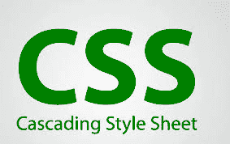

# CSS 的优缺点

> 原文:[https://www . geesforgeks . org/CSS 的优缺点/](https://www.geeksforgeeks.org/advantages-and-disadvantages-of-css/)

**层叠样式表(CSS):** CSS 被定义为一种方法表语言，它为网站设计者提供了对网站如何与网络浏览器通信的控制，包括其 HTML 文档的格式和显示。

CSS 或层叠样式表可能是一种基于文本的编码语言，它指定网站格式以及网站与网络浏览器通信的方式。该语言允许网络开发人员调整各种样式元素和功能，比如布局、颜色、字体，以及 HTML 文档的格式和显示。

主要目标(作为方法表语言)是将文档内容与文档表示分离，文档表示包含样式元素，如颜色、布局和字体。CSS 处理网页的设计和感觉。使用 CSS，您将控制文本的颜色、字体的设计、段落之间的间距、列的大小和布局等。

CSS 指示如何在用户端显示网站。让我们来看看 CSS 的优缺点。

**CSS 的优势:**

*   CSS 起着重要的作用，通过使用 CSS，你只需要为元素指定一个重复的样式一次&多次使用它，因为 CSS 会自动应用所需的样式。
*   CSS 的主要优点是风格在各种网站上一致应用。一条指令可以控制几个区域，这是有利的。
*   网页设计师需要为每个页面使用几行程序来提高网站速度。
*   级联表不仅简化了网站开发，还简化了维护，因为一行代码的更改会影响整个网站和维护时间。
*   它不太复杂，因此工作量大大减少。
*   它有助于形成自发和一致的变化。
*   CSS 的改变是设备友好的。随着人们使用一批各种各样的智能设备通过网络访问网站，对响应性网页设计提出了要求。
*   它有重新定位的能力。它帮助我们确定页面上 web 元素位置的变化。
*   这些带宽节省是从一大堆页面中模糊不清的无关紧要的标签的实际数字。
*   用户可以轻松定制在线页面
*   它减少了文件传输大小。

**CSS 的缺点:**

*   CSS，从 CSS 1 到 CSS3，导致了网页浏览器之间的混乱。
*   有了 CSS，在一个浏览器上工作的东西可能并不总是在另一个浏览器上工作。web 开发人员需要测试兼容性，在多个浏览器上运行程序。
*   缺乏安全感。
*   进行更改后，我们需要确认兼容性(如果出现)。类似的变化会影响所有的浏览器。
*   对于非开发人员和初学者来说，编程语言世界是复杂的。不同级别的 CSS，即 CSS 1、CSS 2、CSS 3 往往相当混乱。
*   浏览器兼容性(支持某些样式表，不支持某些样式表)。
*   CSS 在不同的浏览器上工作方式不同。IE 和 Opera 支持 CSS 作为不同的逻辑。
*   使用 CSS 时可能会出现跨浏览器问题。
*   有多个层次，这给非开发人员和初学者造成了混乱。