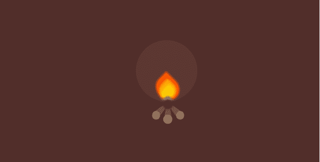

# 使用 CSS 的篝火动画效果

> 原文:[https://www . geesforgeks . org/篝火-动画-效果-使用-css/](https://www.geeksforgeeks.org/bonfire-animation-effect-using-css/)

在本文中，我们将使用 CSS 创建一个篝火动画效果。

**进场:**

*   **创建原木:**我们可以使用*裁剪路径*属性，裁剪一个多边形，并应用一些旋转，使它看起来像它的一端在火里面。
*   **创建火焰:**对于火焰，我们将创建 5 个火焰，即红色、橙色、黄色、蓝色和黑色。使用*边界半径*属性可以轻松创建这些火焰。
*   **闪烁效果:** *关键帧*属性用于创建闪烁动画。为了达到这个效果，我们可以左右旋转火焰，同时缩放它。
*   **创建一个发光效果:**这只是一个使用*边界半径*属性转换成圆形的 *div* 。

**HTML 代码:**

## 超文本标记语言

```css
<!DOCTYPE html>
<html lang="en">

<head>
    <meta charset="UTF-8">
    <meta name="viewport" content="width=device-width, initial-scale=1.0">   
    <link rel="stylesheet" href="styles.css">
</head>

<body>
    <div class="logs_container">
        <div class="log log_1"></div>
        <div class="log log_3"></div>
        <div class="log log_2"></div>
        <div class="log_circle log_circle_1"></div>
        <div class="log_circle log_circle_2"></div>
        <div class="log_circle log_circle_3"></div>
    </div>

    <div class="glowing_circle"></div>

    <div class="flame_container">
        <div class="flame_red flame"></div>
        <div class="flame_orange flame"></div>
        <div class="flame_yellow flame"></div>
        <div class="flame_blue circle"></div>
        <div class="flame_black circle"></div>
    </div>
</body>

</html>
```

**CSS 代码:**以下是上述代码中使用的“styles.css”文件的内容。

```css
* {
    margin: 0;
    padding: 0;
}

body {
    background: #522e2a;
}

.glowing_circle {
    height: 250px;
    width: 250px;
    position: fixed;
    top: 44%;
    left: 52%;
    transform: translate(-50%, -50%);
    background: #5c3631;
    border-radius: 1000px;
}

.log {
    height: 60px;
    width: 30px;
    position: fixed;
    top: 63.25vh;
    background-color: #725442;
    clip-path: polygon(30% 0%, 70% 0%, 
                100% 100%, 0% 100%);
}

.log_1 {
    left: 49.25vw;
    transform: rotate(45deg);
}

.log_2 {
    top: 64vh;
    left: 51.25vw;
}

.log_3 {
    left: 53.25vw;
    transform: rotate(-45deg);
}

.log_circle {
    background-color: #91725c;
    position: fixed;
}

.log_circle_1 {
    height: 35px;
    width: 32px;
    border-radius: 40px;
    top: 68.75vh;
    left: 47.5vw;
}

.log_circle_2 {
    height: 37px;
    width: 37px;
    border-radius: 100px;
    top: 71vh;
    left: 50.9vw;
}

.log_circle_3 {
    height: 35px;
    width: 32px;
    border-radius: 40px;
    top: 68.75vh;
    left: 55vw;
}

.flame_container {
    position: fixed;
    top: 50vh;
    left: 50vw;
    transform: translate(-50%, -50%);
    width: 60px;
    height: 60px;
    animation: flame_flickering 3ms 200ms 
            ease-in infinite alternate;
}

.flame {
    bottom: 0;
    position: absolute;
    border-radius: 50% 0 50% 50%;
    transform: rotate(-45deg) scale(1.5, 1.5);
}

.flame_yellow {
    left: 15px;
    width: 30px;
    height: 20px;
    background: gold;
    box-shadow: 0px 0px 9px 4px gold;
}

.flame_orange {
    left: 10px;
    width: 40px;
    height: 40px;
    background: orange;
    box-shadow: 0px 0px 9px 4px orange;
}

.flame_red {
    left: 5px;
    width: 50px;
    height: 60px;
    background: OrangeRed;
    box-shadow: 0px 0px 5px 4px OrangeRed;
}

.circle {
    border-radius: 50%;
    position: absolute;
}

.flame_blue {
    width: 10px;
    height: 10px;
    left: 25px;
    bottom: -25px;
    background: SlateBlue;
    box-shadow: 0px 0px 15px 10px SlateBlue;
}

.flame_black {
    width: 11px;
    height: 11px;
    left: 25px;
    bottom: -40px;
    background: black;
    box-shadow: 0px 0px 15px 10px black;
}

@keyframes flame_flickering {
    0% {
        transform: rotate(-1deg);
    }
    15% {
        transform: rotate(1deg) scaleY(0.95);
    }
    30% {
        transform: rotate(-1deg) scaleY(0.9);
    }
    45% {
        transform: rotate(1deg) scaleY(0.95);
    }
    60% {
        transform: rotate(-1deg) scaleY(1);
    }
    75% {
        transform: rotate(1deg) scaleY(1.05);
    }
    90% {
        transform: rotate(-1deg) scaleY(1);
    }
    100% {
        transform: rotate(1deg);
    }
}
```

**输出:**



篝火动画