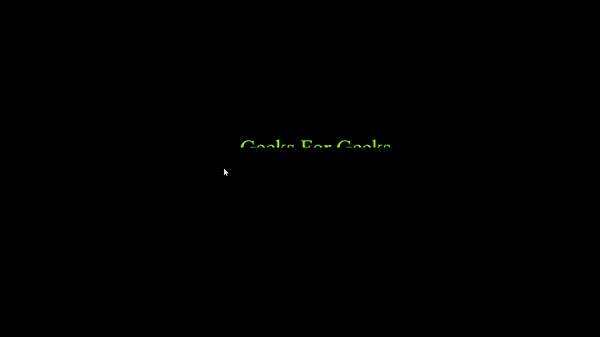

# CSS 中鼠标悬停时下半部分隐藏文本显示

> 原文:[https://www . geesforgeks . org/bottom-half-hidden-text-revealer-on-mouse-over-in-CSS/](https://www.geeksforgeeks.org/bottom-half-hidden-text-revealer-on-mouse-over-in-css/)

在这种 CSS 效果中，文本的下半部分是隐藏的，当用户将鼠标悬停在文本上时，文本的某些部分会变得可见。这种效果可以通过给要隐藏的文本 0 亮度并使用 [*剪辑路径*](https://www.geeksforgeeks.org/css-clip-path-property/) 属性使其可见来创建。JavaScript 用于获取光标位置。

**进场:**

*   创建一个名为*index.html*的 HTML 文件。
*   创建两个 div 元素，一个类名为 *upper_text* ，另一个类名为*指针*。
*   在 CSS 中为这两个类添加样式。
*   确保这两个 *div* 元素的样式具有完全相同的属性，即大小和位置应该完全相同，这样这两个*div*就位于彼此之上。
*   利用 *upper_text* div 元素中的*裁剪路径*属性来裁剪文本的上半部分。
*   在*index.html*文件中添加脚本标签。
*   在文档中添加一个事件监听器来监听 [*鼠标移动*](https://www.geeksforgeeks.org/html-dom-onmousemove-event/) 事件。
*   获取对具有类名指针的 HTML 元素的引用。
*   获取光标的当前位置，并更改指针元素的样式。在当前光标位置截取一个具有预定半径的圆。以便文本在该半径内可见。

**HTML 代码:**

## 超文本标记语言

```css
<!DOCTYPE html>
<html lang="en">

<head>
    <meta charset="UTF-8">
    <meta http-equiv="X-UA-Compatible"
                content="IE=edge">

    <meta name="viewport" content=
        "width=device-width, initial-scale=1.0">

    <style>
        * {
            padding: 0;
            margin: 0;
            box-sizing: border-box;
            overflow: hidden;
            background-color: black;
        }

        .upper_text,
        .pointer {
            position: fixed;
            top: 40vh;
            left: 40vw;
            width: 350px;
            color: chartreuse;
            font-size: 50px;
            cursor: all-scroll;
        }

        .upper_text {
            clip-path: polygon(0% 0%, 
                100% 0%, 100% 50%, 0% 50%);
        }
    </style>
</head>

<body>
    <div class="upper_text">
        Geeks For Geeks
    </div>

    <div class="pointer">
        Geeks For Geeks
    </div>
    <script>
        document.addEventListener('mousemove', (e) => {
            const pointer = document.querySelector('.pointer');

            pointer.style.clipPath = 
            `circle(30px at ${e.offsetX}px ${e.offsetY}px)`;
        });
    </script>
</body>

</html>
```

**输出:**

