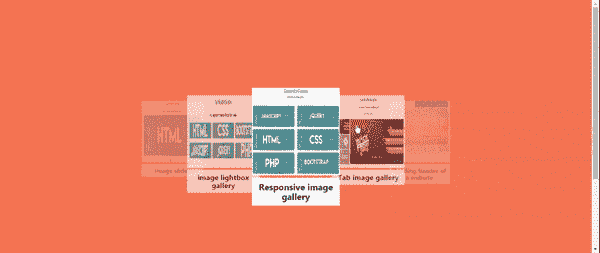

# 使用物化 CSS 旋转木马

> 原文:[https://www . geesforgeks . org/carousel-using-物化-css/](https://www.geeksforgeeks.org/carousel-using-materialize-css/)

[物化 CSS](https://www.geeksforgeeks.org/materialize-introduction-and-installation/) 是谷歌创建设计的 UI 组件库。这是一种将成功设计的经典原则与创新和技术相结合的设计语言。

**特征:**

*   响应式前端 CSS 框架。
*   它与浏览器无关。
*   可扩展。
*   它是免费使用的。
*   它的重点是不同的行动和组成部分。
*   需要使用 jQuery JavaScript 库。

在本文中，我们将使用物化 CSS 创建一个非常有趣且易于设计的三维旋转木马。物化 CSS 轮播是一个健壮和通用的组件。它支持触摸功能，因此在移动设备上使用起来非常方便。

**语法:**

## 超文本标记语言

```css
<div class="carousel">
    <a class="carousel-item" href="#one!">
        
    </a>
    <a class="carousel-item" href="#two!">
        
    </a>
    <a class="carousel-item" href="#three!">
        
    </a>
    <a class="carousel-item" href="#four!">
        
    </a>
    <a class="carousel-item" href="#five!">
        </a>
</div>
```

**初始化用 jQuery/JavaScript:**

## java 描述语言

```css
document.addEventListener('DOMContentLoaded', function() {
    var elems = document.querySelectorAll('.carousel');
    var instances = M.Carousel.init(elems, options);
});

$(document).ready(function(){
    $('.carousel').carousel();
});
```

**示例 1:** 使用上面的代码片段，我们可以通过给出图像的来源和这些图像的超链接(如果需要)来轻松创建我们的转盘。让我们看看下面的例子。

## 超文本标记语言

```css
<!DOCTYPE html>
<html>

<head>
    <!-- Compiled and minified CSS -->
    <link rel="stylesheet" href=
"https://cdnjs.cloudflare.com/ajax/libs/materialize/1.0.0/css/materialize.min.css">
    <meta name="viewport" content="width=device-width, initial-scale=1.0" />

    <script type="text/javascript" 
src="https://code.jquery.com/jquery-1.12.0.min.js">
    </script>

    <!-- Compiled and minified JavaScript -->
    <script src=
"https://cdnjs.cloudflare.com/ajax/libs/materialize/1.0.0/js/materialize.min.js">
    </script>

    <script>
        $(document).ready(function () {
            $('.carousel').carousel();
        });
    </script>

    <style>
        body {
            margin: 0;
            padding: 0;
            background-color: coral;
        }

        a {
            height: 900px;
            width: 650px;
        }

        .carousel {
            height: 800px;
            perspective: 950px;
            transform: translateY(-100px);
        }

        .carousel carousel-item {
            width: 7050px;
        }

        img {
            width: 100%;
            height: 200px;
        }

        h4 {
            margin: 0;
            padding: 0;
            background: #fff;
            color: #000;
            box-sizing: border-box;
            padding: 10px 5px;
            font-weight: bold;
            font-size: 20px;
            text-align: center;
        }
    </style>
</head>

<body>
    <div class="carousel">
        <div class="carousel-item">
            <a href=
"https://www.geeksforgeeks.org/how-to-create-responsive-image-gallery-using-html-css-jquery-and-bootstrap/">
                
            </a>
            <h4>Responsive image gallery</h4>
        </div>

        <div class="carousel-item">
            <a href=
"https://www.geeksforgeeks.org/how-to-create-a-tab-image-gallery/">
                
            </a>
            <h4>Tab image gallery</h4>
        </div>

        <div class="carousel-item">
            <a href=
"https://www.geeksforgeeks.org/html-course-building-header-of-the-website/">
                
            </a>
            <h4>Building header of a website</h4>
        </div>

        <div class="carousel-item">
            <a href=
"https://www.geeksforgeeks.org/how-to-design-image-slider-using-jquery/">
                
            </a>
            <h4>image slider</h4>
        </div>

        <div class="carousel-item">
            <a href=
"https://www.geeksforgeeks.org/how-to-create-image-lightbox-gallery-using-html-css-and-javascript/">
                
            </a>
            <h4>image lightbox gallery</h4>
        </div>
    </div>
</body>

</html>
```

**输出:**



**全幅滑块:**同样，我们也可以通过将 jQuery *全幅*选项设置为 *true* 来创建全幅滑块。我们还可以在滑块底部显示指示器。这个滑块也是触摸兼容的。

为了创建这种类型的滑块，我们有一个类作为“*转盘-滑块*”，在这个*分区*中，我们放置用于创建滑块的图像，如下所示。

## 超文本标记语言

```css
<div class="carousel carousel-slider">
    <a class="carousel-item" href="#one!">
        
    </a>
    <a class="carousel-item" href="#two!">
        
    </a>
    <a class="carousel-item" href="#three!">
        
    </a>
    <a class="carousel-item" href="#four!">
        
    </a>
</div>
```

jQuery 脚本将被更改，如下所示。

## java 描述语言

```css
$('.carousel.carousel-slider').carousel({
    fullWidth: true
});
```

**例 2:**

## 超文本标记语言

```css
<!DOCTYPE html>
<html>

<head>
    <!-- Compiled and minified CSS -->
    <link rel="stylesheet" href=
"https://cdnjs.cloudflare.com/ajax/libs/materialize/1.0.0/css/materialize.min.css">
    <meta name="viewport" content=
        "width=device-width, initial-scale=1.0" />

    <script type="text/javascript" 
src="https://code.jquery.com/jquery-1.12.0.min.js">
    </script>

    <!-- Compiled and minified JavaScript -->
    <script src=
"https://cdnjs.cloudflare.com/ajax/libs/materialize/1.0.0/js/materialize.min.js">
    </script>

    <script>
        $(document).ready(function () {
            $('.carousel.carousel-slider').carousel(
                {
                    fullWidth: true,
                    indicators: true
                }
            );
        });
    </script>
</head>

<body>
    <div class="carousel carousel-slider center">
        <div class="carousel-item pink" href="#one!">
            <h2>First Panel</h2>
            
        </div>

        <div class="carousel-item blue" href="#two!">
            <h2>Second Panel</h2>
            
        </div>

        <div class="carousel-item grey" href="#three!">
            <h2>Third Panel</h2>
            
        </div>

        <div class="carousel-item yellow" href="#four!">
            <h2>Fourth Panel</h2>
            
        </div>
    </div>
</body>

</html>
```

**输出:**

