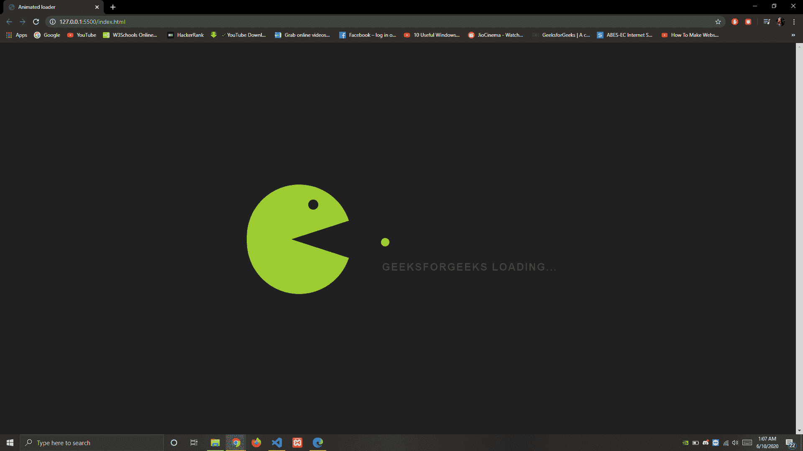
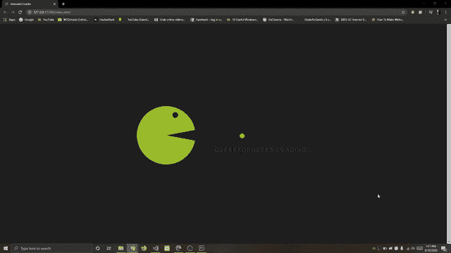

# 使用 CSS 的卡通动画加载器

> 原文:[https://www . geesforgeks . org/cartoon-animation-loader-using-CSS/](https://www.geeksforgeeks.org/cartoon-animation-loader-using-css/)

在操作系统中，所有程序和库的加载都由加载器处理，加载器是启动程序的重要过程之一。程序被保存在内存中，以备进一步执行。



**HTML 代码:**本节设计了代码的基本结构。

```css
<!DOCTYPE html>
<html lang="en">

<head>
    <meta charset="UTF-8">
    <meta name="viewport" content=
        "width=device-width, initial-scale=1.0">
    <title>Animated loader</title>
    <link rel="stylesheet" href="style.css">
</head>

<body>
    <div class="pieces"></div>
    <div class="one"></div>
    <div class="two"></div>
    <div class="eye"></div>
    <p>GeeksforGeeks loading...</p>
</body>

</html>
```

**CSS 代码:**在本节中，卡通加载器的设计是使用**@关键帧**等 CSS 属性实现的。动画是通过从一套风格逐渐改变到另一套风格来创建的。更改以百分比表示，或者带有关键字“从”和“到”，这将与 0%和 100%相同。我们可以根据需要多次更改 CSS 样式集。

**语法:**

```css
@keyframes animationname {keyframes-selector {css-styles;}}
```

```css
body{
    display: flex;
    justify-content: center;
    align-items: center;
    min-height: 100vh;
    background: #202020;

}
.pieces{
    padding: 10px;
    border-radius: 50%;
    background: #ffcc00;
    position: absolute;
    right: 40%;
    animation: pieces 1s linear infinite;
}
.one{
    position: absolute;
    top: 50.5%;
    left: 30%;
    background: yellowgreen;
    border-radius: 0 0 125px 125px;
    height: 125px;
    width: 250px;
    animation: anim1 1s linear infinite;
}
.two{
    position: absolute;
    top: 36.5%;
    left: 30%;
    background: yellowgreen;
    border-radius: 125px 125px 0 0;
    height: 125px;
    width: 250px;
    animation: anim2 1s linear infinite;
}
.eye{
    position: absolute;
    right: 60%;
    top: 40%;
    background: #202020;
    padding: 12px;
    border-radius: 50%;
    animation: eye 1s linear infinite;
}
p{
    position: absolute;
    font-weight: bold;
    text-transform: uppercase;
    font-size: 25px;
    letter-spacing: 2px;
    top: 53%;
    right: 30%;
    font-family: arial;
    color: green;
}
@keyframes anim1{
    0%{
        transform: rotate(0deg);
    }
    50%{
        transform: rotate(20deg);
    }
    100%{
        transform: rotate(0deg);
    }
}
@keyframes anim2{
    0%{
        transform: rotate(0deg);
    }
    50%{
        transform: rotate(-20deg);
    }
    100%{
        transform: rotate(0deg);
    }
}
@keyframes eye{
    0%{
        top: 40%;
        right: 60%;
    }
    50%{
        top: 40.3%;
        right: 60.3%;
    }
    100%{
        top: 40%;
        right: 60%;
    }
}
@keyframes pieces{
    0%{
        right: 40%;
    }
    100%{
        right: 60%;
    }
}
```

**完整代码:**是以上两个代码段的组合。

```css
<!DOCTYPE html>
<html lang="en">

<head>
  <meta charset="UTF-8">
  <meta name="viewport" content=
    "width=device-width, initial-scale=1.0">

  <title>Animated loader</title>

  <style>
    body {
      display: flex;
      justify-content: center;
      align-items: center;
      min-height: 100vh;
      background: #202020;

    }

    .pieces {
      padding: 10px;
      border-radius: 50%;
      background: #ffcc00;
      position: absolute;
      right: 40%;
      animation: pieces 1s linear infinite;
    }

    .one {
      position: absolute;
      top: 50.5%;
      left: 30%;
      background: yellowgreen;
      border-radius: 0 0 125px 125px;
      height: 125px;
      width: 250px;
      animation: anim1 1s linear infinite;
    }

    .two {
      position: absolute;
      top: 36.5%;
      left: 30%;
      background: yellowgreen;
      border-radius: 125px 125px 0 0;
      height: 125px;
      width: 250px;
      animation: anim2 1s linear infinite;
    }

    .eye {
      position: absolute;
      right: 60%;
      top: 40%;
      background: #202020;
      padding: 12px;
      border-radius: 50%;
      animation: eye 1s linear infinite;
    }

    p {
      position: absolute;
      font-weight: bold;
      text-transform: uppercase;
      font-size: 25px;
      letter-spacing: 2px;
      top: 53%;
      right: 30%;
      font-family: arial;
      color: green;
    }

    @keyframes anim1 {
      0% {
        transform: rotate(0deg);
      }

      50% {
        transform: rotate(20deg);
      }

      100% {
        transform: rotate(0deg);
      }
    }

    @keyframes anim2 {
      0% {
        transform: rotate(0deg);
      }

      50% {
        transform: rotate(-20deg);
      }

      100% {
        transform: rotate(0deg);
      }
    }

    @keyframes eye {
      0% {
        top: 40%;
        right: 60%;
      }

      50% {
        top: 40.3%;
        right: 60.3%;
      }

      100% {
        top: 40%;
        right: 60%;
      }
    }

    @keyframes pieces {
      0% {
        right: 40%;
      }

      100% {
        right: 60%;
      }
    }
  </style>
</head>

<body>
  <div class="pieces"></div>
  <div class="one"></div>
  <div class="two"></div>
  <div class="eye"></div>

  <p>GeeksforGeeks loading...</p>
</body>

</html>
```

**输出:**
