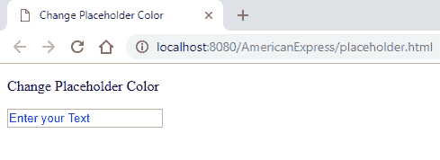
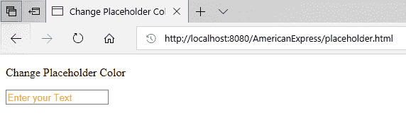
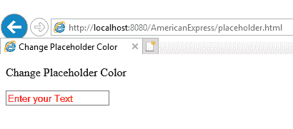
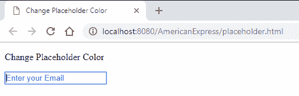

# 用 CSS 改变 HTML5 输入占位符颜色

> 原文:[https://www . geesforgeks . org/change-an-html 5-input-placeholder-color-with-CSS/](https://www.geeksforgeeks.org/change-an-html5-input-placeholder-color-with-css/)

CSS [伪元素](https://www.geeksforgeeks.org/css-pseudo-elements/)中的[占位符选择器](https://www.geeksforgeeks.org/css-placeholder-selector/)用于通过更改文本颜色来设计占位符文本，并允许修改文本的样式。在大多数浏览器中，占位符(在输入标签内)是灰色的。为了改变这个占位符的颜色，可以使用非标准的*:占位符*选择器，它在那个特定的选择器中实现颜色属性。该选择器因浏览器而异。例如，对于谷歌浏览器、Mozilla Firefox 和 Opera 浏览器等，选择器可以实现为:

**语法:**

```
::placeholder
```

*   **对于互联网浏览器:**

    ```
    :-ms-input-placeholder
    ```

*   **针对微软 Edge:**

    ```
    ::-ms-input-placeholder
    ```

**示例 1:** 这段代码展示了不同浏览器中*::占位符选择器*的使用。

## 超文本标记语言

```
<!DOCTYPE html>
<html>

<head>
    <title>Change Placeholder Color</title>
    <style>
    ::placeholder {

        /* Firefox, Chrome, Opera */
        color: blue;
    }

    :-ms-input-placeholder {

        /* Internet Explorer 10-11 */
        color: red;
    }

    ::-ms-input-placeholder {

        /* Microsoft Edge */
        color: orange;
    }
    </style>
</head>

<body>

<p>Change Placeholder Color</p>

    <input type="text" placeholder="Enter your Text">
</body>

</html>
```

**输出:**

*   **在谷歌 Chrome:**

    

*   **在微软 Edge:**

    

*   **在互联网浏览器中:**

    

**注意:**Internet Explorer 不再支持占位符选择器。

**示例 2** :该代码在输入标签的电子邮件属性中实现了一个占位符选择器。占位符选择器可以应用于输入标签的任何属性(文本、电话、密码等)，以突出显示任何不同属性中的颜色变化。

## 超文本标记语言

```
<!DOCTYPE html>
<html>

<head>
    <title>Change Placeholder Color</title>
    <style>
    input[type="email"]::placeholder {

        /* Firefox, Chrome, Opera */
        color: blue;
    }

    input[type="email"]:-ms-input-placeholder {

        /* Internet Explorer 10-11 */
        color: red;
    }

    input[type="email"]::-ms-input-placeholder {

        /* Microsoft Edge */
        color: orange;
    }
    </style>
</head>

<body>

<p>Change Placeholder Color</p>

    <input type="email" placeholder="Enter your Email">
</body>

</html>
```

**输出:**

