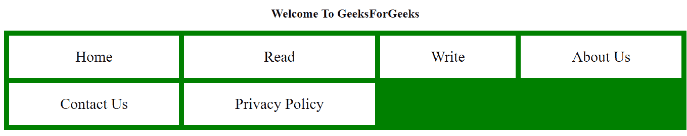
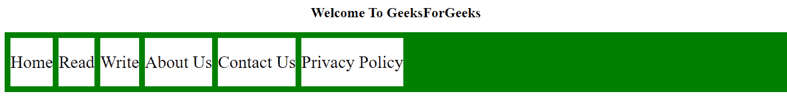

# CSS 网格和 CSS 弹性框的区别

> 原文:[https://www . geesforgeks . org/comparison-to-CSS-grid-CSS-flex box/](https://www.geeksforgeeks.org/comparison-between-css-grid-css-flexbox/)

**[Grid](https://www.geeksforgeeks.org/css-grid-property/):**CSS Grid Layout，是一个基于二维网格的有行有列的布局系统，让网页的设计变得更加容易，无需使用浮动和定位。像表格一样，网格布局允许我们将元素排列成列和行。

首先，您必须将容器元素定义为带有**显示的网格:**使用网格-模板-列和网格-模板-行设置列和行的大小，然后将其子元素放入带有网格-列和网格-行的网格中。

**示例:**

## 超文本标记语言

```html
<!DOCTYPE html>
<html lang="en">
<head>
    <style>
        .main{

            display: grid;
            display: grid; 
            grid: auto auto / auto auto auto auto; 
            grid-gap: 10px; 
            background-color: green; 
            padding: 10px; 
        }
        .gfg { 
            background-color: rgb(255, 255, 255); 
            text-align: center; 
            padding: 25px 0; 
            font-size: 30px; 
        } 
    </style>
</head>
<body>
    <h2 style="text-align: center;">Welcome To GeeksForGeeks </h2>
    <div class="main">
        <div class="gfg">Home</div>
        <div class="gfg">Read</div>
        <div class="gfg">Write</div>
        <div class="gfg">About Us</div>
        <div class="gfg">Contact Us</div>
        <div class="gfg">Privacy Policy</div>
    </div>
</body>
</html>
```



**[Flexbox](https://www.geeksforgeeks.org/introduction-to-css-flexbox/):**CSS Flexbox 提供一维布局。它有助于在容器(由网格组成)中的项目之间分配和对齐空间。它适用于各种显示设备和屏幕尺寸。

要开始，您必须将容器元素定义为带有**显示的网格:flex**

**例:**

## 超文本标记语言

```html
<!DOCTYPE html>
<html lang="en">
<head>
    <style>
        .main{

            display: flex;
            display: flex; 
            grid: auto auto / auto auto auto auto; 
            grid-gap: 10px; 
            background-color: green; 
            padding: 10px; 
        }
        .gfg { 
            background-color: rgb(255, 255, 255); 
            text-align: center; 
            padding: 25px 0; 
            font-size: 30px; 
        } 
    </style>
</head>
<body>
    <h2 style="text-align: center;">Welcome To GeeksForGeeks </h2>
    <div class="main">
        <div class="gfg">Home</div>
        <div class="gfg">Read</div>
        <div class="gfg">Write</div>
        <div class="gfg">About Us</div>
        <div class="gfg">Contact Us</div>
        <div class="gfg">Privacy Policy</div>
    </div>
</body>
</html>
```



**网格和弹性框中的唯一性:**

**一维 Vs 二维:**

*   网格用于二维布局，而 Flexbox 用于一维布局。这意味着 Flexbox 一次可以处理一行或一列，但是 Grids 可以同时处理这两列。
*   Flexbox，在处理任一元素(行或列)时为您提供更大的灵活性。在这种情况下，HTML 标记和 CSS 将很容易管理。
*   网格让您可以更加灵活地在块之间移动，而不考虑您的 HTML 标记。

**内容优先 vs 布局优先:**

*   Flexbox 和 Grids 的主要独特之处在于前者基于内容，而后者基于布局。
*   Flexbox 布局最适合应用程序组件和小规模布局，而 Grid 布局是为设计中非线性的大规模布局而设计的。

**网格和弹性箱的区别:**

**1。维度和灵活性:**

*   Flexbox 可以更好地控制项目之间的对齐和空间分配。由于是一维的，Flexbox 只处理列或行。
*   网格具有二维布局功能，允许以灵活的宽度作为长度单位。这弥补了 Flex 的局限性。

**2。对齐方式:**

*   Flex Direction 允许开发人员垂直或水平对齐元素，这在开发人员创建和反转行或列时使用。
*   CSS 网格为网格流动性和自动关键字功能部署分数度量单位，以自动调整列或行。

**3。项目管理**

*   弹性容器是父元素，而弹性项代表子元素。灵活容器可以通过调整项目尺寸来确保平衡的表示。这使得开发人员可以针对波动的屏幕尺寸进行设计。
*   网格支持隐式和显式内容放置。它内置的自动化功能允许它自动扩展行项目，并将值从前面的项目复制到新创建的项目中。

<figure class="table">

| **属性** | **网格** | **Flexbox** |
| 尺寸 | 二维的 | 一维的 |
| 特征 | 可以通过占据空间的功能灵活组合项目 | 可以将内容元素推向极端对齐 |
| 支持类型 | 布局优先 | 内容第一 |

</figure>

**结论**

*   CSS 网格帮助您创建网页的外部布局。你可以用它来构建复杂且反应灵敏的设计。这就是为什么它被称为“布局优先”。
*   Flexbox 主要帮助对齐内容和移动块。
*   CSS 网格用于 2D 布局。它同时适用于行和列。
*   Flexbox 仅在一维(行或列)中工作更好。
*   如果两者同时使用，会更节省时间，更有帮助。