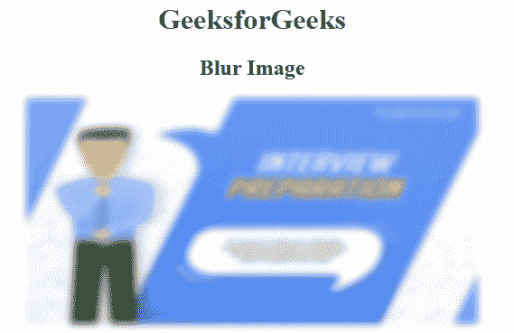

# 使用 HTML/CSS 将图像转换为模糊

> 原文:[https://www . geesforgeks . org/convert-a-image-in-blur-using-html-CSS/](https://www.geeksforgeeks.org/convert-an-image-into-blur-using-html-css/)

给定一个图像，任务是使用 CSS 属性将图像转换为模糊图像。在 CSS 中，滤镜属性用于将图像转换为模糊图像。Filter 属性主要用于设置图像的视觉效果。

**语法:**

```
filter: blur()

```

**示例 1:** 本示例使用模糊滤镜将图像转换为模糊图像。

**原图:**


```
<!DOCTYPE html> 
<html> 
    <head> 
        <title>Convert into blur image</title> 
        <style> 
            img { 
                -webkit-filter: blur(4px); 
                filter: blur(4px); 
            } 
            h1 { 
                color:green; 
            } 
        </style> 
    </head> 
    <body> 
        <center> 
        <h1>GeeksforGeeks</h1> 
        <h2>Blur Image</h2> 
         
        </center> 
    </body> 
</html> 
```

**输出:**


**示例 2:** 本示例使用模糊滤镜创建背景模糊图像。
**原图:**


```
<!DOCTYPE html> 
<html> 
    <head> 
        <title>
            Convert into blur image
        </title> 

        <style> 
            img { 
                -webkit-filter: blur(4px); 
                filter: blur(4px); 
            } 
            h1 { 
                color:green; 
            } 
            .backgr-text {
                position: absolute;
                top: 20%;
                left: 50%;
                transform: translate(-50%, -50%);
                text-align: center;
            }
        </style> 
    </head> 

    <body> 
        <center> 
             

            <div class="backgr-text">
                <h1>GeeksforGeeks</h1>
                <h2>Blurred Background Image</h2>
            </div>
        </center> 
    </body> 
</html>                    
```

**输出:**
