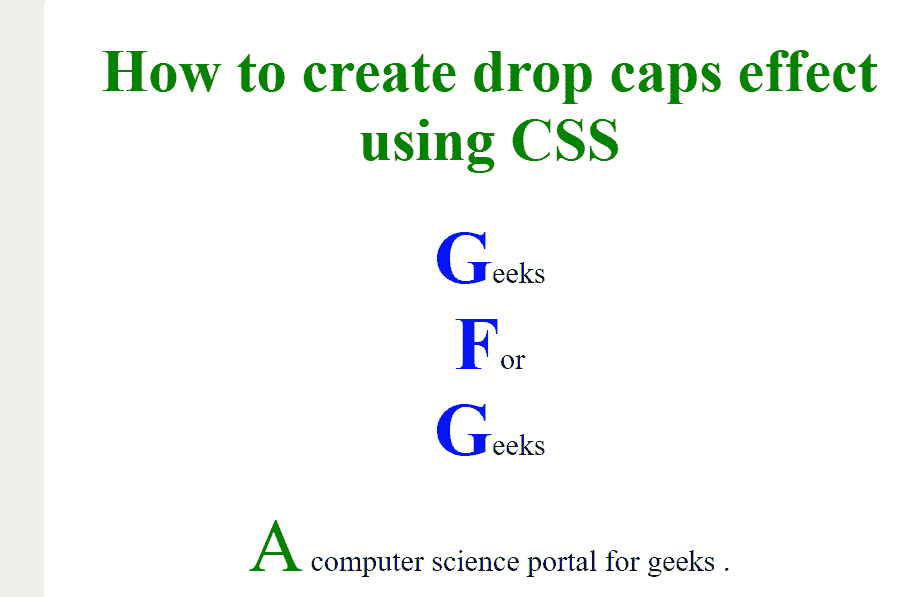

# 使用 CSS 创建首字下沉效果

> 原文:[https://www . geesforgeks . org/create-a-drop-caps-effect-using-CSS/](https://www.geeksforgeeks.org/create-a-drop-caps-effect-using-css/)

首字下沉被定义为一个段落的第一个大写字母，其字体要大得多，深度相当于两行或两行以上的普通文本。

这个任务可以通过使用 **CSS::首字母**伪元素来创建漂亮的首字下沉效果来完成。CSS 中的::首字母选择器用于将样式应用于块级元素第一行的首字母，条件是它前面不应该有其他内容(如图像或内联表)。

**语法:**

```html
::first-letter {
    // CSS Property 
}
```

**示例:**

## 超文本标记语言

```html
<!DOCTYPE html>
<html>

<head>
    <style>
        .gfg::first-letter {
            font-size: 250%;
            color: green;
        }

        div::first-letter {
            font-size: 250%;
            color: blue;
            font-weight: bold;
        }
    </style>
</head>

<body style="text-align: center;">
    <h1 style="color:green;">
        How to create drop caps 
        effect using CSS
    </h1>

    <p>
        <div>Geeks</div>
        <div>For</div>
        <div>Geeks</div>
    </p>

    <p class="gfg">
        A computer science portal for geeks.
    </p>
</body>

</html>
```

**输出:**



**支持的浏览器:**

*   谷歌 Chrome
*   微软公司出品的 web 浏览器
*   火狐浏览器
*   歌剧
*   旅行队