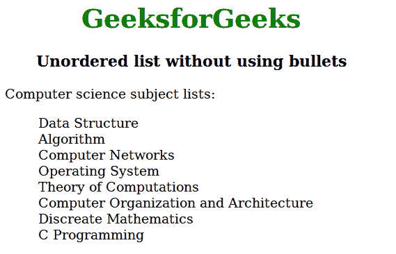
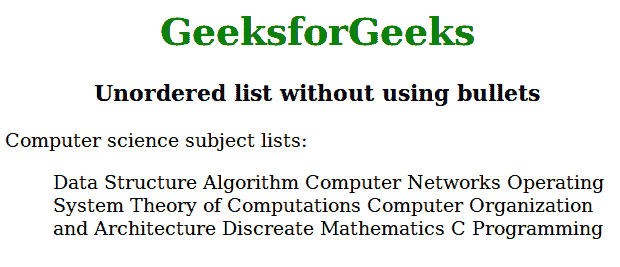

# 使用 CSS

创建一个没有任何项目符号的无序列表

> 原文:[https://www . geesforgeks . org/create-一个没有任何项目符号的无序列表-使用-css/](https://www.geeksforgeeks.org/create-an-unordered-list-without-any-bullets-using-css/)

HTML 提供的列表基本上有三种不同的类型:

*   有序列表
*   无序列表
*   描述列表

用 CSS 设计这三种类型的列表有几种方法。它可以是数字、圆形、方形、字母数字，甚至可能不存在。它还可以在 CSS 的帮助下选择是水平对齐还是垂直对齐列表。
本文的任务是使用 CSS 创建一个没有任何项目符号的无序列表。
**例 1:**

## 超文本标记语言

```css
<!DOCTYPE html>
<html>
    <head>
        <title>Unordered list without using bullets</title>
        <style>
            ul {
                list-style-type:none;
            }
            h1 {
                text-align:center;
                color:green;
            }
            h3 {
                text-align:center;
            }
            body {
                width:60%;
            }
        </style>
    </head>
    <body>
        <h1>GeeksforGeeks</h1>
        <h3>Unordered list without using bullets</h3>

<p>Computer science subject lists:</p>

        <ul>
            <li>Data Structure</li>
            <li>Algorithm</li>
            <li>Computer Networks</li>
            <li>Operating System</li>
            <li>Theory of Computations</li>
            <li>Computer Organization and Architecture</li>
            <li>Discrete Mathematics</li>
            <li>C Programming</li>
        </ul>
    </body>
</html>                   
```

**输出:**



**例 2:**

## 超文本标记语言

```css
<!DOCTYPE html>
<html>
    <head>
        <title>Unordered list without using bullets</title>
        <style>
            ul {
                list-style-type:none;
            }
            ul li {
                display:inline;
            }
            h1 {
                text-align:center;
                color:green;
            }
            h3 {
                text-align:center;
            }
            body {
                width:70%;
            }
        </style>
    </head>
    <body>
        <h1>GeeksforGeeks</h1>
        <h3>Unordered list without using bullets</h3>

<p>Computer science subject lists:</p>

        <ul>
            <li>Data Structure</li>
            <li>Algorithm</li>
            <li>Computer Networks</li>
            <li>Operating System</li>
            <li>Theory of Computations</li>
            <li>Computer Organization and Architecture</li>
            <li>Discrete Mathematics</li>
            <li>C Programming</li>
        </ul>
    </body>
</html>                   
```

**输出:**

