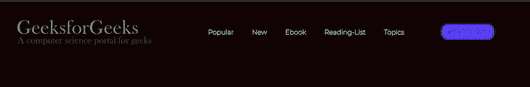

# 使用 CSS 创建具有三种不同对齐方式的导航栏

> 原文:[https://www . geeksforgeeks . org/creating-a-导航栏-具有三种不同的对齐方式-使用-css/](https://www.geeksforgeeks.org/creating-a-navigation-bar-with-three-different-alignments-using-css/)

在本文中，我们将创建一个具有三个不同位置的导航栏，即左、右和中心。要理解这篇文章，我们需要了解一些基本的 HTML 和 CSS。

**进场:**

*   在这里，我们将为电子书网站制作一个导航栏。
*   我们将用于导航栏的标签是标题、图像、导航、按钮。这里我们将分别针对每个标签。
*   在这里，我们将尝试导航栏的 3 个不同位置，即左、右和中心。
*   写完 HTML 之后，我们会把重点放在 CSS 上，或者我们会在 HTML 上使用一个样式标签，让网站 Navbar 变得有吸引力。

**1。左对齐导航栏:**在左定位导航栏中，所有链接列表都在右侧，即左对齐，图像在左侧，即右对齐。

## 超文本标记语言

```css
<!DOCTYPE html>
<html lang="en">

<head>
    <style>
        @import url(
'https://fonts.googleapis.com/css2?family=Montserrat:wght@100&display=swap');

        /* First make all margin and padding 0 */
        * {
            margin: 0px;
            padding: 0px;
            background-color: rgb(19, 6, 6);
        }

        /* Second work on image*/
        header img {
            display: block;
            height: 84px;
            cursor: pointer;
            margin-right: auto;
        }

        /* Changes the styling of links if necessary */
        li,
        a,
        button {
            font-family: "Montserrat", sans-serif;
            font-weight: 800;
            font-size: 16px;
            color: whitesmoke;
            text-decoration: none;
        }

        /* Now start positioning the links and images 
           according to your convinence */
        header {
            display: flex;
            justify-content: flex-end;
            align-items: center;
            padding: 30px 10%;
        }

        .navigate_links {
            list-style: none;
        }

        .navigate_links li {
            display: inline-block;
            padding: 10px 20px;
        }

        .navigate_links li a {
            transition: all 0.3s ease-in-out 0s;
        }

        /* Add some transition to make navigation 
           bar attractive */
        .navigate_links li a:hover {
            color: greenyellow;
            border: 2px solid blue;
            box-shadow: 3px 3px 3px red, 3px 3px 3px blue;
            border-radius: 8px;
            margin: 10px;
            padding: 12px;
        }

        button {
            margin-left: 70px;
            padding: 9px 12px;
            border-radius: 15px;
            background-color: rgb(89, 61, 248);
            color: rgb(243, 236, 236);
            border: none;
            cursor: pointer;
            transition: all 0.3s ease-in-out 0s;
        }

        button:hover {
            background-color: rgb(219, 221, 81);
            color: black;
        }
    </style>
</head>

<body>
    <header>
        
        <nav>
            <ul class="navigate_links">
                <li><a href="#">Popular</a></li>
                <li><a href="#">New</a></li>
                <li><a href="#">Ebook</a></li>
                <li><a href="#">Reading-List</a></li>
                <li><a href="#">Topics</a></li>
            </ul>
        </nav>
        <a class="signin" href="#"> 
            <button>Get it for free</button> 
        </a>
    </header>
</body>

</html>
```

**输出:**



**2。居中对齐导航栏:**在居中对齐的导航栏中，所有链接都在中间，徽标右对齐，按钮左对齐，所有这些都只能从一行代码中完成。

## 超文本标记语言

```css
<!DOCTYPE html>
<html lang="en">

<head>
    <style>
        @import url(
'https://fonts.googleapis.com/css2?family=Montserrat:wght@100&display=swap');

        * {
            margin: 0px;
            padding: 0px;
            background-color: rgb(7, 6, 6);
        }

        header img {
            display: block;
            height: 84px;
            cursor: pointer;
        }

        li,
        a,
        button {
            font-family: "Montserrat", sans-serif;
            font-weight: 800;
            font-size: 16px;
            color: whitesmoke;
            text-decoration: none;
        }

        header {
            display: flex;
            justify-content: space-between;
            align-items: center;
            padding: 30px 10%;
        }

        .navigate_links {
            list-style: none;
        }

        .navigate_links li {
            display: inline-block;
            padding: 0px 20px;
        }

        .navigate_links li a {
            transition: all 0.3s ease-in-out 0s;
        }

        button {
            padding: 9px 12px;
            border-radius: 15px;
            background-color: rgb(89, 61, 248);
            color: rgb(243, 236, 236);
            border: none;
            cursor: pointer;
            transition: all 0.3s ease-in-out 0s;
        }

        .navigate_links li a:hover {
            color: greenyellow;
            border: 2px solid blue;
            box-shadow: 3px 3px 3px red, 3px 3px 3px blue;
            border-radius: 4px;
            margin: 10px;
            padding: 12px;
        }

        button:hover {
            background-color: rgb(219, 221, 81);
            color: black;
        }
    </style>
</head>

<body>
    <header>
        

        <nav>
            <ul class="navigate_links">
                <li><a href="#">Popular</a></li>
                <li><a href="#">New</a></li>
                <li><a href="#">Ebook</a></li>
                <li><a href="#">Reading-List</a></li>
                <li><a href="#">Topics</a></li>
            </ul>
        </nav>

        <a class="signin" href="#"> 
            <button>Get it for free</button> 
        </a>
    </header>
</body>

</html>
```

**输出:**


**3。右对齐导航栏:**在右对齐导航栏中，导航链接是右对齐的，所有其他链接，如按钮和徽标，都取决于开发人员的选择。

## 超文本标记语言

```css
<!DOCTYPE html>
<html lang="en">

<head>
    <style>
        @import url(
'https://fonts.googleapis.com/css2?family=Montserrat:wght@100&display=swap');

        * {
            margin: 0px;
            padding: 0px;
            background-color: rgb(12, 9, 9);
        }

        header img {
            display: block;
            height: 84px;
            cursor: pointer;
            /* margin-right: auto; */
            order: 3;
            margin-left: auto;
        }

        li,
        a,
        button {
            font-family: "Montserrat", sans-serif;
            font-weight: 800;
            font-size: 16px;
            color: whitesmoke;
            text-decoration: none;
        }

        header {
            display: flex;
            justify-content: flex-end;
            align-items: center;
            padding: 30px 10%;
            order: 1;
        }

        .navigate_links {
            list-style: none;
        }

        .navigate_links li {
            display: inline-block;
            padding: 0px 20px;
        }

        .navigate_links li a {
            transition: all 0.3s ease-in-out 0s;
        }

        button {
            margin-left: 20px;
            padding: 9px 12px;
            border-radius: 15px;
            background-color: rgb(89, 61, 248);
            color: rgb(243, 236, 236);
            border: none;
            cursor: pointer;
            transition: all 0.3s ease-in-out 0s;
        }

        .navigate_links li:nth-child(1) {
            padding: 0px 20px 0px 0px;
        }

        .navigate_links li a:hover {
            color: greenyellow;
            border: 2px solid blue;
            box-shadow: 3px 3px 3px red, 3px 3px 3px blue;
            border-radius: 4px;
            margin: 10px;
            padding: 12px;
        }

        button:hover {
            background-color: rgb(219, 221, 81);
            color: black;
        }
    </style>
</head>

<body>
    <header>
        

        <nav>
            <ul class="navigate_links">
                <li><a href="#">Popular</a></li>
                <li><a href="#">New</a></li>
                <li><a href="#">Ebook</a></li>
                <li><a href="#">Reading-List</a></li>
                <li><a href="#">Topics</a></li>
            </ul>
        </nav>
        <a class="signin" href="#"> 
            <button>Get it for free</button> 
        </a>
    </header>
</body>

</html>
```

**输出:**

