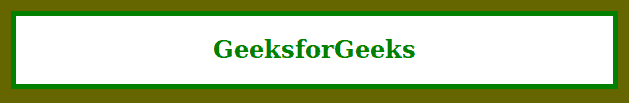

# CSS | 3 位十六进制颜色

> 原文:[https://www.geeksforgeeks.org/css-3-digit-hex-color/](https://www.geeksforgeeks.org/css-3-digit-hex-color/)

**3 位六进制颜色**代码类似于 6 位六进制颜色，是 6 位六进制颜色的简写。在 3 位数十六进制颜色收缩成单字符的那些有双胞胎在 6 位数十六进制颜色的效果将是相同的，但减少颜色的变化。3 位十六进制颜色包含 3 个字符，后跟哈希(#)，如#RGB。#RGB 定义了红色、绿色和蓝色分量。
**语法:**

```html
#RGB

```

**例 1:**

```html
<!DOCTYPE html>
<html>

<head>
    <title>CSS 3 Digit Hex Color</title>
    <style>
        body {
            background-color: #666600;
        }

        h1 {
            color: green;
        }

        article {
            background-color: #FFF;
            border: 5px solid green;
            margin: 15px;
            text-align: center;
        }
    </style>
</head>

<body>
    <article>
        <h1>GeeksforGeeks</h1>
    </article>
</body>

</html>
```

**输出:**

**例 2:**

```html
<!DOCTYPE html>
<html>

<head>
    <title>CSS 3 Digit Hex Color</title>

    <style>
        body {
            background-image: url(
'https://media.geeksforgeeks.org/wp-content/uploads/20190806202057/Screenshot-from-2019-08-02-10-51-372.png');
            background-attachment: fixed;
            background-size: cover;
        }

        h2 {
            color: green;
        }

        article {
            background-color: #FFF;
            border: 2px solid green;
            background-position: center center;
            text-align: center;
        }
    </style>
</head>

<body>
    <article>
        <h2>GeeksforGeeks</h2>
    </article>
</body>

</html>
```

**输出:**
