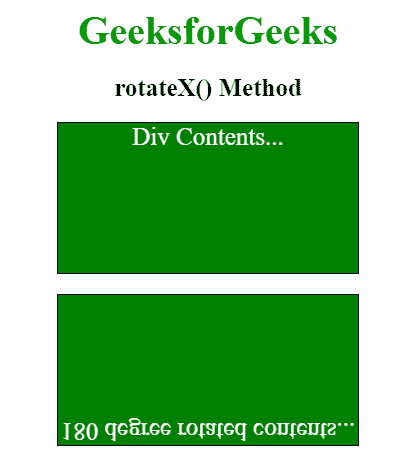
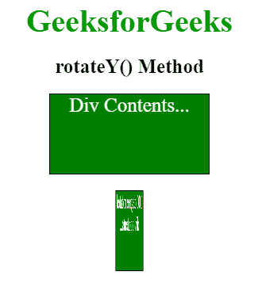
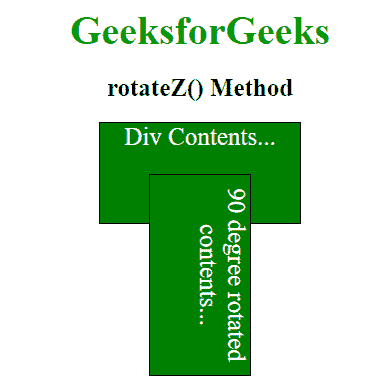

# CSS | 3D 变换

> 原文:[https://www.geeksforgeeks.org/css-3d-transforms/](https://www.geeksforgeeks.org/css-3d-transforms/)

它允许使用 3D 变换来改变元素。在三维变换中，元素沿 X 轴、Y 轴和 Z 轴旋转。

下面列出了三种主要的转换类型:

*   rotateX()
*   旋转()
*   旋转()

**rotateX()方法:**该旋转用于以给定的角度围绕 X 轴旋转元素。
T3】例:

```html
<!DOCTYPE html>
<html>
    <head>
        <title>3D Transformation</title>
        <style>
            .normal_div {
                width: 300px;
                height: 150px;
                color: white;
                font-size:25px;
                background-color: green;
                border: 1px solid black;
                margin-bottom:20px;
            }

            #rotateX {
                width: 300px;
                height: 150px;
                color: white;
                font-size:25px;
                background-color: green;
                border: 1px solid black;
                -webkit-transform: rotateX(180deg); /* Safari */
                transform: rotateX(180deg); /* Standard syntax */

            }
            .gfg {
                font-size:40px;
                font-weight:bold;
                color:#090;
            }
            .geeks {
                font-size:25px;
                font-weight:bold;
                margin:20px 0;
            }
        </style>
    </head>
    <body>
        <center>
            <div class = "gfg">GeeksforGeeks</div>
            <div class = "geeks">rotateX() Method</div>
            <div class = "normal_div"> Div Contents... </div>
            <div id="rotateX">180 degree rotated contents...</div>
        </center>
    </body>
</html>                                
```

**输出:**


**rotateY()方法:**此方法用于以给定的角度围绕 Y 轴旋转元素。
T3】例:

```html
<!DOCTYPE html>
<html>
    <head>
        <title>3D Transformation</title>
        <style>
            .normal_div {
                width: 200px;
                color:white;
                font-size:25px;
                height: 100px;
                background-color: green;
                border: 1px solid black;
                margin-bottom:20px;
            }

            #rotateY {
                width: 200px;
                color:white;
                font-size:25px;
                height: 100px;
                background-color: green;
                border: 1px solid black;
                -webkit-transform: rotateY(180deg); /* Safari */
                transform: rotateY(100deg); /* Standard syntax */
            }
            .gfg {
                font-size:40px;
                font-weight:bold;
                color:#090;
            }
            .geeks {
                font-size:25px;
                font-weight:bold;
                margin:20px 0;
            }
        </style>
    </head>
    <body>
        <center>
            <div class = "gfg">GeeksforGeeks</div>
            <div class = "geeks">rotateY() Method</div>
            <div class = "normal_div"> Div Contents... </div>
            <div id="rotateY">180 degree rotated div contents...</div>
        </center>
    </body>
</html>                                    
```

**输出:**


**rotateZ()方法:**此方法用于以给定的角度围绕 Z 轴旋转元素。
T3】例:

```html
<!DOCTYPE html>
<html>
    <head>
        <title>3D Transformation</title>
        <style>
            .normal_div {
                width: 200px;
                height: 100px;
                font-size:25px;
                color:white;
                background-color: green;
                border: 1px solid black;
            }

            #rotateZ {
                width: 200px;
                height: 100px;
                color:white;
                font-size:25px;
                background-color: green;
                border: 1px solid black;
                -webkit-transform: rotateZ(90deg); /* Safari */
                transform: rotateZ(90deg); /* Standard syntax */
            }
            .gfg {
                font-size:40px;
                font-weight:bold;
                color:#090;
            }
            .geeks {
                font-size:25px;
                font-weight:bold;
                margin:20px 0;
            }
        </style>
    </head>
    <body>
        <center>
            <div class = "gfg">GeeksforGeeks</div>
            <div class = "geeks">rotateZ() Method</div>
            <div class = "normal_div"> Div Contents... </div>
            <div id="rotateZ">90 degree rotated contents...</div>
        </center>
    </body>
</html>                    
```

**输出:**
