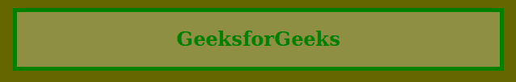

# CSS | 4 位十六进制颜色

> 原文:[https://www.geeksforgeeks.org/css-4-digit-hex-color/](https://www.geeksforgeeks.org/css-4-digit-hex-color/)

四位十六进制颜色可以用作八位六进制颜色的简写。四位十六进制颜色可以用来定义 CSS 元素的颜色，比如 8 位十六进制颜色。8 位十六进制颜色有 8 个字符，4 位十六进制颜色缩小到 4 个字符，但性能与颜色相同。在 4 位数字中，4 个字符后面跟有散列(#)，如#RGBA。这里 R 定义了红色，G 定义了绿色，B 定义了蓝色，A 定义了影响透明度的阿尔法通道。
**语法:**

```
#RGBA
```

**注意:**这里红色、绿色和蓝色定义的颜色与 8 位和 6 位十六进制颜色相比变化较小，最后一个字符代表 Alpha 通道。
T3】例 1:

```
<!DOCTYPE html>
<html>

<head>
    <title>CSS 4 Digit Hex Color</title>
    <style>
        body {
            background-color: #666600;
        }

        h1 {
            color: green;
        }

        article {
            background-color: #FFF4;
            border: 5px solid green;
            margin: 15px;
            text-align: center;
        }
    </style>
</head>

<body>
    <article>
        <h1>GeeksforGeeks</h1>
    </article>
</body>

</html>
```

**输出:**

**例 2:**

```
<!DOCTYPE html>
<html>

<head>
    <title>CSS 4 Digit Hex Color</title>

    <style>
        body {
            background-image: url(
'https://media.geeksforgeeks.org/wp-content/uploads/20190806202057/Screenshot-from-2019-08-02-10-51-372.png');
            background-attachment: fixed;
            background-size: cover;
        }

        h2 {
            color: white;
        }

        article {
            background-color: #FFF2;
            border: 2px solid green;
            background-position: center center;
            text-align: center;
        }
    </style>
</head>

<body>
    <article>
        <h2>GeeksforGeeks</h2>
    </article>
</body>

</html>
```

**输出:**
