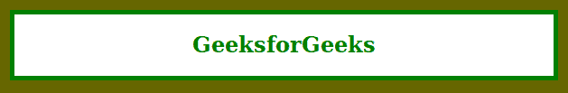

# CSS | 6 位十六进制颜色

> 原文:[https://www.geeksforgeeks.org/css-6-digit-hex-color/](https://www.geeksforgeeks.org/css-6-digit-hex-color/)

**六位十六进制颜色**在 CSS 中定义颜色非常流行，因为六位十六进制颜色代码中有多种颜色的变化。有六个字符后跟一个哈希(#)，如#RRGGBB。开发人员使用了十六进制颜色代码，很难记住这些代码来与蓝色、绿色、青色、棕色等颜色名称进行比较，因为颜色代码包含太多单一颜色的阴影。通过使用十六进制颜色代码，你可以在任何你想使用它们的地方为你的应用或网站选择你喜欢的颜色。通过颜色的名称，有 **147** 的名称可以使用，但是通过使用十六进制色码可以获得 **16** 万种颜色，这是使用十六进制色码背后的主要原因。
**语法:**

```
#RRGGBB
```

**注意:**这里这 6 个字符定义了 RGB 颜色，分别是红、绿、蓝。
T3】例 1:

```
<!DOCTYPE html>
<html>

<head>
    <title>CSS 6 Digit Hex Color</title>
    <style>
        body {
            background-color: #666600;
        }

        h1 {
            color: green;
        }

        article {
            background-color: #FFFFFF;
            border: 5px solid green;
            margin: 15px;
            text-align: center;
        }
    </style>
</head>

<body>
    <article>
        <h1>GeeksforGeeks</h1>
    </article>
</body>

</html>
```

**输出:**

**例 2:**

```
<!DOCTYPE html>
<html>

<head>
    <title>CSS 6 Digit Hex Color</title>

    <style>
        body {
            background-image: url(
'https://media.geeksforgeeks.org/wp-content/uploads/20190806202057/Screenshot-from-2019-08-02-10-51-372.png');
            background-attachment: fixed;
            background-size: cover;
        }

        h2 {
            color: green;
        }

        article {
            background-color: #FFFFFF;
            border: 2px solid green;
            background-position: center center;
            text-align: center;
        }
    </style>
</head>

<body>
    <article>
        <h2>GeeksforGeeks</h2>
    </article>
</body>

</html>
```

**输出:**
