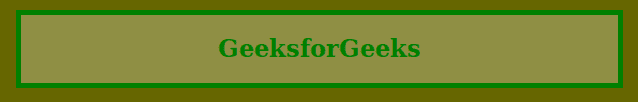

# CSS | 8 位十六进制颜色

> 原文:[https://www.geeksforgeeks.org/css-8-digit-hex-color/](https://www.geeksforgeeks.org/css-8-digit-hex-color/)

八位十六进制颜色和六位十六进制颜色一样简单，它包含 8 位而不是 6 位，它用于定义 CSS 元素的颜色。它在数字前有一个前缀散列(#)值，如六位十六进制代码。
6 位和 8 位十六进制代码的区别在于，2 个额外的字符定义了 8 位十六进制颜色中的字母通道。最后两位数字将定义颜色将有多少透明或不透明。如果最后两位数字是 00，那么它将是完全透明的，如果是 FF，那么它将是完全不透明的。

**语法:**

```html
#RRGGBBAA
```

**注:**前六位字符表示 RGB 颜色为六位十六进制色码。最后两个代表阿尔法通道。

**例 1:**

```html
<!DOCTYPE html>
<html>

<head>
    <title>CSS 8 Digit Hex Color</title>
    <style>
        body {
            background-color: #666600;
        }

        h1 {
            color: green;
        }

        article {
            background-color: #FFFFFF44;
            border: 5px solid green;
            margin: 15px;
            text-align: center;
        }
    </style>
</head>

<body>
    <article>
        <h1>GeeksforGeeks</h1>
    </article>
</body>

</html>
```

**输出:**


**例 2:**

```html
<!DOCTYPE html>
<html>

<head>
    <title>CSS 8 Digit Hex Color</title>

    <style>
        body {
            background-image: url(
'https://media.geeksforgeeks.org/wp-content/uploads/20190808143838/logsm.png');
            background-attachment: fixed;
            background-size: cover;
        }

        h2 {
            color: white;
        }

        article {
            background-color: #FFFFFF22;
            border: 2px solid green;
            background-position: center center;
            text-align: center;
        }
    </style>
</head>

<body>
    <article>
        <h2>GeeksforGeeks</h2>
    </article>
</body>

</html>
```

**输出:**
