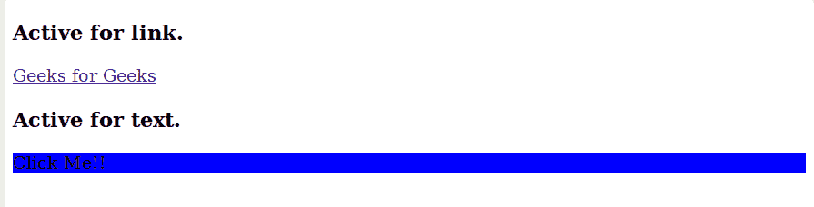
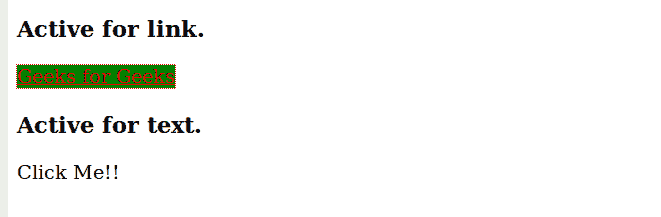

# CSS |:活动选择器

> 原文:[https://www.geeksforgeeks.org/css-active-selector/](https://www.geeksforgeeks.org/css-active-selector/)

:**活动选择器**用于设计网页的活动链接。用户单击链接时的样式显示。此选择器不同于:链接、已访问和悬停选择器。活动选择器的主要用途是用于链接，但它可以用于所有元素。
**语法:**

```css
:active{
        //CSS property
}
```

下面的 HTML/CSS 代码展示了功能:活动选择器:

## 超文本标记语言

```css
<!DOCTYPE html>
<html>

<head>
    <title>Active selector</title>
    <style>
        a:active {
            background-color: green;
        }

        p:active {
            background-color: blue;
        }
    </style>
</head>

<body>
    <h3>Active for link.</h3>
    <a href="https://www.geeksforgeeks.org/">Geeks for Geeks</a>
    <h3>Active for text.</h3>

<p>Click Me!!</p>

</body>

</html>
```

**输出:**





**支持的浏览器**

*   谷歌 Chrome 4.0

*   Edge 7.0

*   Firefox 2.0

*   Safari 3.1

*   歌剧 9.6